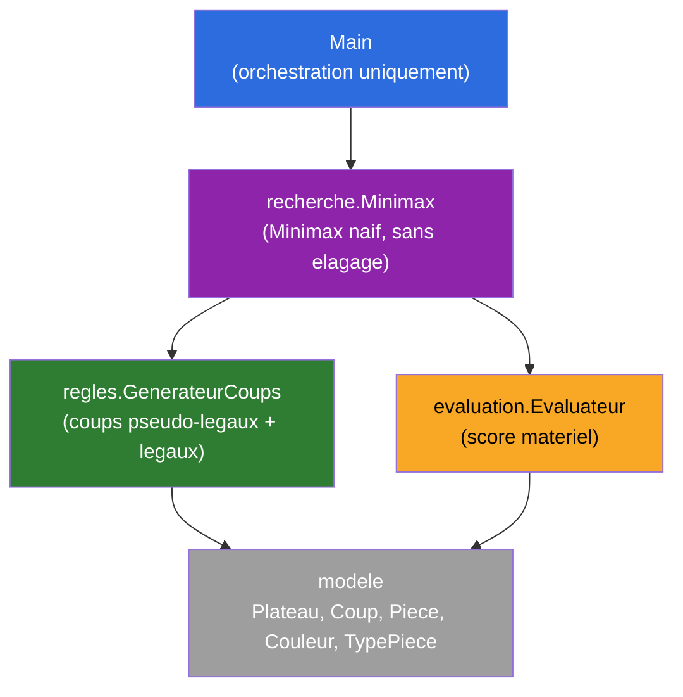
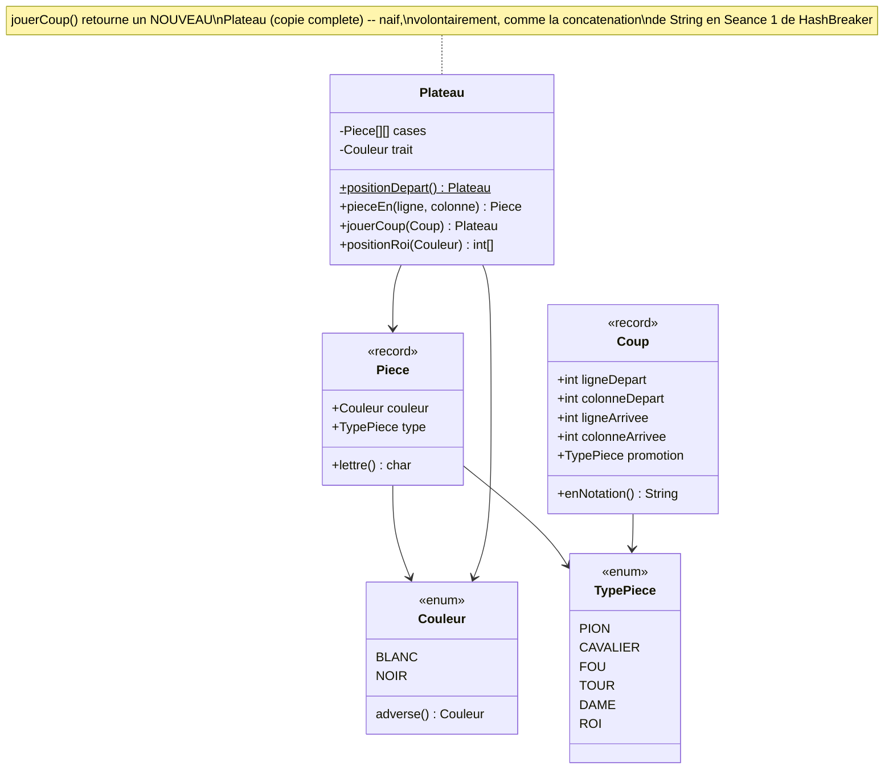
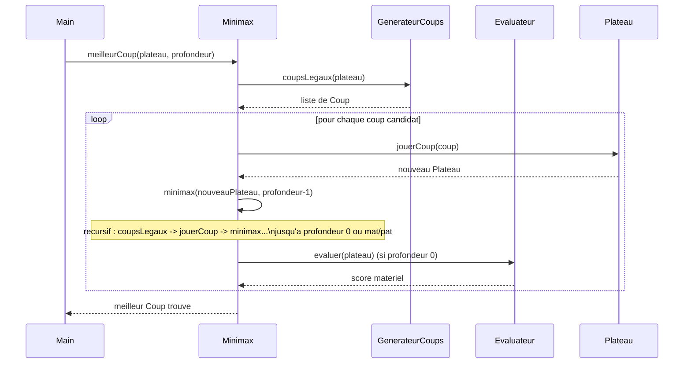
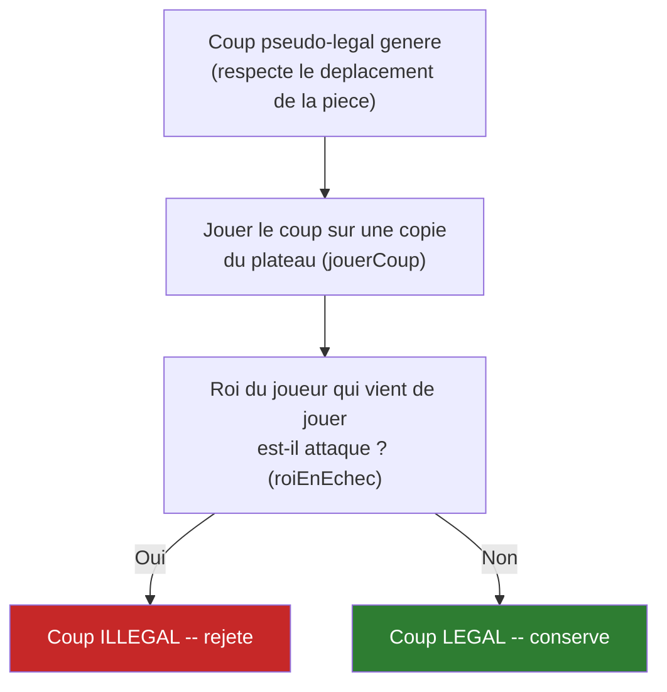
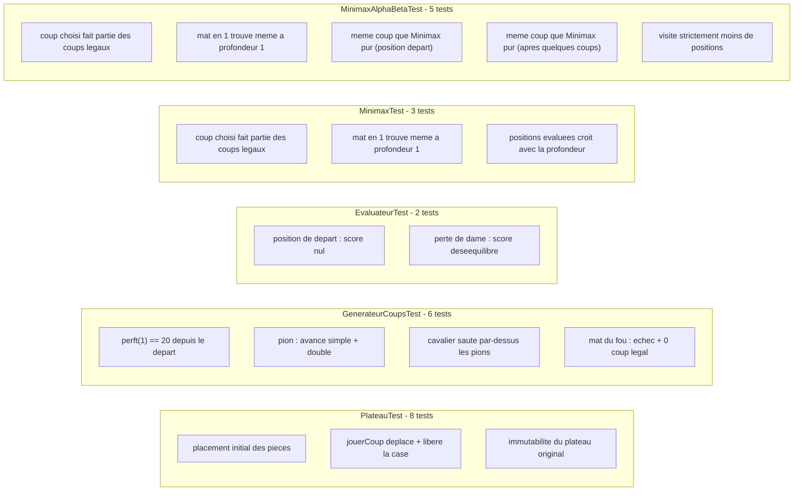
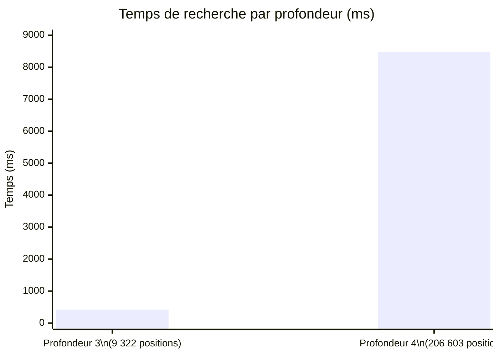
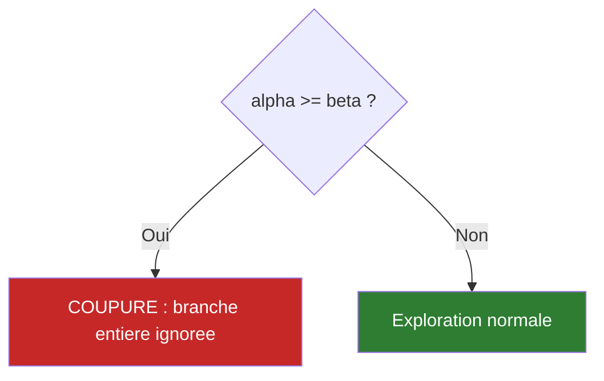
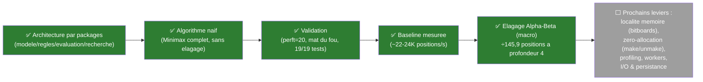

# Schémas — État actuel du projet (Étape 1 : Naïf, Étape 2 : Alpha-Beta)

Diagrammes Mermaid de l'architecture et du fonctionnement du moteur. Même conventions que HashBreaker (`../../shemas/schemas.md`).

> Ouvrir dans VSCode avec `Ctrl+Shift+V` pour l'aperçu Markdown (extension "Markdown Preview Mermaid Support" si besoin).

---

## 1. Architecture par packages

**Principe** : chaque futur levier d'optimisation touche un seul package. Bitboards → `modele`. Élagage alpha-beta → `recherche`. Table de transposition → périphérie de `recherche`. Tables de position → `evaluation`.

---

## 2. Diagramme de classes — `modele`

---

## 3. Flux : de `Main` au meilleur coup

---

## 4. Détection légalité d'un coup (échec au roi)

**Un seul mécanisme** couvre tous les cas : clouages, roi qui se met lui-même en echec, roi qui doit sortir d'échec — pas de logique spéciale par cas.

---

## 5. Couverture des tests

**Résultat actuel : 24/24 tests passent.**

---

## 6. Baseline mesurée (Minimax naïf, sans élagage)

Débit stable autour de **~22 000 à 24 000 positions/seconde** — c'est cette valeur qui servira de référence pour mesurer les gains des futures micro-optimisations (l'élagage alpha-beta, lui, change l'algorithme : voir section suivante).

---

## 7. Étape 2 : Élagage Alpha-Beta (macro-optimisation)

`MinimaxAlphaBeta` — mêmes structures (`modele`, `regles`, `evaluation`), seule `recherche/Minimax` est étendue avec des bornes `alpha`/`beta` qui coupent les branches mathématiquement inutiles.

### Impact mesuré (comparaison directe contre l'Étape 1, même position, même profondeur)

```mermaid
xychart-beta
    title "Positions evaluees : Naif vs Alpha-Beta"
    x-axis ["Profondeur 3", "Profondeur 4"]
    y-axis "Positions evaluees" 0 --> 210000
    bar [9322, 206603]
    bar [585, 1416]
```

| Profondeur | Naïf | Alpha-Beta | Facteur | Coup trouvé |
|---|---|---|---|---|
| 3 | 9 322 pos. / 437 ms | 585 pos. / 22 ms | ÷15,9 / ÷19,9 | `b1c3` (identique) |
| 4 | 206 603 pos. / 8 791 ms | 1 416 pos. / 53 ms | **÷145,9 / ÷165,9** | `b1c3` (identique) |

**Équivalence mathématique validée par tests** : même coup choisi à chaque fois — le gain est "gratuit", zéro perte de qualité de décision. Débloque des profondeurs 5-6 auparavant hors de portée (1,8 s et 29,2 s respectivement). Détails : [process/02-elagage-alpha-beta.md](../process/02-elagage-alpha-beta.md) et [syntheses/02-elagage-alpha-beta.md](../syntheses/02-elagage-alpha-beta.md).

---

## 8. Où on en est

