# Schémas — État actuel du projet (Étapes 1 à 9)

Diagrammes Mermaid de l'architecture et du fonctionnement du moteur. Même conventions que HashBreaker (`../../shemas/schemas.md`).

> Ouvrir dans VSCode avec `Ctrl+Shift+V` pour l'aperçu Markdown (extension "Markdown Preview Mermaid Support" si besoin).

---

## 1. Architecture par packages

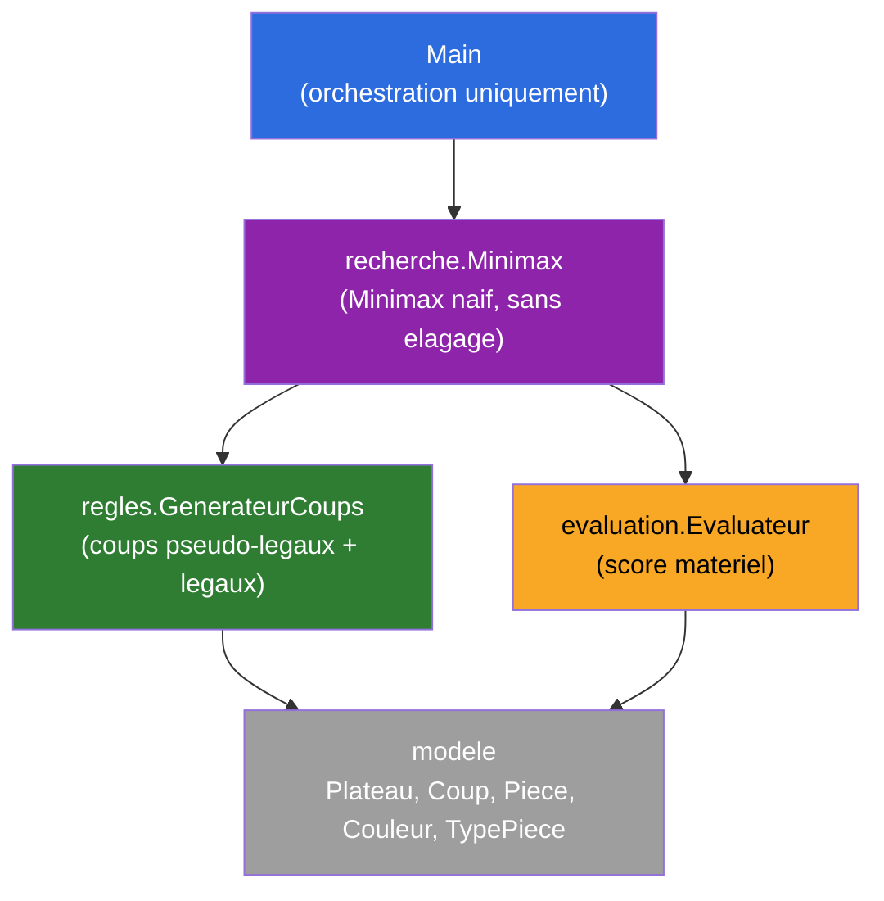
```mermaid
flowchart TD
    Main["Main\n(orchestration uniquement)"] --> Recherche["recherche.Minimax\n(Minimax naif, sans elagage)"]
    Recherche --> Regles["regles.GenerateurCoups\n(coups pseudo-legaux + legaux)"]
    Recherche --> Evaluation["evaluation.Evaluateur\n(score materiel)"]
    Regles --> Modele["modele\nPlateau, Coup, Piece, Couleur, TypePiece"]
    Evaluation --> Modele

    style Main fill:#2d6cdf,color:#fff
    style Recherche fill:#8e24aa,color:#fff
    style Regles fill:#2e7d32,color:#fff
    style Evaluation fill:#f9a825,color:#000
    style Modele fill:#9e9e9e,color:#fff
```

**Principe** : chaque futur levier d'optimisation touche un seul package. Bitboards → `modele`. Élagage alpha-beta → `recherche`. Table de transposition → périphérie de `recherche`. Tables de position → `evaluation`.

---

## 2. Diagramme de classes — `modele`

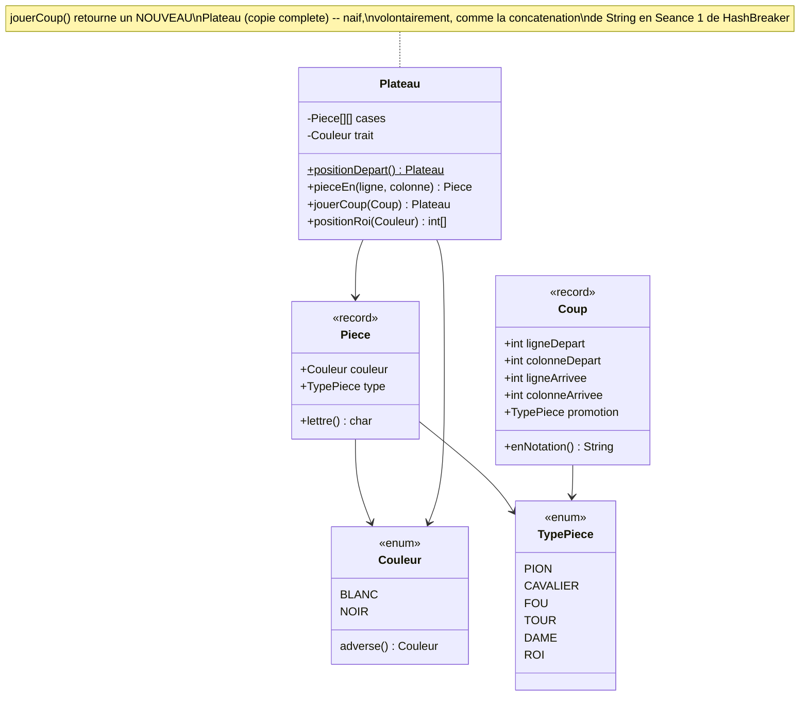
```mermaid
classDiagram
    class Couleur {
        <<enum>>
        BLANC
        NOIR
        adverse() Couleur
    }
    class TypePiece {
        <<enum>>
        PION
        CAVALIER
        FOU
        TOUR
        DAME
        ROI
    }
    class Piece {
        <<record>>
        +Couleur couleur
        +TypePiece type
        +lettre() char
    }
    class Coup {
        <<record>>
        +int ligneDepart
        +int colonneDepart
        +int ligneArrivee
        +int colonneArrivee
        +TypePiece promotion
        +enNotation() String
    }
    class Plateau {
        -Piece[][] cases
        -Couleur trait
        +positionDepart() Plateau$
        +pieceEn(ligne, colonne) Piece
        +jouerCoup(Coup) Plateau
        +positionRoi(Couleur) int[]
    }
    Piece --> Couleur
    Piece --> TypePiece
    Coup --> TypePiece
    Plateau --> Piece
    Plateau --> Couleur
    note for Plateau "jouerCoup() retourne un NOUVEAU\nPlateau (copie complete) -- naif,\nvolontairement, comme la concatenation\nde String en Seance 1 de HashBreaker"
```

---

## 3. Flux : de `Main` au meilleur coup

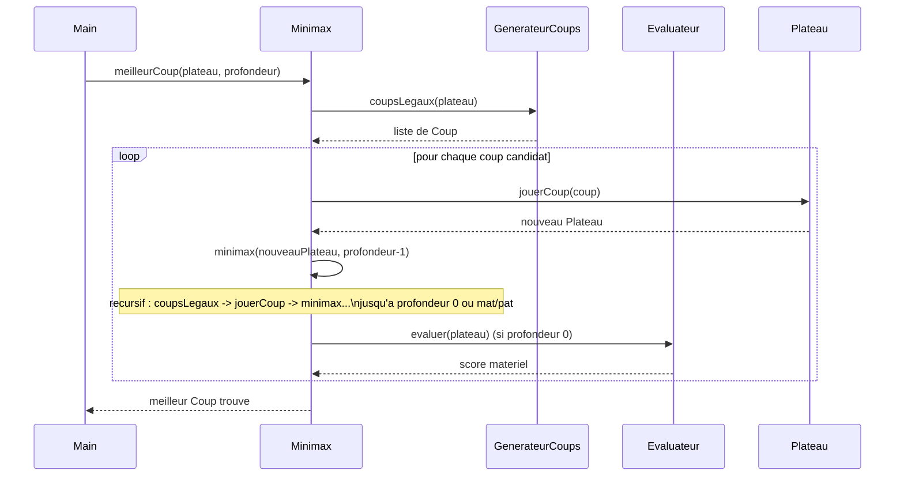
```mermaid
sequenceDiagram
    participant M as Main
    participant M2 as Minimax
    participant G as GenerateurCoups
    participant E as Evaluateur
    participant P as Plateau

    M->>M2: meilleurCoup(plateau, profondeur)
    M2->>G: coupsLegaux(plateau)
    G-->>M2: liste de Coup

    loop pour chaque coup candidat
        M2->>P: jouerCoup(coup)
        P-->>M2: nouveau Plateau
        M2->>M2: minimax(nouveauPlateau, profondeur-1)
        Note over M2: recursif : coupsLegaux -> jouerCoup -> minimax...\njusqu'a profondeur 0 ou mat/pat
        M2->>E: evaluer(plateau) (si profondeur 0)
        E-->>M2: score materiel
    end

    M2-->>M: meilleur Coup trouve
```

---

## 4. Détection légalité d'un coup (échec au roi)

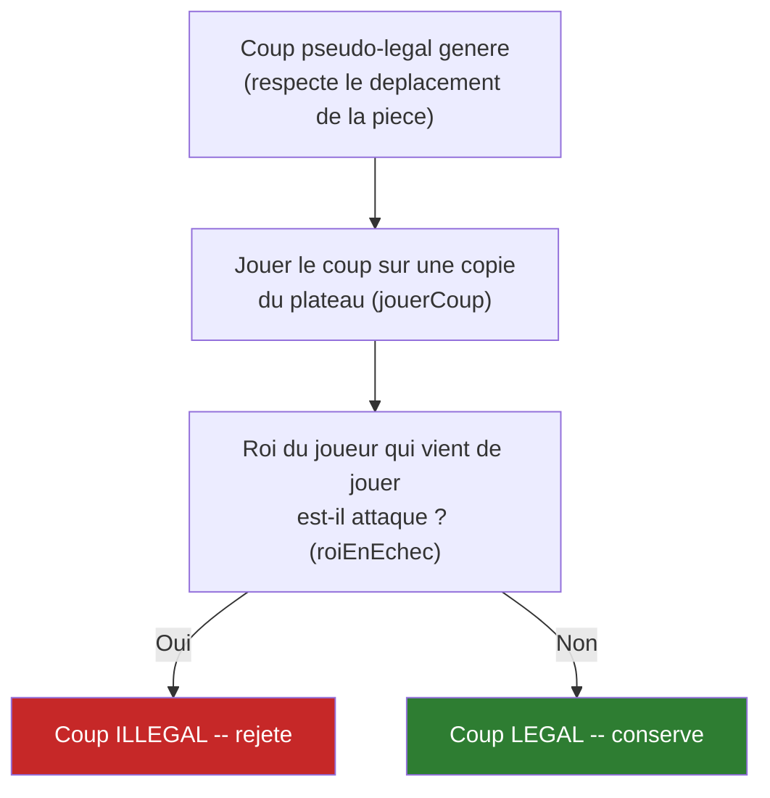
```mermaid
flowchart TD
    A["Coup pseudo-legal genere\n(respecte le deplacement de la piece)"] --> B["Jouer le coup sur une copie\ndu plateau (jouerCoup)"]
    B --> C["Roi du joueur qui vient de jouer\nest-il attaque ? (roiEnEchec)"]
    C -- "Oui" --> D["Coup ILLEGAL -- rejete"]
    C -- "Non" --> E["Coup LEGAL -- conserve"]

    style D fill:#c62828,color:#fff
    style E fill:#2e7d32,color:#fff
```

**Un seul mécanisme** couvre tous les cas : clouages, roi qui se met lui-même en echec, roi qui doit sortir d'échec — pas de logique spéciale par cas.

---

## 5. Couverture des tests

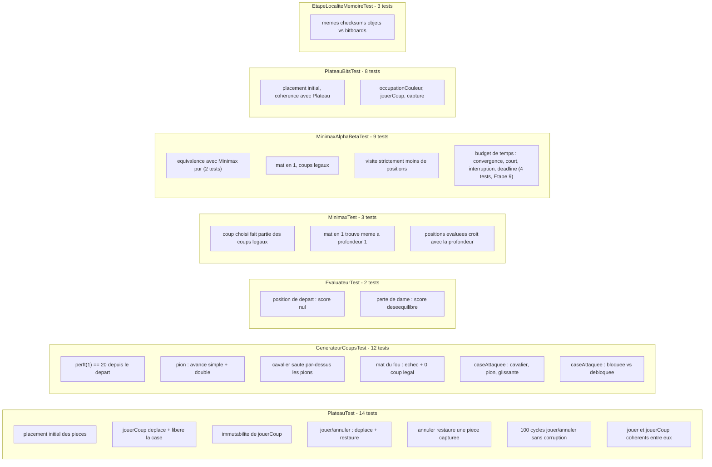
```mermaid
graph LR
    subgraph "PlateauTest - 14 tests"
        T1["placement initial des pieces"]
        T2["jouerCoup deplace + libere la case"]
        T3["immutabilite de jouerCoup"]
        T4["jouer/annuler : deplace + restaure"]
        T5["annuler restaure une piece capturee"]
        T6["100 cycles jouer/annuler sans corruption"]
        T7["jouer et jouerCoup coherents entre eux"]
    end
    subgraph "GenerateurCoupsTest - 12 tests"
        T8["perft(1) == 20 depuis le depart"]
        T9["pion : avance simple + double"]
        T10["cavalier saute par-dessus les pions"]
        T11["mat du fou : echec + 0 coup legal"]
        T12["caseAttaquee : cavalier, pion, glissante"]
        T13["caseAttaquee : bloquee vs debloquee"]
    end
    subgraph "EvaluateurTest - 2 tests"
        T14["position de depart : score nul"]
        T15["perte de dame : score deseequilibre"]
    end
    subgraph "MinimaxTest - 3 tests"
        T16["coup choisi fait partie des coups legaux"]
        T17["mat en 1 trouve meme a profondeur 1"]
        T18["positions evaluees croit avec la profondeur"]
    end
    subgraph "MinimaxAlphaBetaTest - 9 tests"
        T19["equivalence avec Minimax pur (2 tests)"]
        T20["mat en 1, coups legaux"]
        T21["visite strictement moins de positions"]
        T21b["budget de temps : convergence, court, interruption, deadline (4 tests, Etape 9)"]
    end
    subgraph "PlateauBitsTest - 8 tests"
        T22["placement initial, coherence avec Plateau"]
        T23["occupationCouleur, jouerCoup, capture"]
    end
    subgraph "EtapeLocaliteMemoireTest - 3 tests"
        T24["memes checksums objets vs bitboards"]
    end
```

**Résultat actuel : 51/51 tests passent.**

---

## 6. Baseline mesurée (Minimax naïf, sans élagage)

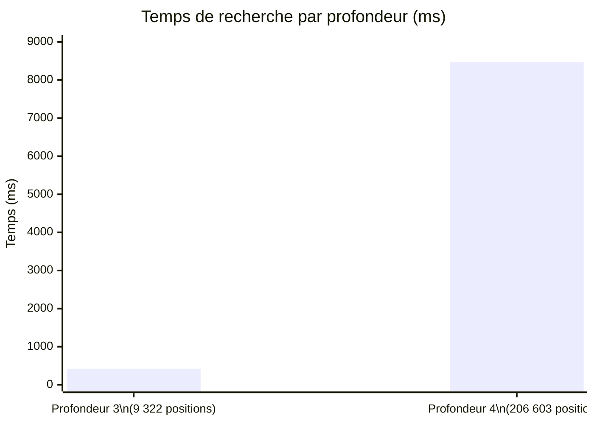
```mermaid
xychart-beta
    title "Temps de recherche par profondeur (ms)"
    x-axis ["Profondeur 3\n(9 322 positions)", "Profondeur 4\n(206 603 positions)"]
    y-axis "Temps (ms)" 0 --> 9000
    bar [421, 8465]
```

Débit stable autour de **~22 000 à 24 000 positions/seconde** — c'est cette valeur qui servira de référence pour mesurer les gains des futures micro-optimisations (l'élagage alpha-beta, lui, change l'algorithme : voir section suivante).

---

## 7. Étape 2 : Élagage Alpha-Beta (macro-optimisation)

`MinimaxAlphaBeta` — mêmes structures (`modele`, `regles`, `evaluation`), seule `recherche/Minimax` est étendue avec des bornes `alpha`/`beta` qui coupent les branches mathématiquement inutiles.

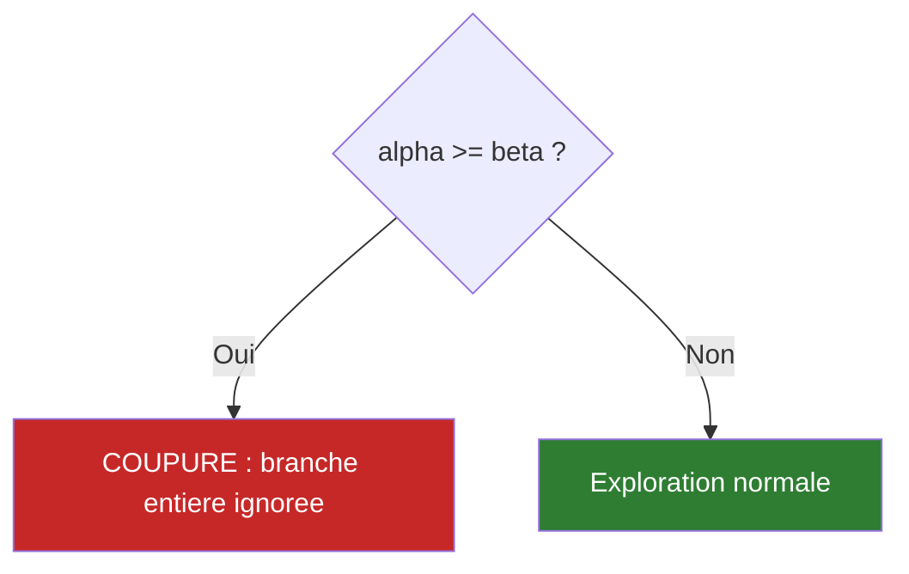
```mermaid
flowchart TD
    Check{"alpha >= beta ?"} -- "Oui" --> Coupe["COUPURE : branche entiere ignoree"]
    Check -- "Non" --> Continue["Exploration normale"]

    style Coupe fill:#c62828,color:#fff
    style Continue fill:#2e7d32,color:#fff
```

### Impact mesuré (comparaison directe contre l'Étape 1, même position, même profondeur)

```mermaid
xychart-beta
    title "Positions evaluees : Naif vs Alpha-Beta"
    x-axis ["Profondeur 3", "Profondeur 4"]
    y-axis "Positions evaluees" 0 --> 210000
    bar [9322, 206603]
    bar [585, 1416]
```

| Profondeur | Naïf | Alpha-Beta | Facteur | Coup trouvé |
|---|---|---|---|---|
| 3 | 9 322 pos. / 437 ms | 585 pos. / 22 ms | ÷15,9 / ÷19,9 | `b1c3` (identique) |
| 4 | 206 603 pos. / 8 791 ms | 1 416 pos. / 53 ms | **÷145,9 / ÷165,9** | `b1c3` (identique) |

**Équivalence mathématique validée par tests** : même coup choisi à chaque fois — le gain est "gratuit", zéro perte de qualité de décision. Débloque des profondeurs 5-6 auparavant hors de portée (1,8 s et 29,2 s respectivement). Détails : [process/02-elagage-alpha-beta.md](../process/02-elagage-alpha-beta.md) et [syntheses/02-elagage-alpha-beta.md](../syntheses/02-elagage-alpha-beta.md).

---

## 8. Étape 3 : Localité mémoire — Bitboards (micro-optimisation)

`PlateauBits` (12 `long`, un par couple couleur/type) vs `Plateau` (grille d'objets). Comparaison sur l'opération réelle d'un générateur de coups : "quelles cases sont occupées par telle couleur ?", pas une simple lecture de case.

```mermaid
xychart-beta
    title "Temps par essai (ms, 500 000 repetitions)"
    x-axis ["Essai 1", "Essai 2", "Essai 3", "Essai 4", "Essai 5"]
    y-axis "Temps (ms)" 0 --> 30
    bar [26, 19, 15, 15, 16]
    bar [19, 14, 17, 10, 9]
```

*(première série = grille d'objets ~18,2 ms en moyenne, deuxième = bitboards ~13,8 ms — gain ~×1,3)*

> **Différent de HashBreaker Séance 2** (x8-x10) : le plateau est trop petit (64 cases) pour un effet de cache — il tient en permanence en L1. Le gain ici vient du **nombre d'opérations** (16 bits parcourus vs 64 cases testées), pas de la localité mémoire au sens strict. Détails : [process/03-localite-memoire-bitboards.md](../process/03-localite-memoire-bitboards.md).

> ⚠️ `PlateauBits` n'est pas encore intégré à `GenerateurCoups`/`MinimaxAlphaBeta` — mesure d'accès pur uniquement à ce stade.

---

## 9. Étape 4 : Zéro-allocation — `caseAttaquee()` directe + Make/Unmake

Diagnostic JFR (profondeur 5) avant toute correction : le coupable principal n'était **pas** la copie de `Plateau` supposée, mais `caseAttaquee()` qui régénérait toute la liste de coups pour vérifier une seule case.

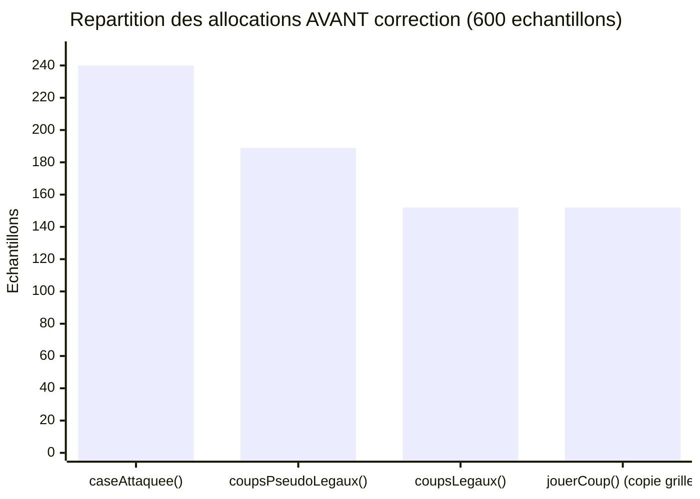
```mermaid
xychart-beta
    title "Repartition des allocations AVANT correction (600 echantillons)"
    x-axis ["caseAttaquee()", "coupsPseudoLegaux()", "coupsLegaux()", "jouerCoup() (copie grille)"]
    y-axis "Echantillons" 0 --> 250
    bar [240, 189, 152, 152]
```

**Deux corrections de nature différente** (une seule version du code, modifiée en place — pas de classe parallèle) :

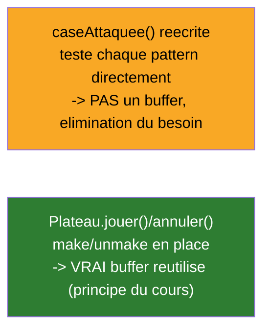
```mermaid
flowchart LR
    C1["caseAttaquee() reecrite\nteste chaque pattern directement\n-> PAS un buffer, elimination du besoin"]
    C2["Plateau.jouer()/annuler()\nmake/unmake en place\n-> VRAI buffer reutilise (principe du cours)"]

    style C1 fill:#f9a825,color:#000
    style C2 fill:#2e7d32,color:#fff
```

### Impact mesuré

```mermaid
xychart-beta
    title "Allocations et cycles GC : avant vs apres"
    x-axis ["Echantillons d'allocation", "Cycles Young GC"]
    y-axis "Nombre" 0 --> 600
    bar [600, 25]
    bar [120, 2]
```

| Mesure | Avant | Après | Facteur |
|---|---|---|---|
| Temps (Hyperfine, 5 essais) | 1,999 s ± 0,058 s | 475,3 ms ± 37,8 ms | **×4,2** |
| Échantillons d'allocation | 600 | 120 | ÷5 |
| Cycles Young GC | 25 | 2 | ÷12,5 |

Même coup trouvé (`b2b3`) avant/après, tests d'équivalence avec `Minimax` pur toujours au vert. Détails : [process/04-zero-allocation-caseattaquee-et-makeunmake.md](../process/04-zero-allocation-caseattaquee-et-makeunmake.md).

---

## 10. Étape 5 : Struct Padding / Alignement (JOL) — levier rattrapé

Vérification (jamais faite ici, alors qu'elle l'était sur HashBreaker) du layout mémoire réel de `Piece`, `Coup` et `Plateau.InfoAnnulation` — créés en masse pendant la recherche.

**Piège rencontré** : JOL refuse par défaut d'analyser les `record` Java (`UnsupportedOperationException: can't get field offset on a record class`) — contourné avec `-Djol.magicFieldOffset=true`.

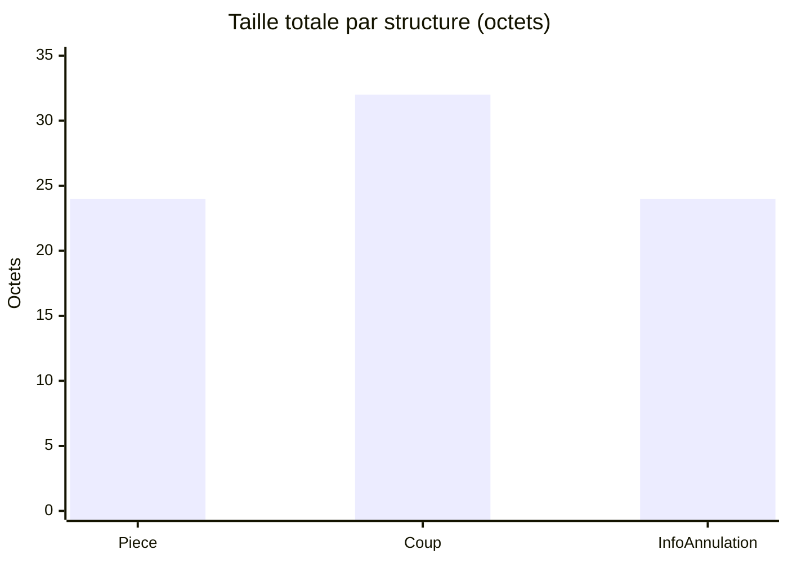
```mermaid
xychart-beta
    title "Taille totale par structure (octets)"
    x-axis ["Piece", "Coup", "InfoAnnulation"]
    y-axis "Octets" 0 --> 35
    bar [24, 32, 24]
```

| Structure | Taille | Padding |
|---|---|---|
| `Piece` (2 refs enum) | 24 octets | 4 octets (~16,7%) |
| `Coup` (4 int + 1 enum) | 32 octets | **0 octet** |
| `InfoAnnulation` (2 refs Piece) | 24 octets | 4 octets (~16,7%) |

**Conclusion : rien à corriger manuellement.** Le padding sur `Piece`/`InfoAnnulation` vient de l'arrondi obligatoire à 8 octets de la JVM (2 champs de 4B = 20B avec l'en-tête, arrondi à 24B) — pas d'un mauvais ordre de champs (aucun réordonnancement de 2 champs identiques ne change rien). Même conclusion que HashBreaker Séance 3, mais **vérifiée** sur des structures à composition différente, pas supposée par analogie. Détails : [process/05-struct-padding-jol.md](../process/05-struct-padding-jol.md).

---

## 11. Étape 6 : Pré-allocation de capacité (listes de `Coup`) — levier rattrapé

Application littérale de l'exemple J2_PM ("réallocations de slices") : `new ArrayList<>()` → capacité pré-dimensionnée, dans `GenerateurCoups.coupsLegaux()` (capacité **exacte** : `pseudoLegaux.size()`) et `coupsPseudoLegaux()` (capacité **estimée** : 48, documentée comme telle).

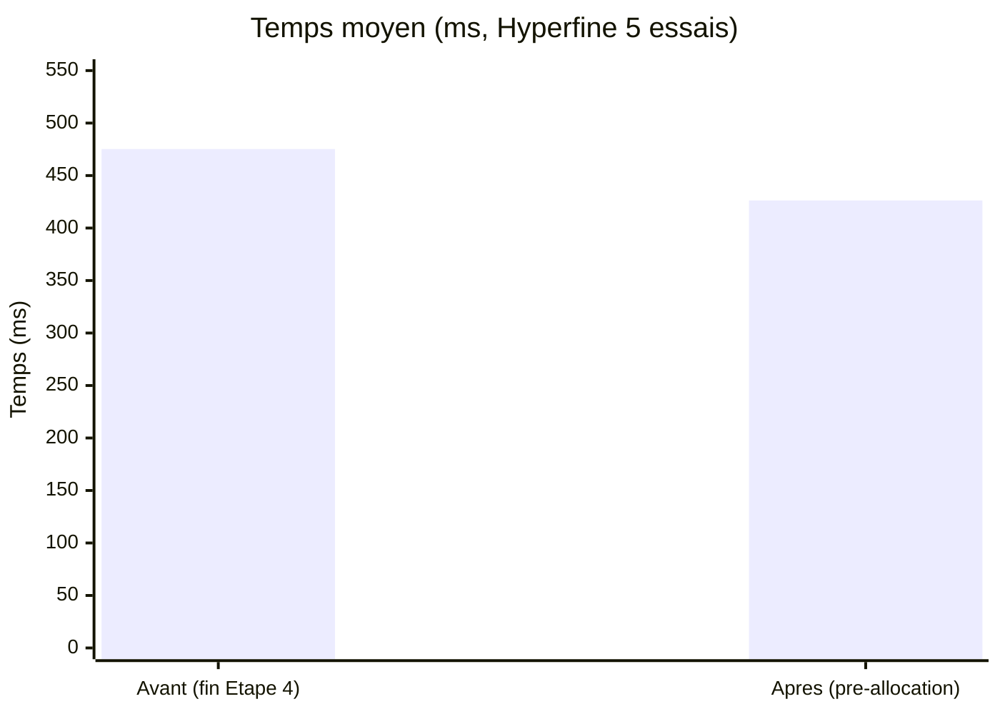
```mermaid
xychart-beta
    title "Temps moyen (ms, Hyperfine 5 essais)"
    x-axis ["Avant (fin Etape 4)", "Apres (pre-allocation)"]
    y-axis "Temps (ms)" 0 --> 550
    bar [475.3, 426.3]
```

| Mesure | Avant | Après | Facteur |
|---|---|---|---|
| Temps (Hyperfine) | 475,3 ms ± 37,8 ms | 426,3 ms ± 35,8 ms | **×1,11** |
| Échantillons d'allocation (JFR) | 120 | 120 | inchangé |

**Gain réel mais modeste, assumé honnêtement comme tel** — contrairement à `caseAttaquee()` (Étape 4, ×4,2) qui éliminait un vrai travail inutile, ce levier optimise un détail d'implémentation d'`ArrayList` (moins de petits tableaux internes recopiés, pas moins de volume total alloué — d'où l'absence de mouvement visible sur les échantillons JFR, sensibles au débit d'octets). Les intervalles ±1σ se chevauchent légèrement avec seulement 5 essais — pas une preuve aussi solide que les gains précédents. Détails : [process/06-preallocation-listes-coup.md](../process/06-preallocation-listes-coup.md).

---

## 12. Étape 7 : Profiling réel & Hot Path (Axe 2 du barème)

Premier vrai flamegraph CPU du projet — `DiagnosticProfilingReel` (profondeur 6, ~2,06 s, 645 199 positions) sous JFR (`settings=profile`), ~140 `jdk.ExecutionSample` capturés par run, agrégés par méthode (`jfr print --stack-depth 1`). **Reproductibilité vérifiée sur 3 runs** (le chiffre précis varie avec ~140 échantillons, mais le classement est stable).

```mermaid
xychart-beta
    title "Part du temps CPU par categorie, 3 runs (%)"
    x-axis ["Run 1", "Run 2", "Run 3"]
    y-axis "Pourcentage" 0 --> 80
    bar [58.6, 72.1, 62.3]
    bar [29.3, 20.2, 27.5]
    bar [8.6, 6.2, 8.7]
    bar [3.6, 1.6, 1.4]
```

| Catégorie | Fonctions | Part (3 runs) |
|---|---|---|
| Vérification de légalité | `caseAttaquee`, `attaqueGlissante` | **59-72 %** |
| Génération de coups | `coupsPseudoLegaux`, `coupsLegaux`, `genererCoups*` | **20-29 %** |
| Recherche / make-unmake | `alphabeta`, `Plateau.jouer/annuler` | **6-9 %** |
| Évaluation de position | `Evaluateur.evaluer/valeur` | **<4 %** |

**Résultat contre-intuitif** : l'évaluation de position ne pèse jamais plus de 4 % — le vrai goulot est `caseAttaquee()`, appelée à chaque coup candidat pour vérifier que le roi n'est pas en échec. Ça **valide a posteriori** le choix de l'Étape 4 (déjà réécrite en zéro-allocation sur la base d'un raisonnement structurel, confirmé ici par la mesure, et stable sur 3 runs). Piste ouverte pour une étape future : détection d'échec incrémentale plutôt que recalculée à chaque coup. Détails : [process/07-profiling-reel-hotpath.md](../process/07-profiling-reel-hotpath.md).

---

## 13. Étape 8 : Tri des coups (MVV-LVA) — macro-optimisation

Exploite directement le Hot Path mesuré à l'Étape 7 : la génération/légalité de coups (~90% du CPU) est proportionnelle au **nombre de positions visitées**. Le tri MVV-LVA (`MinimaxAlphaBeta.trierCoups()`) explore les captures avant les coups calmes, pour que les coupures alpha-beta arrivent plus tôt.

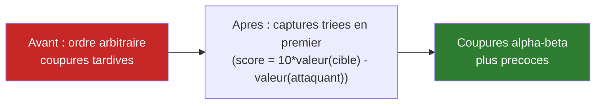
```mermaid
flowchart LR
    Avant["Avant : ordre arbitraire\ncoupures tardives"] --> Apres["Apres : captures triees en premier\n(score = 10*valeur(cible) - valeur(attaquant))"]
    Apres --> Coupe["Coupures alpha-beta\nplus precoces"]

    style Avant fill:#c62828,color:#fff
    style Coupe fill:#2e7d32,color:#fff
```

| Mesure | Avant | Après | Facteur |
|---|---|---|---|
| Positions évaluées | 41 554 | 25 319 | **−39 %** |
| Temps (Hyperfine) | 887,1 ms ± 43,0 ms | 709,8 ms ± 23,1 ms | **×1,25** |
| Échantillons d'allocation (JFR) | 120 | 132 | +10 % *(coût du tri lui-même)* |

**Écart positions vs temps** : −39% de positions mais seulement ×1,25 sur le temps — le tri lui-même a un coût (comparateur exécuté à chaque nœud), qui mange une partie du gain. Résultat honnête, pas gonflé : c'est un vrai levier macro (même famille que l'alpha-beta de l'Étape 2), mais son bénéfice net est amorti par son propre coût d'exécution. Détails : [process/08-tri-coups-move-ordering.md](../process/08-tri-coups-move-ordering.md).

---

## 14. Étape 9 : Recherche à budget de temps (Iterative Deepening) — macro-optimisation

`MinimaxAlphaBeta.meilleurCoupBudgetTemps()` : boucle sur des profondeurs croissantes jusqu'à épuisement d'un budget de temps, retourne le coup de la dernière profondeur **complètement terminée** (jamais un résultat partiel).

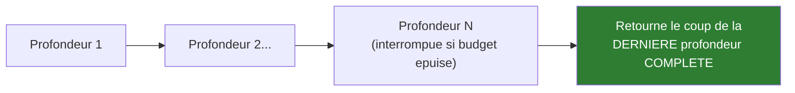
```mermaid
flowchart LR
    P1["Profondeur 1"] --> P2["Profondeur 2..."]
    P2 --> PN["Profondeur N\n(interrompue si budget epuise)"]
    PN --> R["Retourne le coup de la\nDERNIERE profondeur COMPLETE"]

    style R fill:#2e7d32,color:#fff
```

**Nature différente des leviers macro précédents** : Étapes 2 et 8 réduisaient le nombre de positions visitées. Celle-ci en **rajoute** (profondeurs 1 à N-1 refaites) — le gain n'est pas la vitesse, c'est une capacité nouvelle : répondre sous une vraie contrainte de temps.

| Budget | Profondeur atteinte | Coup |
|---|---|---|
| 200 ms | 4 | `b1c3` |
| 500-2000 ms | 5 *(profondeur 6 commencee mais jetee)* | `b2b3` |
| 5000 ms | 6 | `b1c3` |

**3 bugs corrigés avant que ce soit fiable** : deadline par défaut à 0 (interrompait tout appel direct à `meilleurCoup()`), deadline non réinitialisée après un budget (polluait l'appel suivant), et surtout — `Plateau` muté en place (Étape 4) risquant de rester corrompu si `annuler()` n'est pas protégé par `try/finally` lors d'une interruption en pleine récursion. Détails : [process/09-recherche-budget-temps.md](../process/09-recherche-budget-temps.md).

---

## 15. Fonctionnement des méthodes principales (état actuel du code)

### 15.1 `MinimaxAlphaBeta.meilleurCoup()` — point d'entrée de la recherche

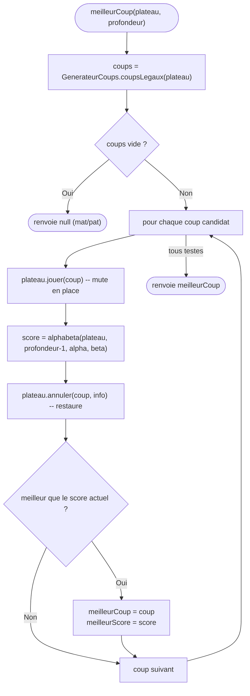
```mermaid
flowchart TD
    Start(["meilleurCoup(plateau, profondeur)"]) --> Coups["coups = GenerateurCoups.coupsLegaux(plateau)"]
    Coups --> Vide{"coups vide ?"}
    Vide -- "Oui" --> Null(["renvoie null (mat/pat)"])
    Vide -- "Non" --> Boucle["pour chaque coup candidat"]
    Boucle --> Jouer["plateau.jouer(coup) -- mute en place"]
    Jouer --> Rec["score = alphabeta(plateau, profondeur-1, alpha, beta)"]
    Rec --> Annuler["plateau.annuler(coup, info) -- restaure"]
    Annuler --> Compare{"meilleur que le score actuel ?"}
    Compare -- "Oui" --> MAJ["meilleurCoup = coup\nmeilleurScore = score"]
    Compare -- "Non" --> Suite["coup suivant"]
    MAJ --> Suite
    Suite --> Boucle
    Boucle -- "tous testes" --> Fin(["renvoie meilleurCoup"])
```

Pas de coupure à la racine (il faut comparer tous les coups candidats), mais `alpha`/`beta` se resserrent à chaque coup testé.

### 15.2 `MinimaxAlphaBeta.alphabeta()` — le cœur récursif avec élagage

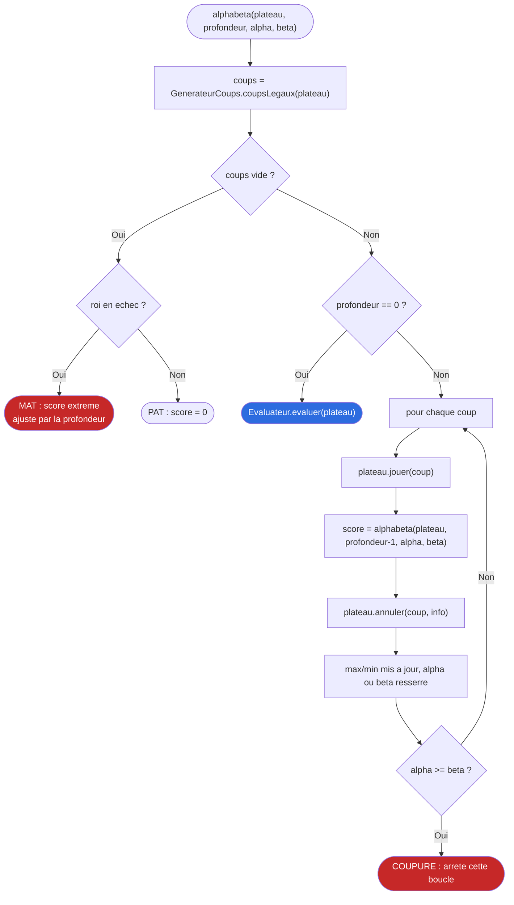
```mermaid
flowchart TD
    Start(["alphabeta(plateau, profondeur, alpha, beta)"]) --> Coups["coups = GenerateurCoups.coupsLegaux(plateau)"]
    Coups --> Terminal{"coups vide ?"}
    Terminal -- "Oui" --> Echec{"roi en echec ?"}
    Echec -- "Oui" --> Mat(["MAT : score extreme\najuste par la profondeur"])
    Echec -- "Non" --> Pat(["PAT : score = 0"])
    Terminal -- "Non" --> Prof{"profondeur == 0 ?"}
    Prof -- "Oui" --> Eval(["Evaluateur.evaluer(plateau)"])
    Prof -- "Non" --> Boucle["pour chaque coup"]
    Boucle --> Jouer["plateau.jouer(coup)"]
    Jouer --> RecAppel["score = alphabeta(plateau, profondeur-1, alpha, beta)"]
    RecAppel --> Annuler["plateau.annuler(coup, info)"]
    Annuler --> MAJBornes["max/min mis a jour, alpha ou beta resserre"]
    MAJBornes --> Coupe{"alpha >= beta ?"}
    Coupe -- "Oui" --> Break(["COUPURE : arrete cette boucle"])
    Coupe -- "Non" --> Boucle

    style Mat fill:#c62828,color:#fff
    style Break fill:#c62828,color:#fff
    style Eval fill:#2d6cdf,color:#fff
```

Même fonction pour BLANC (maximise) et NOIR (minimise) selon `plateau.trait()` — diagramme simplifié en un seul chemin, le code a deux branches symétriques (`Math.max`/`alpha` vs `Math.min`/`beta`).

### 15.3 `GenerateurCoups.coupsLegaux()` — filtrage pseudo-légal → légal

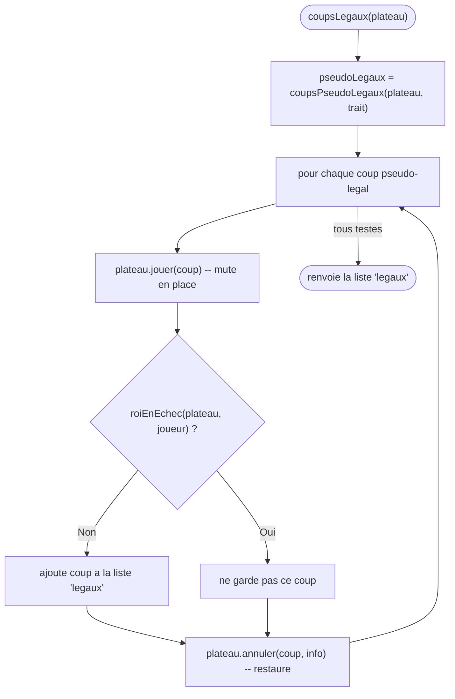
```mermaid
flowchart TD
    Start(["coupsLegaux(plateau)"]) --> Pseudo["pseudoLegaux = coupsPseudoLegaux(plateau, trait)"]
    Pseudo --> Boucle["pour chaque coup pseudo-legal"]
    Boucle --> Jouer["plateau.jouer(coup) -- mute en place"]
    Jouer --> Check{"roiEnEchec(plateau, joueur) ?"}
    Check -- "Non" --> Ajoute["ajoute coup a la liste 'legaux'"]
    Check -- "Oui" --> Skip["ne garde pas ce coup"]
    Ajoute --> Annuler["plateau.annuler(coup, info) -- restaure"]
    Skip --> Annuler
    Annuler --> Boucle
    Boucle -- "tous testes" --> Fin(["renvoie la liste 'legaux'"])
```

Chaque coup pseudo-légal est essayé puis annulé sur la même instance de plateau (make/unmake) — plus aucune copie de grille ici depuis l'Étape 4.

### 15.4 `GenerateurCoups.caseAttaquee()` — détection directe (réécrite à l'Étape 4)

```mermaid
flowchart TD
    Start(["caseAttaquee(plateau, ligne, colonne, parCouleur)"]) --> P{"un pion parCouleur\nen diagonale arriere ?"}
    P -- "Oui" --> True(["true"])
    P -- "Non" --> C{"un cavalier parCouleur\na un saut en L ?"}
    C -- "Oui" --> True
    C -- "Non" --> R{"un roi parCouleur\nadjacent ?"}
    R -- "Oui" --> True
    R -- "Non" --> F{"un fou/dame parCouleur\nen diagonale, rien entre les deux ?"}
    F -- "Oui" --> True
    F -- "Non" --> T{"une tour/dame parCouleur\nen ligne/colonne, rien entre les deux ?"}
    T -- "Oui" --> True
    T -- "Non" --> False(["false"])

    style True fill:#2e7d32,color:#fff
    style False fill:#9e9e9e,color:#fff
```

Chaque test regarde directement les cases pertinentes (aucune liste de coups générée) — la correction qui a fait passer les allocations de 600 à 120 échantillons (Étape 4).

### 15.5 `Plateau.jouer()` / `annuler()` — le mécanisme make/unmake

```mermaid
sequenceDiagram
    participant Appelant
    participant Plateau

    Appelant->>Plateau: jouer(coup)
    Note over Plateau: sauvegarde piece d'origine + piece capturee<br/>dans un InfoAnnulation (petit record)
    Plateau->>Plateau: deplace la piece, mute la grille EN PLACE
    Plateau-->>Appelant: InfoAnnulation

    Note over Appelant: ... exploration recursive sur CE MEME plateau ...

    Appelant->>Plateau: annuler(coup, info)
    Plateau->>Plateau: remet piece d'origine en case depart,<br/>piece capturee (ou vide) en case arrivee
    Note over Plateau: plateau EXACTEMENT comme avant jouer()
```

Une seule instance de `Plateau` traverse tout l'arbre de recherche — c'est le "buffer réutilisé" de l'Étape 4, l'équivalent échecs du `[8]byte` du cours.

### 15.6 `GenerateurCoups.coupsPseudoLegaux()` — génération brute, par type de pièce

```mermaid
flowchart TD
    Start(["coupsPseudoLegaux(plateau, couleur)"]) --> Boucle["pour chaque case (ligne, colonne) du plateau (0..7 x 0..7)"]
    Boucle --> Piece{"piece presente\net de la bonne couleur ?"}
    Piece -- "Non" --> Boucle
    Piece -- "Oui" --> Type{"quel type ?"}
    Type -- "PION" --> Pion["genererCoupsPion(...)"]
    Type -- "CAVALIER" --> Saut1["genererCoupsSauts(..., SAUTS_CAVALIER)"]
    Type -- "ROI" --> Saut2["genererCoupsSauts(..., DIRECTIONS_DAME_ROI)"]
    Type -- "FOU" --> Gliss1["genererCoupsGlissants(..., DIRECTIONS_FOU)"]
    Type -- "TOUR" --> Gliss2["genererCoupsGlissants(..., DIRECTIONS_TOUR)"]
    Type -- "DAME" --> Gliss3["genererCoupsGlissants(..., DIRECTIONS_DAME_ROI)"]
    Pion --> Boucle
    Saut1 --> Boucle
    Saut2 --> Boucle
    Gliss1 --> Boucle
    Gliss2 --> Boucle
    Gliss3 --> Boucle
    Boucle -- "64 cases balayees" --> Fin(["renvoie la liste 'coups' remplie"])
```

Balaie les 64 cases une seule fois, délègue par type de pièce — pas encore optimisé (candidat naturel pour les bitboards, Étape 3, une fois intégrés).

### 15.7 `GenerateurCoups.genererCoupsPion()` — le cas le plus riche en règles

```mermaid
flowchart TD
    Start(["genererCoupsPion(plateau, ligne, colonne, couleur)"]) --> Avance{"case juste devant\nest vide ?"}
    Avance -- "Non" --> Captures
    Avance -- "Oui" --> Ajoute1["ajoute avance simple\n(+ promotion si derniere rangee)"]
    Ajoute1 --> RangeeDepart{"sur la rangee de depart\nET case 2 devant vide ?"}
    RangeeDepart -- "Oui" --> Ajoute2["ajoute avance double"]
    RangeeDepart -- "Non" --> Captures
    Ajoute2 --> Captures["pour chaque diagonale (gauche, droite)"]
    Captures --> Cible{"piece adverse presente\nen diagonale ?"}
    Cible -- "Oui" --> Ajoute3["ajoute capture\n(+ promotion si derniere rangee)"]
    Cible -- "Non" --> Fin(["fin"])
    Ajoute3 --> Fin
```

Seule méthode qui gère la promotion (auto-Dame) et l'avance double conditionnelle — cohérent avec la simplification actée (pas de prise en passant).

### 15.8 `GenerateurCoups.genererCoupsGlissants()` — fou/tour/dame (rayons)

```mermaid
flowchart TD
    Start(["genererCoupsGlissants(plateau, ligne, colonne, couleur, directions)"]) --> Dir["pour chaque direction de la liste"]
    Dir --> Avance["avance d'une case dans cette direction"]
    Avance --> Bord{"toujours dans le plateau ?"}
    Bord -- "Non" --> Dir
    Bord -- "Oui" --> Case{"case vide ?"}
    Case -- "Oui" --> Ajoute["ajoute ce coup, continue a glisser"]
    Ajoute --> Avance
    Case -- "Non" --> Couleur{"piece adverse ?"}
    Couleur -- "Oui" --> AjouteCapture["ajoute la capture, ARRETE cette direction"]
    Couleur -- "Non (alliee)" --> Stop["ARRETE cette direction, rien ajoute"]
    AjouteCapture --> Dir
    Stop --> Dir
    Dir -- "toutes directions testees" --> Fin(["fin"])
```

Exactement le même schéma sert au cavalier/roi (`genererCoupsSauts`), mais sans la boucle "continue à glisser" — un seul pas par direction, pas de rayon.

### 15.9 `Evaluateur.evaluer()` — score matériel

```mermaid
flowchart TD
    Start(["evaluer(plateau)"]) --> Init["score = 0"]
    Init --> Boucle["pour chaque case (ligne, colonne) du plateau"]
    Boucle --> Vide{"case vide ?"}
    Vide -- "Oui" --> Boucle
    Vide -- "Non" --> Val["valeur = table(type)\nPion=100, Cavalier=320, Fou=330,\nTour=500, Dame=900, Roi=0"]
    Val --> Signe{"couleur == BLANC ?"}
    Signe -- "Oui" --> Plus["score += valeur"]
    Signe -- "Non" --> Moins["score -= valeur"]
    Plus --> Boucle
    Moins --> Boucle
    Boucle -- "64 cases balayees" --> Fin(["renvoie score\n(positif = avantage Blancs)"])
```

Volontairement simple (V1) : aucune table de position, aucun bonus structurel — c'est le score utilisé par `alphabeta()` aux nœuds terminaux.

---

## 16. Où on en est

```mermaid
flowchart LR
    A["✅ Architecture par packages\n(modele/regles/evaluation/recherche)"] --> B["✅ Algorithme naif\n(Minimax complet, sans elagage)"]
    B --> C["✅ Validation\n(perft=20, mat du fou)"]
    C --> D["✅ Baseline mesuree\n(~22-24K positions/s)"]
    D --> E["✅ Elagage Alpha-Beta (macro)\n÷145,9 positions a profondeur 4"]
    E --> EE["✅ Localite memoire (micro)\nBitboards : x1,3"]
    EE --> ZA["✅ Zero-allocation (micro)\ncaseAttaquee directe + make/unmake\nx4,2, allocations ÷5"]
    ZA --> SP["✅ Struct padding (JOL)\nverifie : rien a corriger\n(Coup=0 perte, Piece/InfoAnnulation=4B incompressibles)"]
    SP --> PA["✅ Pre-allocation capacite\n(listes de Coup) : x1,11"]
    PA --> PR["✅ Profiling reel (Flamegraph)\ncaseAttaquee=59-72% CPU (3 runs),\nevaluation<4% (valide Etape 4)"]
    PR --> TC["✅ Tri des coups (MVV-LVA, macro)\npositions -39%, temps x1,25"]
    TC --> BT["✅ Budget de temps (macro, iterative deepening)\nprofondeur adaptative, jamais de resultat partiel"]
    BT --> F["⬜ Prochains leviers :\ntable de transposition,\nworkers, I/O & persistance"]

    style A fill:#2e7d32,color:#fff
    style B fill:#2e7d32,color:#fff
    style C fill:#2e7d32,color:#fff
    style D fill:#2e7d32,color:#fff
    style EE fill:#2e7d32,color:#fff
    style E fill:#2e7d32,color:#fff
    style ZA fill:#2e7d32,color:#fff
    style SP fill:#2e7d32,color:#fff
    style PA fill:#2e7d32,color:#fff
    style PR fill:#2e7d32,color:#fff
    style TC fill:#2e7d32,color:#fff
    style BT fill:#2e7d32,color:#fff
    style F fill:#9e9e9e,color:#fff
```
