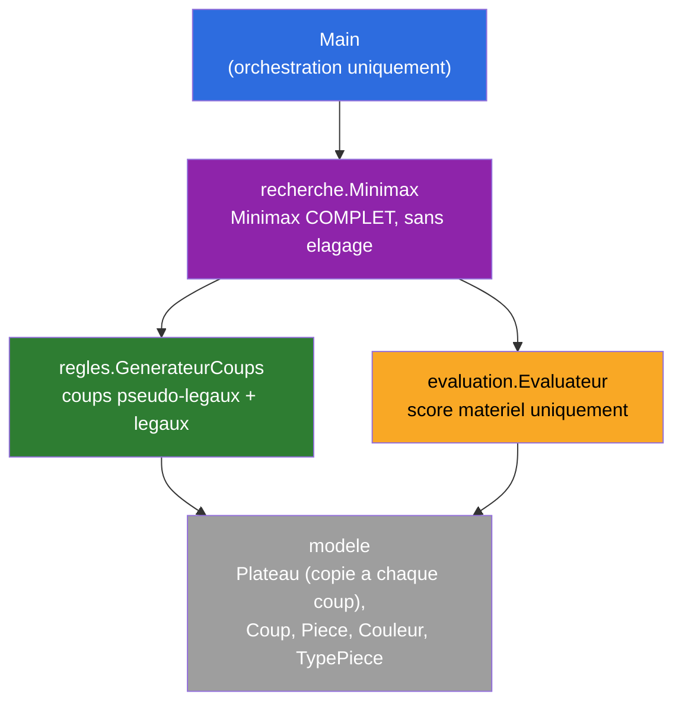
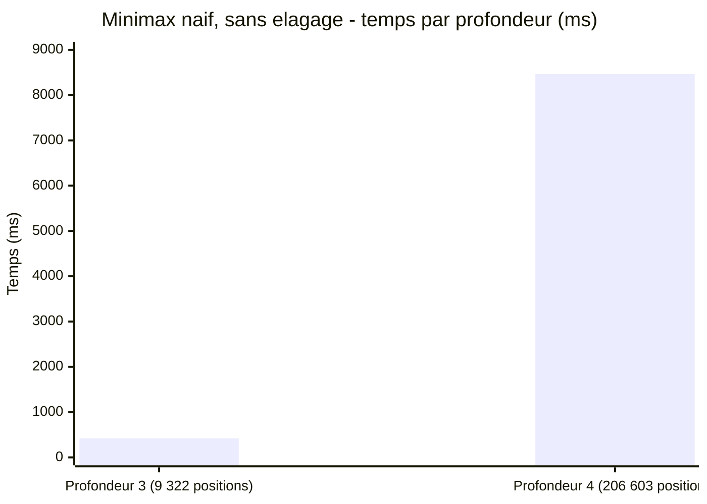

# Synthèse — Architecture & Algorithme Naïf (V1)

## En une phrase

Un moteur d'échecs correct et mesurable (Minimax complet, sans élagage), structuré en packages dès le départ pour que chaque futur levier d'optimisation touche un seul endroit du code — pas un `Main.java` monolithique comme au tout début de HashBreaker.

## État du système à cette étape

**Ce qui caractérise cet état** : aucun levier d'optimisation appliqué. Minimax explore l'intégralité de l'arbre des coups à chaque profondeur (aucune branche coupée), le plateau est recopié intégralement à chaque coup testé, et l'évaluation ne regarde que le matériel.

## Optimisation appliquée à cette étape

Aucune — c'est la baseline de référence (`Make it work` avant `Make it fast`, même principe que la Séance 1 de HashBreaker). Toutes les étapes suivantes se compareront à celle-ci.

## Les 4 idées à retenir

### 1. L'architecture conditionne la facilité des optimisations futures

`modele` / `regles` / `evaluation` / `recherche` séparés : le futur passage aux bitboards ne touchera que `Plateau` et `GenerateurCoups`, le futur élagage alpha-beta ne touchera que `Minimax`, la future table de transposition s'ajoutera en périphérie de `Minimax` sans le réécrire. C'est un investissement qui se rentabilise à chaque étape suivante.

### 2. Coups légaux = coups pseudo-légaux filtrés par la règle "mon roi ne doit pas être en échec après"

Pas besoin de logique spécifique pour empêcher le roi de "bouger dans une case attaquée" ou pour détecter les clouages : **rejouer chaque coup pseudo-légal et vérifier après coup si son propre roi est en échec** couvre tous les cas d'un seul mécanisme, y compris les coups du roi lui-même.

### 3. Le score de mat doit être ajusté par la profondeur restante

Sans cet ajustement, Minimax ne distinguerait pas un "mat en 1 coup" d'un "mat en 3 coups" — les deux auraient le même score extrême. En ajoutant la profondeur restante au score, le moteur préfère naturellement le mat le plus rapide.

### 4. Deux vérifications suffisent à valider un générateur de coups

- **`perft(1) == 20`** depuis la position de départ : le sanity-check standard de l'industrie des moteurs d'échecs.
- **Un vrai scénario de mat rejouable** (ici le "mat du fou", le plus court possible) : valide simultanément la détection d'échec ET l'absence de coups légaux en position terminale.

## Résultats mesurés (baseline — référence pour toutes les étapes futures)

| Profondeur | Positions évaluées | Temps | Débit |
|---|---|---|---|
| 3 | 9 322 | 421 ms | ~22 142 positions/s |
| 4 | 206 603 | 8 465 ms | ~24 406 positions/s |

> **Cette baseline sert de référence pour les micro-optimisations** (localité mémoire, zéro-allocation — même travail, exécuté plus vite). Elle ne sera **plus la référence directe** une fois l'élagage alpha-beta introduit (Étape 2) : l'alpha-beta explore un nombre de positions différent, pas juste plus vite — voir la nuance macro vs micro expliquée dans la synthèse de l'Étape 2.

## Simplifications actées (à ne pas oublier de lever plus tard si besoin)

- Pas de roque, pas de prise en passant.
- Promotion automatique en Dame (pas de sous-promotion).
- Plateau copié à chaque coup (pas de make/unmake) — candidat naturel pour le futur levier zéro-allocation.
- Évaluation matérielle uniquement — aucune heuristique positionnelle.

## Pour aller plus loin

- Détail technique complet : [process/01-architecture-et-algorithme-naif.md](../process/01-architecture-et-algorithme-naif.md)
- Vue d'ensemble et build : [README.md](../README.md)
