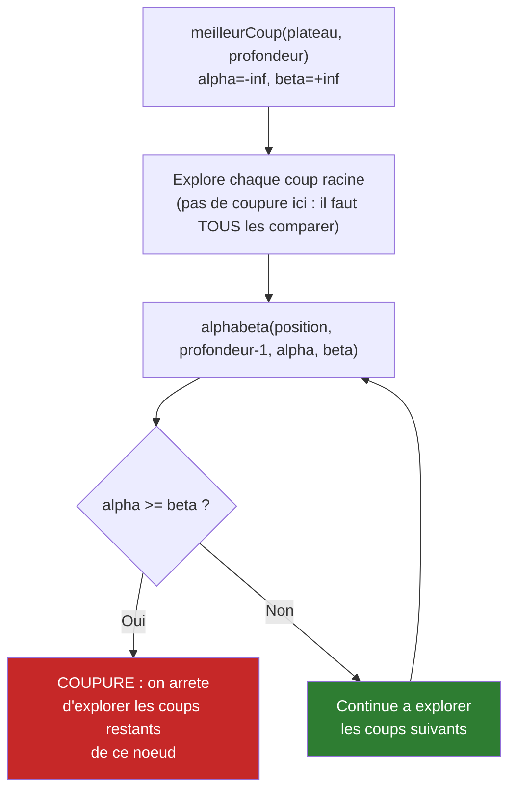
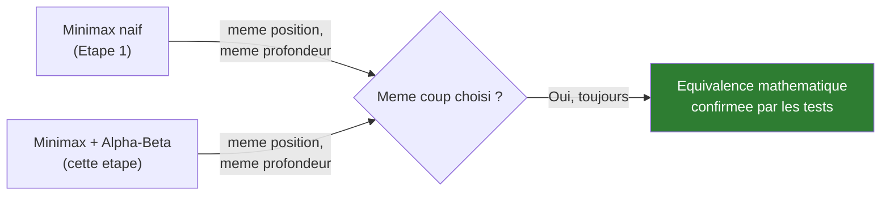

# Synthèse — Élagage Alpha-Beta (Macro-optimisation)

## En une phrase

Une macro-optimisation (changement algorithmique, pas juste une exécution plus rapide) qui réduit le nombre de positions visitées d'un facteur ×146 à profondeur 4, tout en garantissant mathématiquement le même résultat que le Minimax naïf — validé par des tests d'équivalence, pas juste supposé.

## État du système à cette étape

**Ce qui change par rapport à l'Étape 1** : l'algorithme n'est plus le même Minimax exhaustif — il élague des branches entières dès qu'il peut prouver qu'elles ne changeront pas la décision finale, sans jamais perdre en exactitude (contrairement à une heuristique qui accepterait un risque d'erreur).

## Optimisation appliquée

**Élagage alpha-beta** : deux bornes (`alpha` = meilleur score garanti pour les Blancs, `beta` = meilleur score garanti pour les Noirs) se resserrent au fur et à mesure de l'exploration. Dès qu'une branche ne peut plus améliorer ni l'un ni l'autre, elle est coupée — l'adversaire a de toute façon déjà une meilleure option ailleurs dans l'arbre.

**Pourquoi ce levier avant les micro-optimisations** : c'est le facteur dominant sur un moteur d'échecs (explosion combinatoire de l'arbre), exactement le même raisonnement que la loi d'Amdahl vue en Séance 2 de HashBreaker — inutile d'accélérer l'exécution d'un travail qu'on peut simplement éviter de faire.

## Preuve d'équivalence (pas juste un gain de vitesse)

5 tests dédiés (`MinimaxAlphaBetaTest`), dont deux vérifient explicitement que le coup choisi est **identique** à celui de `Minimax` sur plusieurs positions — l'élagage ne doit jamais changer la décision, seulement l'accélérer.

## Impact mesuré — comparaison directe contre l'Étape 1

```mermaid
xychart-beta
    title "Positions evaluees par profondeur (echelle log approximative via barres)"
    x-axis ["Profondeur 3", "Profondeur 4"]
    y-axis "Positions evaluees" 0 --> 210000
    bar [9322, 206603]
    bar [585, 1416]
```

*(première série = Minimax naïf, deuxième série = Alpha-Beta — noter l'écart, la deuxième barre est presque invisible à cette échelle, c'est le point)*

| Profondeur | Naïf (positions / temps) | Alpha-Beta (positions / temps) | Facteur |
|---|---|---|---|
| 3 | 9 322 / 437 ms | 585 / 22 ms | ÷15,9 positions, ÷19,9 temps |
| 4 | 206 603 / 8 791 ms | 1 416 / 53 ms | ÷145,9 positions, ÷165,9 temps |

**Même coup trouvé dans tous les cas (`b1c3`)** — le gain est "gratuit", sans compromis sur la qualité de la décision.

## Ce que ce gain débloque

Des profondeurs jusque-là hors de portée deviennent explorables en quelques secondes :

| Profondeur | Positions évaluées | Temps |
|---|---|---|
| 5 | 41 554 | 1 830 ms |
| 6 | 645 199 | 29 185 ms |

Le Minimax naïf à ces profondeurs prendrait probablement plusieurs minutes (profondeur 5) à plusieurs heures (profondeur 6) — non mesuré, hors de portée pratique sans cet élagage.

## Limite assumée (levier futur possible)

Aucun tri des coups (*move ordering*) — l'ordre exploré est celui du scan du plateau, pas optimisé pour maximiser les coupures. Un tri intelligent (ex : tester les captures en premier) rapprocherait encore plus la complexité de la borne théorique O(b^(d/2)).

## Pour aller plus loin

- Détail technique complet : [process/02-elagage-alpha-beta.md](../process/02-elagage-alpha-beta.md)
- Étape précédente (baseline) : [01-architecture-naive.md](01-architecture-naive.md)
