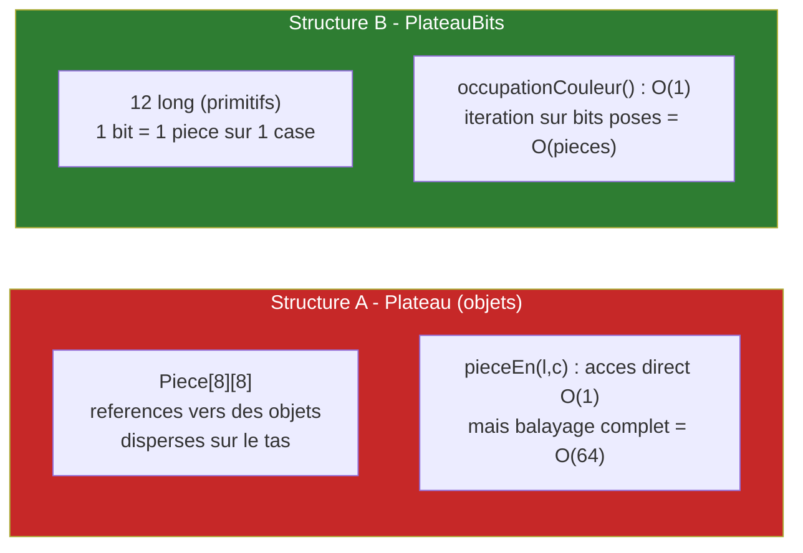
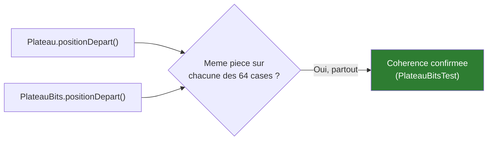
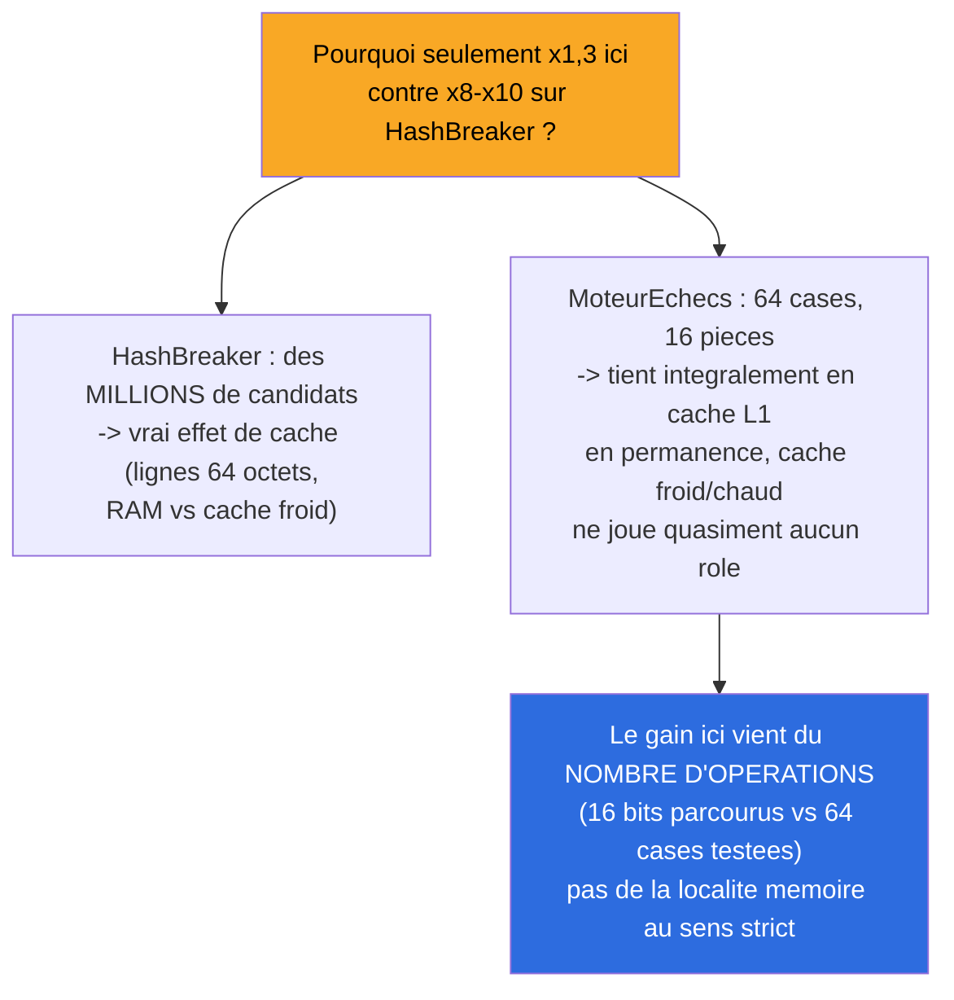

# Synthèse — Localité Mémoire : Bitboards (Micro-optimisation)

## En une phrase

Un gain réel mais modeste (~×1,3), et surtout une découverte méthodologique : contrairement à HashBreaker Séance 2, ce n'est pas la localité de cache qui explique le gain ici (le plateau est trop petit pour que ça joue), mais le nombre d'opérations exécutées — un mécanisme différent qu'on n'a découvert qu'en mesurant, pas en supposant.

## État du système à cette étape

## Optimisation appliquée

Remplacer la grille d'objets par des **bitboards** (12 `long`) pour l'opération "quelles cases sont occupées par telle couleur", cœur de tout générateur de coups. Choix délibéré de **ne pas** comparer une simple lecture de case (`pieceEn`) — c'est une des rares opérations où un tableau d'objets reste compétitif ; le vrai avantage des bitboards apparaît sur les opérations d'ensemble (unions, popcount, itération sur les bits posés).

## Validation de cohérence

35/35 tests passent (11 nouveaux), dont un test croisé case par case entre les deux représentations.

## Impact mesuré

```mermaid
xychart-beta
    title "Temps par essai (ms, 500 000 repetitions)"
    x-axis ["Essai 1", "Essai 2", "Essai 3", "Essai 4", "Essai 5"]
    y-axis "Temps (ms)" 0 --> 30
    bar [26, 19, 15, 15, 16]
    bar [19, 14, 17, 10, 9]
```

*(première série = grille d'objets, deuxième série = bitboards)*

| Structure | Moyenne (5 essais) |
|---|---|
| Grille d'objets | ~18,2 ms |
| Bitboards | ~13,8 ms |

**Gain : ~×1,3**, checksums identiques (60 000 000) — même résultat, calculé plus vite.

## Découverte méthodologique — pourquoi le gain est si différent de HashBreaker

**Leçon à retenir** : un levier qui a fonctionné sur un projet ne fonctionne pas forcément pour la même raison sur un autre projet — ici "bitboards" reste un vrai gain, mais le mécanisme sous-jacent est différent de celui de HashBreaker Séance 2, et seule la mesure l'a révélé.

## Ce qui n'est pas encore fait

`PlateauBits` n'est **pas intégré** à `GenerateurCoups`/`MinimaxAlphaBeta` (qui utilisent toujours `Plateau`) — cette étape mesure l'accès pur, l'intégration dans le vrai algorithme est un chantier plus large laissé pour plus tard, même prudence que HashBreaker Séance 2 (mesure pure d'abord, impact sur le workload réel ensuite).

## Pour aller plus loin

- Détail technique complet : [process/03-localite-memoire-bitboards.md](../process/03-localite-memoire-bitboards.md)
- Étape précédente : [02-elagage-alpha-beta.md](02-elagage-alpha-beta.md)
