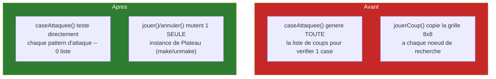
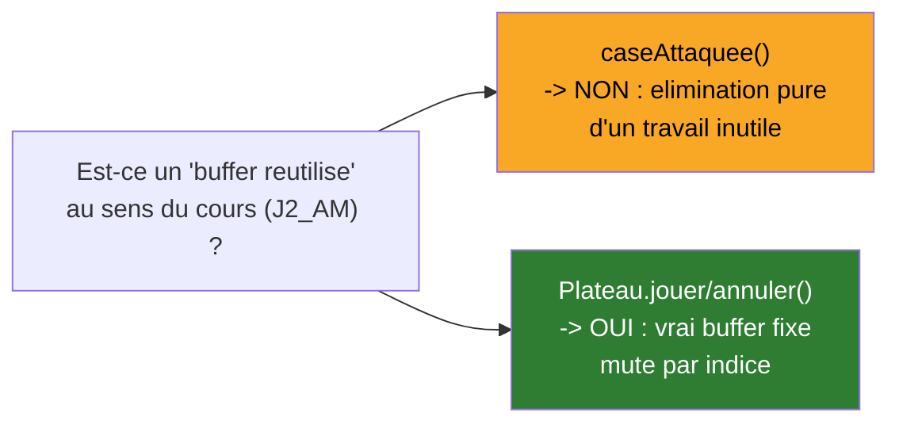
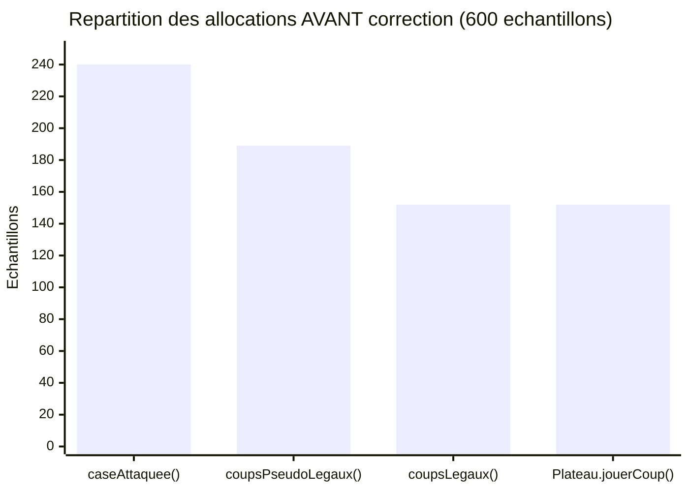

# Synthèse — Zéro-Allocation : `caseAttaquee()` directe + Make/Unmake

## En une phrase

Un diagnostic JFR a révélé que le vrai coupable n'était pas la copie de plateau supposée au départ, mais une fonction censée répondre à une simple question oui/non qui régénérait toute la liste des coups pour y répondre — corriger ça, plus passer la recherche en make/unmake, a divisé le temps par 4,2 et les allocations par 5.

## État du système à cette étape

## Deux corrections, deux natures différentes (important de bien distinguer)

**`caseAttaquee()`** ne "réutilise" rien — elle n'a simplement plus besoin d'allouer quoi que ce soit pour répondre à sa question. **`Plateau.jouer()/annuler()`** est en revanche l'application littérale du principe du cours : une seule structure mutable, réutilisée pour tout l'arbre de recherche, mutée par indice au lieu d'être recopiée.

## Diagnostic qui a guidé la correction

Le coupable principal (`caseAttaquee()`, ~40%) n'était **pas** celui supposé au départ (la copie de grille) — 4ème fois sur ce projet que la mesure contredit l'intuition de départ.

## Impact mesuré

### Allocations (JFR)

```mermaid
xychart-beta
    title "Avant vs Apres (profondeur 5, meme position)"
    x-axis ["Echantillons d'allocation", "Cycles Young GC"]
    y-axis "Nombre" 0 --> 600
    bar [600, 25]
    bar [120, 2]
```

*(première série = avant, deuxième = après — ÷5 sur les allocations, ÷12,5 sur les cycles GC)*

### Temps (Hyperfine, 5 essais)

| Mesure | Avant | Après | Facteur |
|---|---|---|---|
| Temps moyen | 1,999 s ± 0,058 s | 475,3 ms ± 37,8 ms | **×4,2** |

Même coup trouvé (`b2b3`) avant et après — confirmé par JFR et par les tests d'équivalence avec `Minimax` pur (inchangés, toujours au vert).

## Décision de conception : une seule version du code

Contrairement à HashBreaker (classes parallèles par séance), `Plateau`/`GenerateurCoups`/`MinimaxAlphaBeta` sont modifiés **en place** — pas de duplication à maintenir. La comparaison avant/après vit dans les mesures prises juste avant modification (conservées dans `profiling/`), pas dans du code dupliqué. Choix fait en vue d'un dépôt Git propre pour la remise du projet noté.

## Ce qui reste pour plus tard

Les listes de `Coup` (`new ArrayList<>()` à chaque génération) ne sont pas encore réutilisées — `Coup` reste le premier allocateur après correction (42/120 échantillons, 35%). Troisième et dernier levier "buffer réutilisé" identifié, reporté pour une étape future.

## Pour aller plus loin

- Détail technique complet : [process/04-zero-allocation-caseattaquee-et-makeunmake.md](../process/04-zero-allocation-caseattaquee-et-makeunmake.md)
- Étape précédente : [03-localite-memoire-bitboards.md](03-localite-memoire-bitboards.md)
