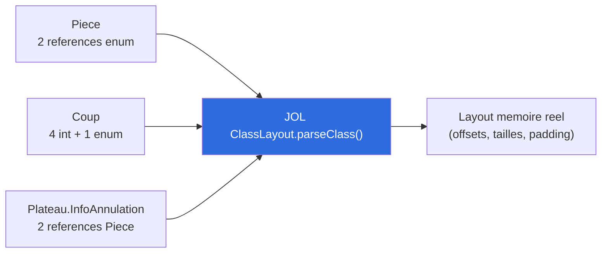
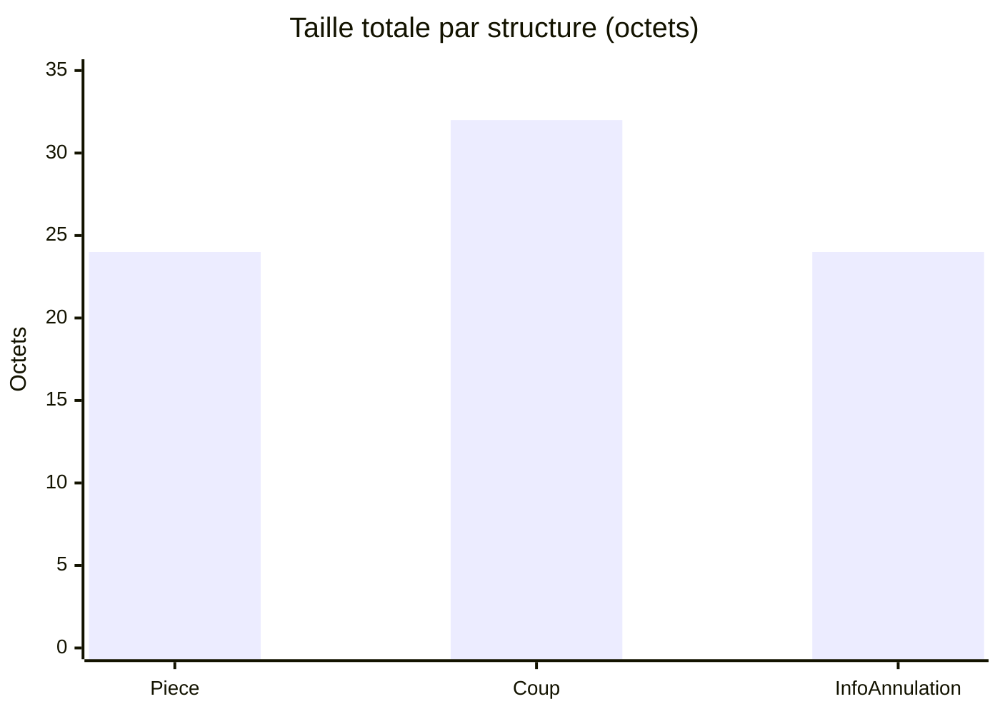
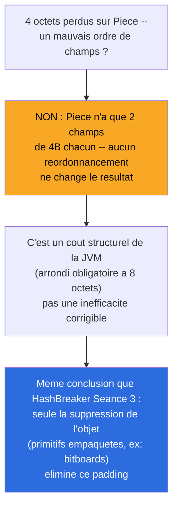

# Synthèse — Struct Padding / Alignement (JOL), un levier manqué rattrapé

## En une phrase

Un levier du cours oublié en cours de route (vérifié sur HashBreaker, jamais refait ici) a été rattrapé — résultat : aucun gain manuel possible (comme sur HashBreaker), mais confirmé par la mesure et non supposé par analogie, avec un piège technique inédit découvert au passage (JOL et les `record` Java).

## État du système à cette étape



## Piège technique découvert : JOL bloque sur les `record`

```
UnsupportedOperationException: can't get field offset on a record class
```

Les `record` Java (utilisés partout dans ce projet : `Piece`, `Coup`, `InfoAnnulation`) sont protégés par la JVM contre l'introspection d'offset via `Unsafe` — une restriction liée aux garanties d'immuabilité des records. HashBreaker n'avait jamais rencontré ce problème car ses structures testées (`CandidateBad`/`CandidateGood`) étaient des `class` classiques. Contournement : `-Djol.magicFieldOffset=true`.

## Résultat mesuré



| Structure | Taille | Padding perdu |
|---|---|---|
| `Piece` | 24 octets | 4 octets (~16,7%) |
| `Coup` | 32 octets | **0 octet** |
| `InfoAnnulation` | 24 octets | 4 octets (~16,7%) |

## Interprétation



`Coup` (32 octets) tombe exactement sur un multiple de 8 — zéro perte. `Piece` et `InfoAnnulation` (20 octets utiles) doivent être arrondis à 24 — 4 octets incompressibles, indépendants de l'ordre de déclaration.

## Conclusion : rien à corriger manuellement, mais vérifié, pas supposé

**Différence importante avec un simple "copier-coller" de la conclusion HashBreaker** : la composition de champs de nos structures (`int`/enum) est différente de l'exemple HashBreaker (`boolean`/`long`/`byte`/`String`) — le même résultat ("rien à optimiser") aurait pu ne pas se reproduire. Vérifier plutôt que supposer, une fois de plus la règle qui traverse tout ce projet.

## Pour aller plus loin

- Détail technique complet : [process/05-struct-padding-jol.md](../process/05-struct-padding-jol.md)
- Étape précédente : [04-zero-allocation.md](04-zero-allocation.md)
