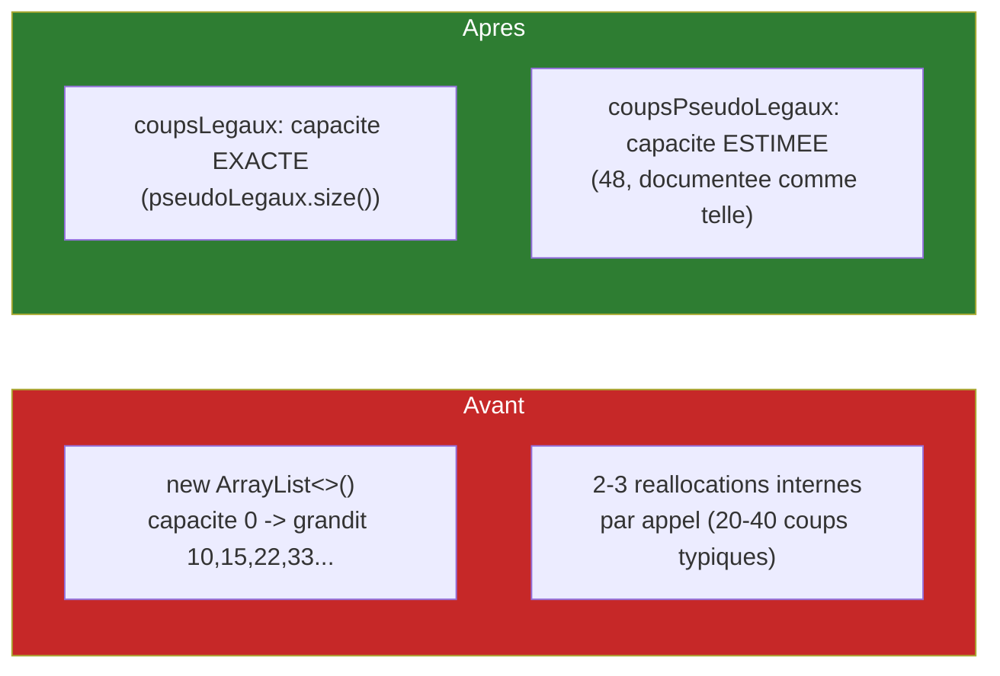
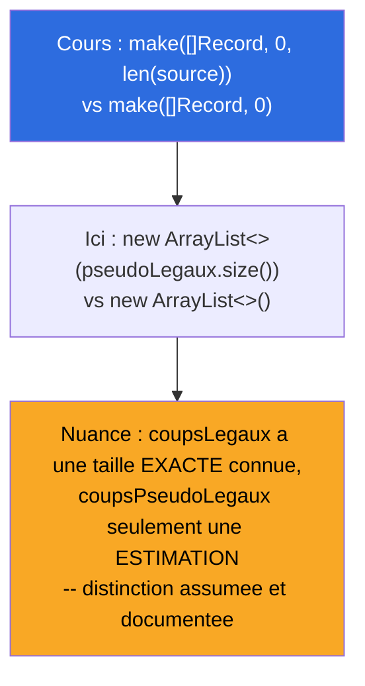
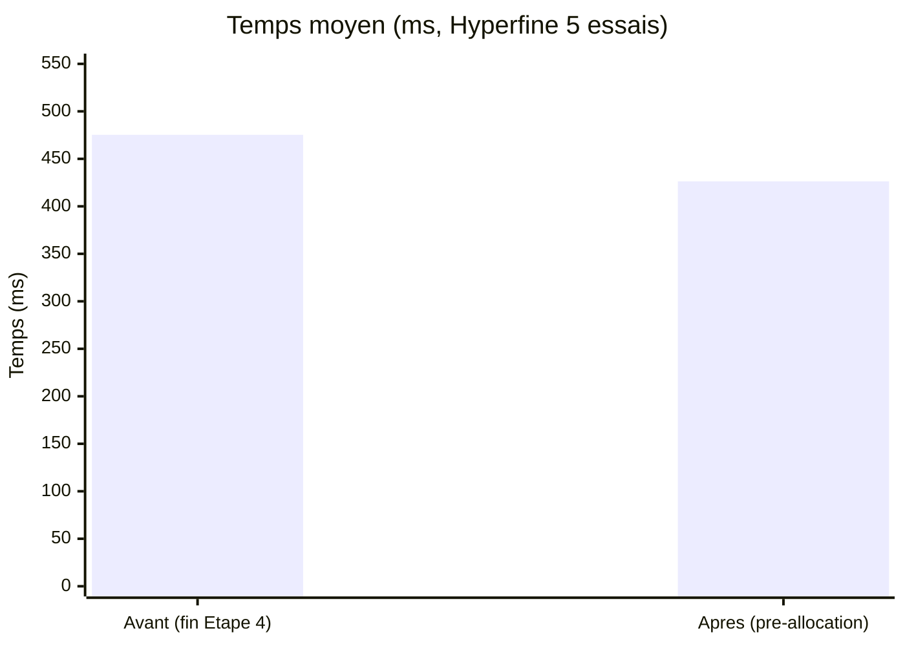
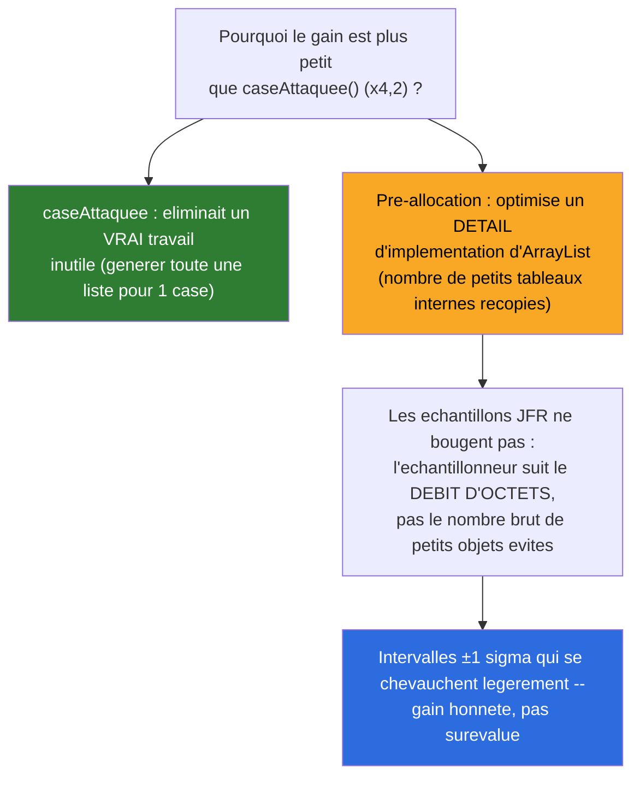

# Synthèse — Pré-allocation de capacité (listes de `Coup`)

## En une phrase

Le deuxième levier oublié du cours (J2_PM, "réallocations de slices") a été rattrapé — gain réel mais modeste (~×1,11), assumé honnêtement comme un résultat d'un ordre de grandeur différent des corrections précédentes, sans forcer une conclusion plus impressionnante qu'elle ne l'est.

## État du système à cette étape

## Application littérale de l'exemple du cours (J2_PM)

## Impact mesuré

| Mesure | Avant | Après | Facteur |
|---|---|---|---|
| Temps (Hyperfine) | 475,3 ms ± 37,8 ms | 426,3 ms ± 35,8 ms | **×1,11** |
| Échantillons d'allocation (JFR) | 120 | 120 | inchangé |

## Interprétation honnête : un gain réel, mais modeste — et assumé comme tel

**Ce résultat n'est pas "décevant"** — c'est la mesure honnête d'un levier dont l'ampleur attendue était d'emblée plus faible que la correction de l'Étape 4. Le documenter tel quel (sans gonfler artificiellement son importance) fait partie de la même discipline que les résultats "aucun gain" de HashBreaker Séance 2 Partie 3-4.

## Pour aller plus loin

- Détail technique complet : [process/06-preallocation-listes-coup.md](../process/06-preallocation-listes-coup.md)
- Étape précédente : [05-struct-padding.md](05-struct-padding.md)
