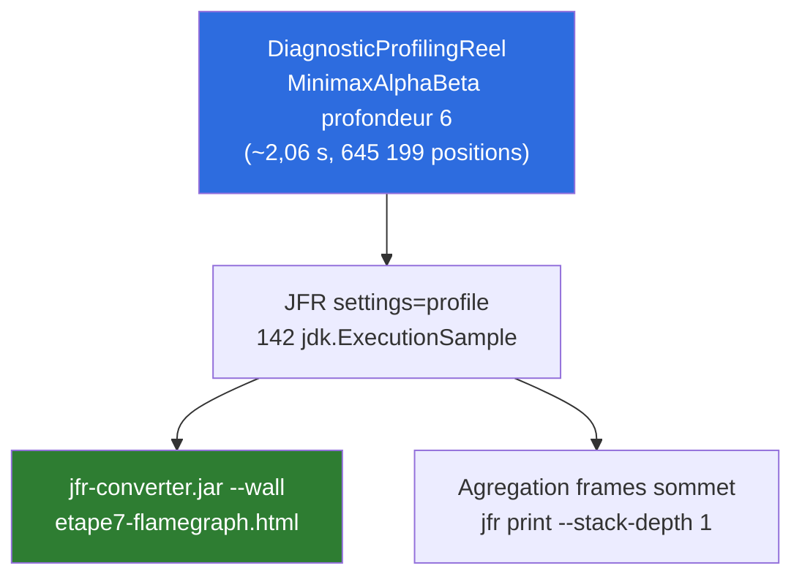
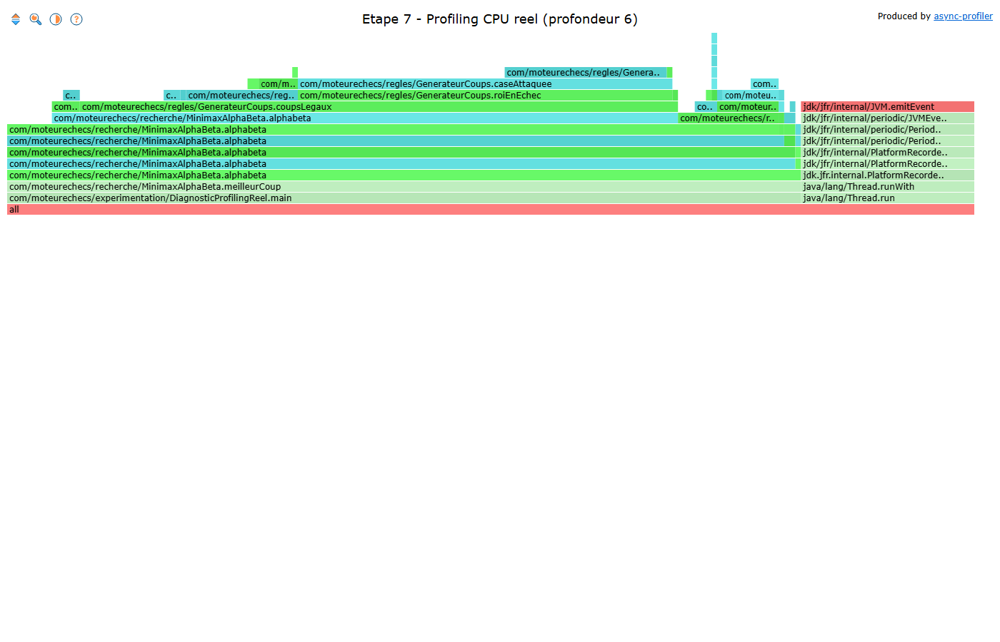
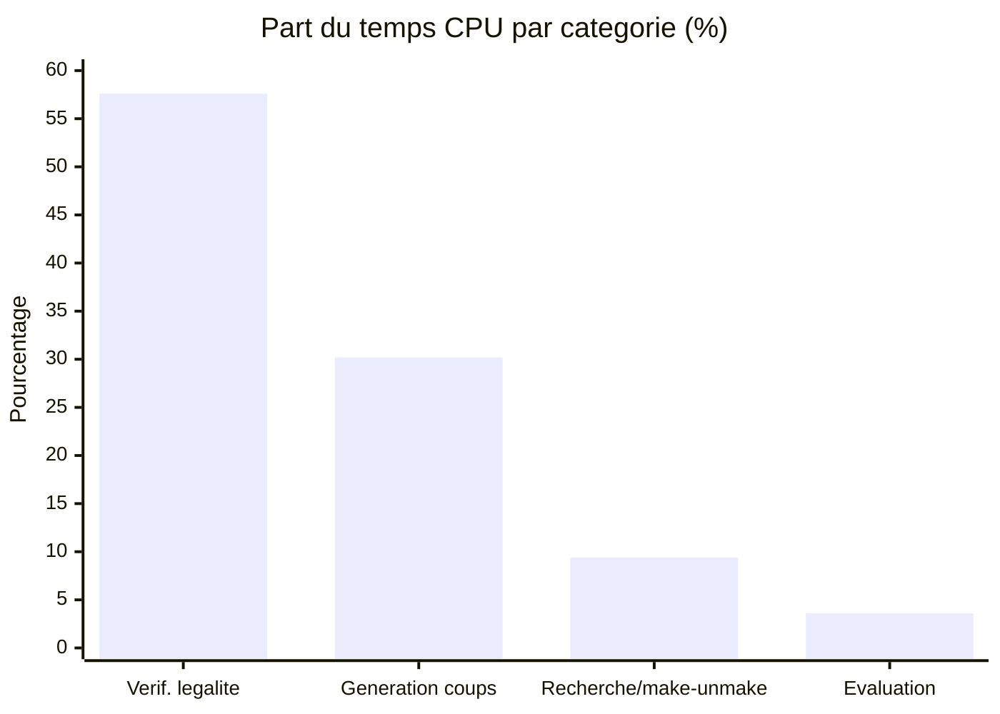
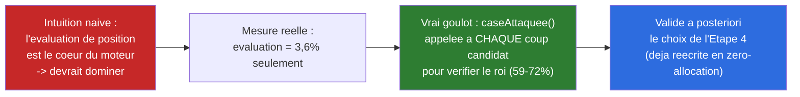

# Synthèse — Profiling réel & Hot Path (Axe 2 du barème)

## En une phrase

Premier vrai flamegraph CPU du projet (toutes les étapes précédentes reposaient sur du raisonnement théorique ou du comptage d'allocations) : la vérification de légalité (`caseAttaquee`) domine à **59-72 %** du temps CPU selon le run (3 runs vérifiés), l'évaluation de position ne pèse jamais plus de **4 %** — résultat contre-intuitif, stable sur plusieurs essais, qui valide a posteriori le choix de l'Étape 4.

## État du système à cette étape

## Flamegraph réel (capture d'écran)

Capture statique du flamegraph interactif généré via `jfr-converter.jar --wall` (async-profiler). Les barres larges de `caseAttaquee`/`roiEnEchec`/`coupsLegaux` sautent immédiatement aux yeux — c'est visuellement la première preuve du Hot Path, avant même de lire le tableau de pourcentages. Version interactive (zoom, recherche) : `profiling/etape7-flamegraph.html`.

⚠️ **Nuance honnête** : cette image inclut les frames `jdk/jfr/internal/*` visibles à droite (le mécanisme JFR qui s'auto-enregistre) — contrairement au tableau de pourcentages ci-dessous, qui a filtré ces frames (139/142 échantillons retenus, code `com.moteurechecs` uniquement). *Pourquoi : `jfr-converter.jar` agrège tous les threads du `.jfr` sans filtre, le tableau lui a été calculé à la main avec `grep "com.moteurechecs"` — écart mineur (3/142 échantillons, ~2%), l'image reste indicative.*

## Répartition mesurée du temps CPU — Run 1 (139 échantillons applicatifs, détail dans `process/`)

| Catégorie | Fonctions | Échantillons | Part |
|---|---|---|---|
| Vérification de légalité | `caseAttaquee`, `attaqueGlissante` | 80 | **57,6 %** |
| Génération de coups | `coupsPseudoLegaux`, `coupsLegaux`, `genererCoups*` | 42 | **30,2 %** |
| Recherche / make-unmake | `alphabeta`, `Plateau.jouer/annuler` | 13 | **9,4 %** |
| Évaluation de position | `Evaluateur.evaluer/valeur` | 5 | **3,6 %** |

## Reproductibilité vérifiée (3 runs)

```mermaid
xychart-beta
    title "Part du temps CPU par categorie, 3 runs (%)"
    x-axis ["Run 1", "Run 2", "Run 3"]
    y-axis "Pourcentage" 0 --> 80
    bar [58.6, 72.1, 62.3]
    bar [29.3, 20.2, 27.5]
    bar [8.6, 6.2, 8.7]
    bar [3.6, 1.6, 1.4]
```

Le pourcentage exact varie d'un run à l'autre (~140 échantillons seulement — bruit statistique normal), mais **le classement reste identique** : légalité toujours dominante (59-72 %), évaluation toujours la plus faible part (<4 %). Conclusion qualitative robuste, chiffre précis à ne pas sur-interpréter.

## Le résultat contre-intuitif, et pourquoi il compte

**Ce que ça change par rapport aux Étapes 2-6** : c'est la première fois que le Hot Path est identifié par la mesure plutôt que déduit par analogie avec HashBreaker ou par raisonnement structurel. Contrairement à HashBreaker (Séance 2 et 3, où la mesure avait *contredit* l'intuition de départ), ici la mesure **confirme** un choix déjà fait — `caseAttaquee()` avait été ciblée dès l'Étape 4 sur la base d'un raisonnement ("c'est appelé dans la boucle la plus chaude"), et le flamegraph démontre que ce raisonnement était juste.

## Piste ouverte pour une étape future (non traitée ici)

Le coût de `caseAttaquee()` restant élevé **même après** l'avoir rendue zéro-allocation montre que la limite n'est plus l'allocation mais le nombre d'appels : `coupsLegaux()` rejoue-vérifie-annule chaque coup pseudo-légal un par un pour tester l'échec. Une détection d'échec incrémentale (mise à jour au fil des coups plutôt que recalculée à chaque candidat) serait la piste logique suivante — notée mais pas traitée à cette étape, qui est un diagnostic, pas une correction.

## Pour aller plus loin

- Détail technique complet, données brutes JFR : [process/07-profiling-reel-hotpath.md](../process/07-profiling-reel-hotpath.md)
- Flamegraph interactif : `profiling/etape7-flamegraph.html`
- Étape précédente : [06-preallocation.md](06-preallocation.md)
