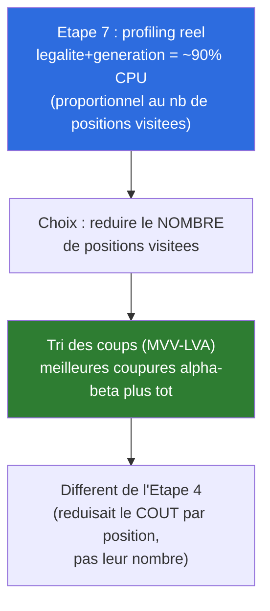
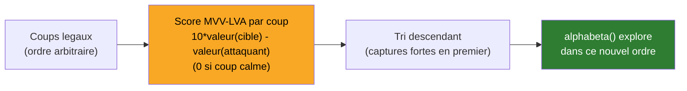
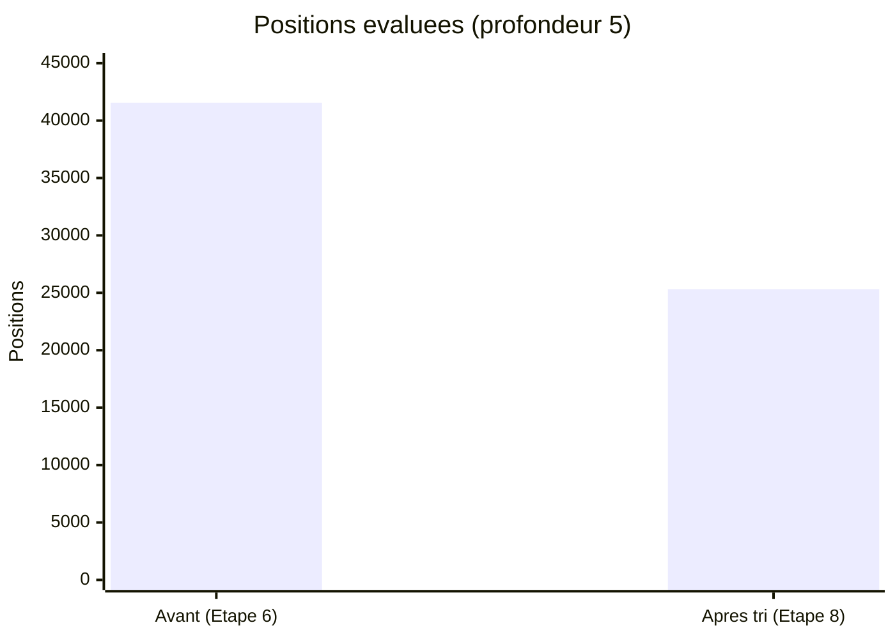
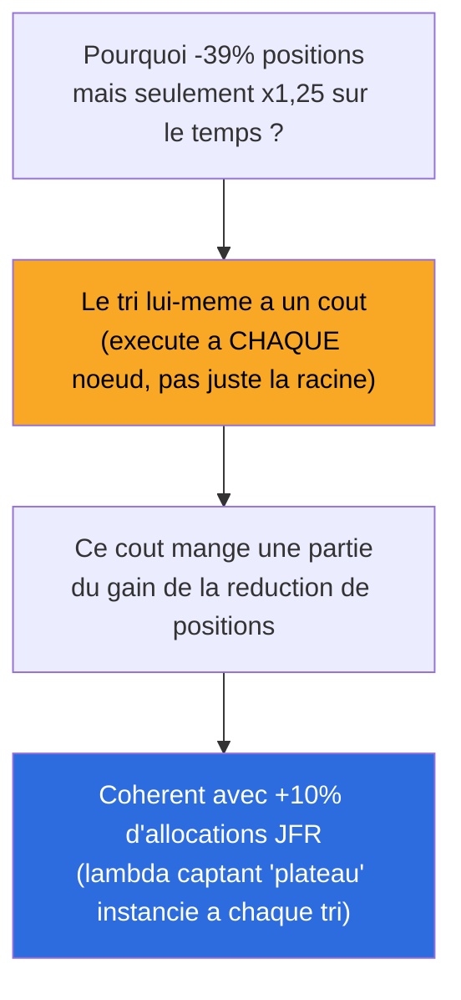

# Synthèse — Tri des coups (MVV-LVA, macro-optimisation)

## En une phrase

Premier levier choisi directement à partir d'une donnée de profiling réelle (Étape 7) plutôt que d'un plan générique : le tri MVV-LVA réduit les positions visitées de 39%, mais le gain net en temps (×1,25) est amorti par le coût du tri lui-même — résultat honnête, pas gonflé.

## Pourquoi ce levier, et pourquoi maintenant

Roadmap initiale : Étape 8 = table de transposition. **Remplacé** par le tri des coups, qui attaque plus directement le goulot mesuré (le Hot Path ne montre presque aucune évaluation — <4% — donc pas de raison de cacher des évaluations ; ce qui coûte, c'est le nombre de fois où on vérifie la légalité d'un coup).

## Implémentation

Appliqué à la fois dans `meilleurCoup()` (racine) et `alphabeta()` (tous les nœuds internes) — pas seulement à la racine, pour que les coupures profitent à tout l'arbre, pas juste au premier niveau.

## Impact mesuré

| Mesure | Avant | Après | Facteur |
|---|---|---|---|
| Positions évaluées | 41 554 | 25 319 | **−39 %** |
| Temps (Hyperfine) | 887,1 ms ± 43,0 ms | 709,8 ms ± 23,1 ms | **×1,25** |
| Allocations (JFR) | 120 échantillons | 132 échantillons | +10 % |

## Interprétation honnête : pourquoi le temps ne suit pas les positions au même rythme

**Ce n'est pas un échec** — c'est un vrai gain macro (réduction du volume de travail, même famille que l'Étape 2), documenté avec son vrai coût plutôt que présenté comme un gain "gratuit" comme l'avait été l'alpha-beta. Une piste micro (éviter la capture de `plateau` dans le comparateur) reste possible plus tard, mais seulement si un futur profiling la justifie — cohérent avec la discipline "macro avant micro" du projet.

**Équivalence préservée** : 47/47 tests passent, y compris les tests d'équivalence Minimax/Alpha-Beta — le tri change l'ordre d'exploration, jamais la décision finale.

## Pour aller plus loin

- Détail technique complet, données brutes : [process/08-tri-coups-move-ordering.md](../process/08-tri-coups-move-ordering.md)
- Étape précédente : [07-profiling-reel.md](07-profiling-reel.md)
