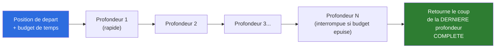
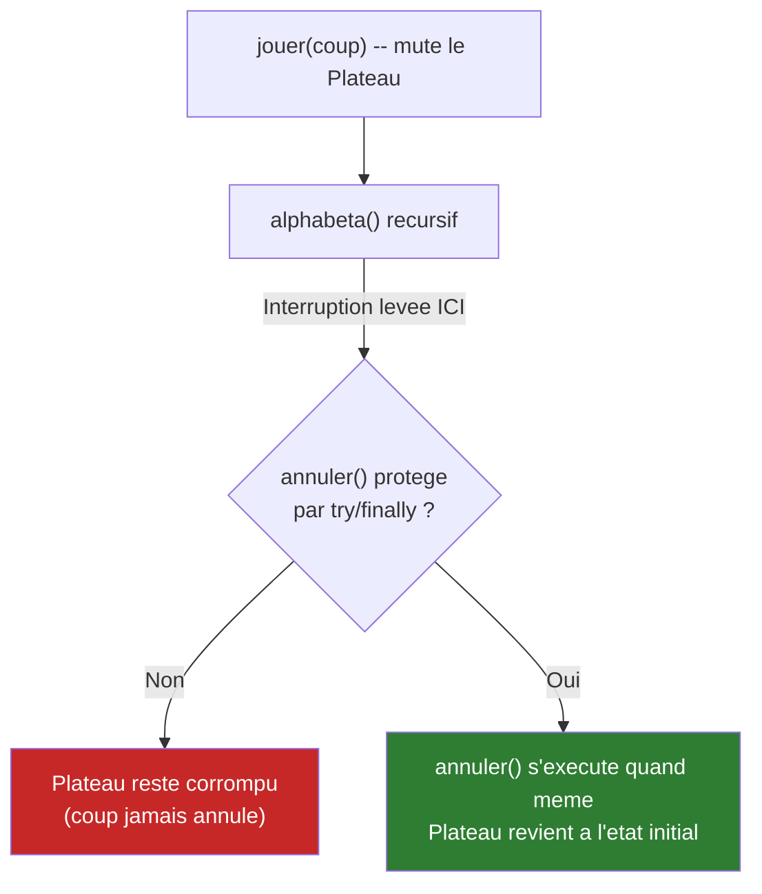
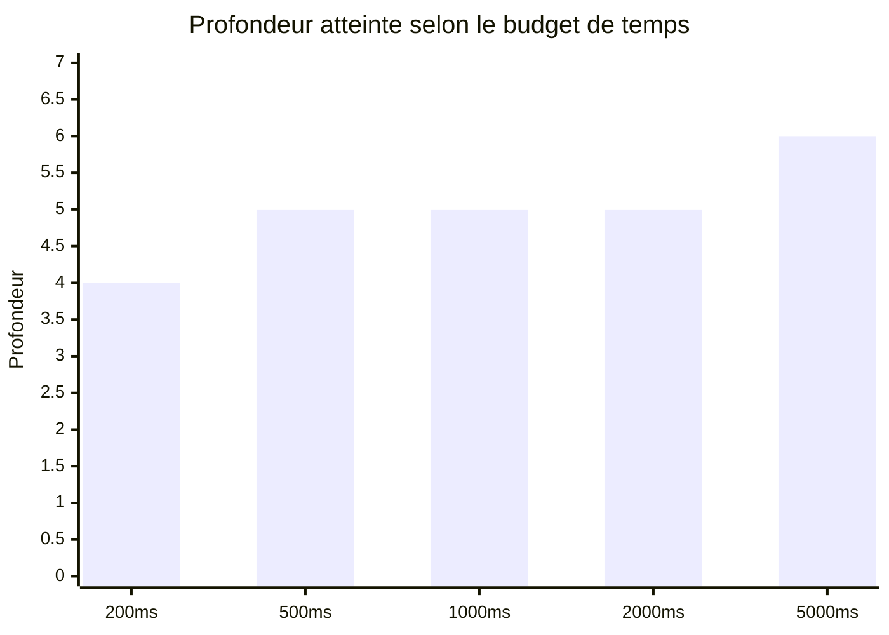
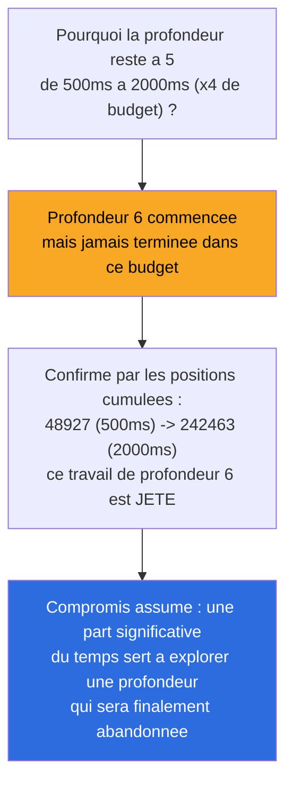

# Synthèse — Recherche à budget de temps (Iterative Deepening)

## En une phrase

Premier levier macro qui n'accélère rien — il rajoute même du travail (profondeurs refaites) — mais donne au moteur une capacité qu'il n'avait pas : répondre sous une vraie contrainte de temps plutôt qu'à une profondeur fixe arbitraire, avec la garantie de toujours renvoyer un coup valide.

## État du système à cette étape

## Le point technique le plus important : ne jamais corrompre le Plateau muté en place

Trouvé et corrigé avant tout bench : sans `try/finally` autour de chaque `annuler()`, une interruption en pleine récursion laisse le plateau à moitié joué. Testé explicitement (`budgetTemps_interruption_neCorrompPasLePlateau`).

## Impact mesuré (3 runs, position de départ)

| Budget | Profondeur | Temps réel | Coup |
|---|---|---|---|
| 200 ms | 4 | ~211-216 ms | `b1c3` |
| 500 ms | 5 | ~502-505 ms | `b2b3` |
| 1000 ms | 5 | ~1003-1006 ms | `b2b3` |
| 2000 ms | 5 | ~2002-2008 ms | `b2b3` |
| 5000 ms | 6 | ~5000-5008 ms | `b1c3` |

## Interprétation honnête : le vrai coût de ce levier

**Pas un levier "gratuit"** comme l'alpha-beta (Étape 2, ÷145 positions sans aucune perte) — ici on accepte de perdre du travail sur les profondeurs interrompues, en échange de la garantie de toujours avoir un coup valide dans un budget donné. Documenté tel quel, pas présenté comme un gain de vitesse qu'il n'est pas.

**3 bugs trouvés et corrigés avant que les mesures soient fiables** (deadline par défaut à 0, deadline périmée après un budget de temps, corruption du plateau sans `try/finally`) — détail complet dans `process/09-recherche-budget-temps.md`. 51/51 tests passent.

## Pour aller plus loin

- Détail technique complet : [process/09-recherche-budget-temps.md](../process/09-recherche-budget-temps.md)
- Étape précédente : [08-tri-coups.md](08-tri-coups.md)
