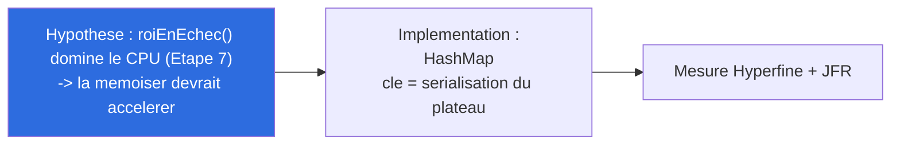
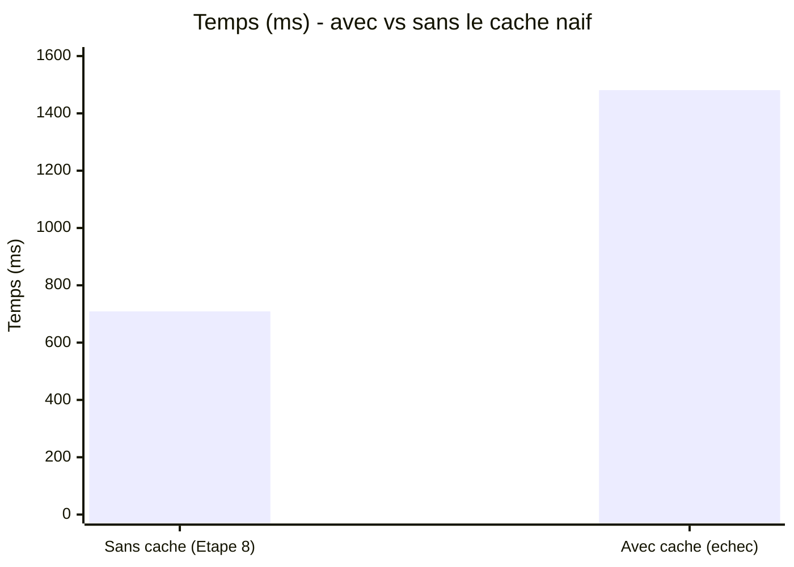
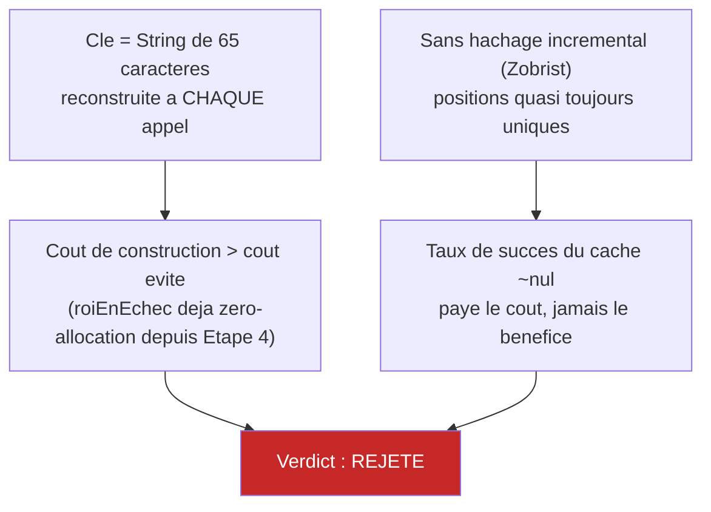

# Synthèse — Échec Constructif : cache naïf de `roiEnEchec()` (Axe 4)

## En une phrase

Une tentative plausible (mémoïser la fonction qui domine 59-72% du CPU) a été implémentée, mesurée, et rejetée : ×2,09 plus lent, +250% d'allocations, cause physique identifiée et comprise, code entièrement retiré.

## Hypothèse testée

## Résultat mesuré

| Mesure | Sans cache | Avec cache | Verdict |
|---|---|---|---|
| Temps (Hyperfine) | 709,0 ms ± 27,8 ms | 1 481 ms ± 25 ms | **×2,09 plus lent** |
| Allocations (JFR) | 132 échantillons | 462 échantillons | **+250%** |
| Positions évaluées | 25 319 | 25 319 | inchangé (décisions correctes) |
| Test iterative deepening | passe | échoue (régression collatérale) | signal supplémentaire |

## Cause physique

**Diagnostic JFR** : les nouvelles allocations dominantes sont `byte[]`/`String`/`StringBuilder` (362 échantillons cumulés) — réintroduction directe de l'anti-pattern éliminé à l'Étape 4, plus `HashMap$Node` (le cache lui-même).

## Verdict & piste correcte

**Rejeté**, code retiré (`git checkout`), 51/51 tests repassent au vert. Un vrai cache de positions nécessite un **hachage de Zobrist** (mise à jour incrémentale en O(1) par coup, pas une sérialisation complète recalculée à chaque appel) — piste correcte notée pour la future table de transposition (Étape 11), pas traitée ici.

## Pour aller plus loin

- Détail technique complet, données JFR brutes : [process/10-echec-constructif-cache-roiEnEchec.md](../process/10-echec-constructif-cache-roiEnEchec.md)
- Étape précédente : [09-recherche-budget-temps.md](09-recherche-budget-temps.md)
