# Choix du Sujet — Projet Noté (RNCP Bloc 4)

> Ce document fixe le choix définitif du sujet libre pour le projet noté, distinct du TP fil rouge HashBreaker (qui reste le démonstrateur guidé — cf. [sujets.md](sujets.md) pour les 4 pistes envisagées à l'origine).
>
> Vérifié le 2026-09-22 contre le barème d'évaluation officiel du TP noté (*Rapport d'Audit de Performance*, 20 pts + 2 bonus). Le sujet reste **cohérent et pertinent**, sous réserve d'élargir la portée initialement prévue — voir section dédiée ci-dessous.

## Sujet retenu : Moteur d'échecs — Minimax / Alpha-Beta

## Pourquoi ce choix

Parmi les 4 pistes évaluées dans [sujets.md](sujets.md), le moteur d'échecs est celui qui colle le plus étroitement à la grille d'évaluation technique du module : calcul CPU intensif, structures de données critiques, opportunités de parallélisme, et un Hot Path clairement identifiable et mesurable par profiling — exactement la même forme d'exercice que HashBreaker (recherche combinatoire bornée par le temps), ce qui permet de réutiliser directement les réflexes acquis sur le TP fil rouge.

## Description du sujet

Un moteur d'échecs capable de :
1. Représenter un plateau et générer tous les coups légaux depuis une position donnée.
2. Évaluer numériquement une position (qui est mieux placé : les blancs ou les noirs, et de combien).
3. Explorer l'arbre des coups possibles sur plusieurs profondeurs pour choisir le meilleur coup — c'est l'algorithme **Minimax**.
4. Élaguer les branches de l'arbre qui ne peuvent de toute façon pas influencer la décision finale — c'est l'**élagage Alpha-Beta**.

### Les briques techniques

| Brique | Rôle |
|---|---|
| **Représentation du plateau** | Bitboards (64 bits = 64 cases, un bit par case) plutôt qu'un tableau d'objets — comparable au choix `char[]` vs `String[]` fait sur HashBreaker en Séance 2 |
| **Génération de coups** | Produire tous les coups légaux depuis une position (le "générateur combinatoire" de ce projet, au même titre que le compteur base-N de HashBreaker) |
| **Fonction d'évaluation** | Score numérique d'une position (valeur des pièces + tables de position) — le calcul répété des millions de fois, équivalent du `sha256()` de HashBreaker |
| **Minimax** | Explore récursivement l'arbre des coups à N profondeurs, en supposant que l'adversaire joue aussi le meilleur coup possible |
| **Élagage Alpha-Beta** | Réduction algorithmique : coupe les branches qui ne peuvent pas changer la décision — passe la complexité de O(b^d) à environ O(b^(d/2)) dans le meilleur cas |
| **Table de transposition** | Cache (hash map) des positions déjà évaluées, pour ne jamais recalculer deux fois la même position atteinte par des chemins différents |
| **Recherche parallèle** | Répartir l'exploration de l'arbre sur plusieurs cœurs (workers bornés) |

## Cohérence avec le barème d'évaluation (20 pts + 2 bonus)

**Point structurant du barème, à ne jamais perdre de vue :** *"Le code source déposé sert exclusivement de pièce à conviction... Le code en tant que tel n'est pas noté. Seul le document final (Rapport d'Audit) fait foi pour la notation."* Autrement dit, le projet noté n'est pas évalué comme HashBreaker (où le code + les process/syntheses suffisent) — il faut produire **un unique document final consolidé** (PDF ou Markdown propre), le code n'étant qu'une preuve de reproductibilité. La méthode `process/` + `syntheses/` rodée sur HashBreaker reste la bonne façon de **travailler** au jour le jour, mais elle devra être **compilée en un rapport final unique** à la fin, structuré exactement selon les 5 sections du barème.

> ⚠️ **Confirmé par le formateur en live (2026-09-22)** : le code doit être **rendu quand même** (dépôt Git ou archive), même s'il n'est pas noté directement — il sert de preuve de reproductibilité pour le rapport. **Ne pas oublier de livrer les deux** : le rapport d'audit final ET le code source complet.

| Axe du barème | Pts | Couverture par le moteur d'échecs | Statut |
|---|---|---|---|
| 1. Environnement & Métrologie | 3 | Banc d'essai matériel (CPU, cœurs, cache L1/L2/L3, RAM, OS, runtime) + protocole **Hyperfine** (warmup, itérations, moyenne/médiane/écart-type/variance) | ⬜ À faire — générique, indépendant du sujet |
| 2. Diagnostic matériel & Profiling réel | 5 | Flamegraphs/pprof réels + identification formelle du Hot Path (génération de coups vs évaluation vs tri des coups) | ✅ Très bon fit — le moteur d'échecs a un Hot Path riche et non trivial à découvrir, contrairement à HashBreaker où tout est évidemment CPU-bound dès le départ |
| 3. Journal d'optimisation (Mémoire, Concurrence, I/O) | 5 | Mémoire : bitboards + zéro-allocation (make/unmake). Concurrence : worker pool + **early cancellation = alpha-beta lui-même**. I/O/Persistance : ⚠️ voir ci-dessous | ⚠️ Le volet I/O/Persistance doit être ajouté explicitement au périmètre (voir plus bas) |
| 4. Confrontation critique & "Échec constructif" | 3 | Documenter une tentative d'optimisation ratée, chiffrée (ex: parallélisation de la recherche qui régresse à cause du context-switching ou d'un verrou trop fin sur la table de transposition partagée) | ⬜ À planifier explicitement — ne pas laisser ça au hasard, sinon risque de ne rien avoir à documenter |
| 5. Reproductibilité & Synthèse comparative | 4 | Script one-shot (`Makefile` / `run_benchmarks.sh`) + tableau final Baseline vs Version finale (`benchstat`/`hyperfine`) | ⬜ À faire — générique, indépendant du sujet |
| BONUS : `constitution.md` | +2 | Fichier de gouvernance IA à la racine, respectant les 4 directives (posture ingénieur système, garde-fous négatifs explicites, couple hypothèse/commande de profiling, formatage compact impératif) | ⬜ À faire une fois le langage choisi (les garde-fous doivent être adaptés à ses anti-patterns spécifiques) |

### Point d'attention : l'axe I/O & Persistance n'est pas optionnel

Dans une première version de ce document, le volet "Streaming binaire / SQL" était noté comme une **extension optionnelle**. Le barème le place en réalité **dans l'axe 3, noté sur 5 pts avec Mémoire et Concurrence** — ce n'est donc pas une extension à faire "si le temps le permet", mais une partie obligatoire pour ne pas perdre de points sur cet axe. Concrètement, sur ce projet, trois pistes s'intègrent naturellement sans dénaturer le sujet :

- **Mise en cache (LRU)** : la table de transposition est déjà une forme de cache — il suffit de lui donner une vraie politique de remplacement bornée (LRU ou équivalent) plutôt qu'une simple hash map non bornée, pour cocher explicitement cette case.
- **Indexation SQL** : un livre d'ouvertures ou une base de parties déjà jouées, indexé par hash de position (Zobrist hashing), avec des requêtes prouvées via `EXPLAIN ANALYZE`.
- **Protobuf / gRPC** : exposer le moteur comme un service (recevoir une position, renvoyer le meilleur coup), en binaire plutôt qu'en JSON — ou streamer l'avancement de la recherche.

### Observation sur le langage (nouvelle donnée pour la décision encore ouverte)

Les garde-fous d'exemple donnés pour le bonus `constitution.md` sont très spécifiquement **Go** : `fmt.Sprintf`, `goroutines`, conversions `string <-> []byte`, `sync.Pool`. Ça ne rend pas les autres langages invalides (J1_AM autorise explicitement "Go, Rust, C++, C#, Java, etc."), mais ça suggère que la matière du cours est probablement calibrée/illustrée en Go par défaut. À garder en tête pour la décision de langage ci-dessous — sans trancher pour autant.

## Mapping avec les leviers du cours

| Levier du cours | Application sur ce projet |
|---|---|
| **Macro-optimisation** (réduction de complexité) | Élagage alpha-beta : O(b^d) → ~O(b^(d/2)) |
| **Micro-optimisation** | Bitboards : opérations bit à bit (AND, OR, XOR, shifts) au lieu de boucles sur un tableau 2D |
| **Zéro-allocation** | Pattern *make/unmake move* : modifier le plateau en place puis annuler le coup, plutôt que copier un nouveau plateau à chaque nœud de l'arbre |
| **Localité mémoire / cache** | Bitboards tiennent dans un seul registre 64-bit ; tables de position (piece-square tables) en tableaux contigus |
| **Compromis espace-temps** | Table de transposition = mémoïsation (+ RAM, - CPU), exactement la catégorie vue en J1_AM |
| **Profiling** | Identifier le vrai Hot Path : génération de coups vs évaluation vs tri des coups (l'ordre de tri des coups impacte fortement l'efficacité de l'élagage) |
| **Workers bornés / parallélisme** | Recherche parallèle sur plusieurs branches de l'arbre (ex: split au niveau racine, ou Lazy SMP) |
| **Loi d'Amdahl** | Vérifier quelle portion (génération, éval, ou recherche) domine réellement avant de paralléliser — même piège que celui découvert en Séance 2 de HashBreaker |
| **Streaming binaire / SQL** (requis — axe 3 du barème, 5 pts) | Exposer le moteur en service (gRPC) et indexer une base de parties (Zobrist hashing) pour un livre d'ouvertures, avec preuve `EXPLAIN ANALYZE` |
| **Mise en cache bornée (LRU)** (requis — axe 3 du barème) | Table de transposition avec politique de remplacement explicite, pas une hash map non bornée |

## Roadmap (mise à jour au fil de l'avancement réel)

> 🔄 **Réordonnée le 2026-09-23** : la macro-optimisation (élagage alpha-beta) est passée avant les micro-optimisations mémoire, décision volontaire — voir justification ci-dessous.

**Pourquoi la macro d'abord ?** Sur un moteur d'échecs, l'explosion combinatoire de l'arbre de recherche (O(b^d)) est le facteur dominant — bien plus déterminant que n'importe quel gain constant de micro-optimisation, même principe que la loi d'Amdahl vue en Séance 2 de HashBreaker. Ça ne bloque pas les micro-optimisations prévues ensuite : l'architecture les sépare déjà proprement (alpha-beta touche uniquement `recherche/`, bitboards et zéro-allocation toucheront `modele/`). Seule conséquence à documenter : la baseline de l'Étape 1 (Minimax naïf) n'est plus la référence directe pour les micro-optimisations à venir — l'alpha-beta devient la nouvelle référence, car il ne fait pas "le même travail plus vite" mais "moins de travail" (nombre de positions visitées différent, pas juste un temps d'exécution différent).

```mermaid
flowchart LR
    A["✅ Étape 1\nMise en place\nPlateau + génération de coups\n+ Minimax naïf + baseline\n(~22-24K positions/s)"] --> E["✅ Étape 2\nÉlagage Alpha-Beta (MACRO)\n÷145,9 positions a profondeur 4\n(nouvelle reference pour la suite)"]
    E --> B["✅ Étape 3\nLocalité mémoire\nBitboards vs objets : x1,3\n(mesure pure, pas integre)"]
    B --> C["✅ Étape 4\nZéro-allocation\ncaseAttaquee directe + make/unmake\nx4,2, allocations ÷5"]
    C --> SP["✅ Étape 5\nStruct Padding (JOL)\nverifie : rien a corriger\n(levier du cours rattrape apres-coup)"]
    SP --> D["⬜ Étape 6\nProfiling réel\nFlamegraph/pprof, Hot Path\n(axe 2)"]
    D --> F["⬜ Étape 7\nTable de transposition\nLRU bornée (axe 3)"]
    F --> G["⬜ Étape 8\nRecherche parallèle\nworker pool + atomique (axe 3)"]
    G --> H["⬜ Étape 9\nI/O & Persistance\nSQL indexé + gRPC (axe 3)"]
    H --> I["⬜ Étape 10\nÉchec constructif\nexpérience ratée, chiffrée\n(axe 4)"]
    I --> J["⬜ Étape 11\nReproductibilité\nscript one-shot + tableau\nfinal (axe 5)"]
    J --> K["⬜ Étape 12\nRapport d'audit final\nconsolidé (PDF/MD)"]

    style A fill:#2e7d32,color:#fff
    style E fill:#2e7d32,color:#fff
    style B fill:#2e7d32,color:#fff
    style C fill:#2e7d32,color:#fff
    style SP fill:#2e7d32,color:#fff
    style D fill:#9e9e9e,color:#fff
    style F fill:#9e9e9e,color:#fff
    style G fill:#9e9e9e,color:#fff
    style H fill:#9e9e9e,color:#fff
    style I fill:#9e9e9e,color:#fff
    style J fill:#9e9e9e,color:#fff
    style K fill:#9e9e9e,color:#fff
```

**Étapes 1 à 5 terminées** (2026-09-23) — voir [MoteurEchecs/process/](MoteurEchecs/process/README.md) et [MoteurEchecs/syntheses/](MoteurEchecs/syntheses/README.md) (suivi détaillé mis en place dès le démarrage, mêmes conventions que HashBreaker : chaque synthèse est autonome avec diagrammes + tableau comparatif contre l'étape directement comparable précédente). L'Étape 5 (struct padding/JOL) a été insérée après coup — un levier du cours identifié comme manqué en relisant la roadmap, plutôt que laissé de côté silencieusement. Depuis l'Étape 4, le code est modifié **en place** (pas de classes parallèles par étape) — la comparaison avant/après repose sur des mesures Hyperfine/JFR prises juste avant chaque modification, conservées dans `MoteurEchecs/profiling/`. Les étapes suivantes restent à réaliser. À garder à l'esprit : ce suivi devra être **consolidé en un rapport final unique** à la fin (Étape 12), puisque c'est ce document-là, et lui seul, qui sera noté.

> 📌 **Rappel explicite (2026-09-23)** : comme pour HashBreaker, il faudra produire des **synthèses de résultats** à chaque étape clé (pas seulement un rapport final écrit d'un coup à la fin) — un tableau chiffré avant/après par levier appliqué, mis à jour au fur et à mesure. C'est cette accumulation progressive de synthèses qui alimentera directement le tableau de synthèse comparatif final (Axe 5) et le rapport d'audit — pas une reconstruction a posteriori en fin de projet, qui serait bien moins fiable et plus difficile à sourcer.

## Livrables attendus (alignés sur le barème)

| Livrable | Axe(s) du barème |
|---|---|
| Spécification du banc d'essai matériel (CPU, cœurs, cache, RAM, OS, runtime) | Axe 1 |
| Protocole de mesure Hyperfine avec statistiques complètes (moyenne, médiane, écart-type, variance) | Axe 1 |
| Captures Flamegraph/pprof réelles + identification textuelle du Hot Path | Axe 2 |
| Journal d'optimisation justifié théoriquement et physiquement (mémoire/cache, concurrence, I/O/persistance) | Axe 3 |
| Au moins une tentative d'optimisation ratée, documentée et chiffrée | Axe 4 |
| Script d'automatisation exécutable en une commande (`Makefile` ou `run_benchmarks.sh`) | Axe 5 |
| Tableau de synthèse final (Baseline vs Version finale, gains chiffrés) | Axe 5 |
| **Rapport d'Audit final unique** (PDF ou Markdown propre) — seul document réellement noté | Toutes |
| **Code source complet** (dépôt Git ou archive) — non noté directement, mais rendu obligatoire (confirmé par le formateur en live) comme preuve de reproductibilité | Pièce à conviction |
| *(Bonus)* `constitution.md` à la racine, respectant les 4 directives | Bonus +2 |

## Décisions

- ✅ **Langage : Java** (tranché le 2026-09-23) — cohérent avec HashBreaker, toolchain déjà opérationnelle (Maven, JUnit, JFR, JOL, Hyperfine).
- ✅ **Portée des règles (V1) : simplifiée** (tranché le 2026-09-23) — pas de roque ni de prise en passant au départ, promotion automatique en Dame. Ajoutables plus tard si besoin.
- ⏸️ **Interface** : encore ouvert — moteur en ligne de commande (échange de positions FEN) vs interface graphique minimale. Pas bloquant pour l'instant (le moteur s'utilise directement via `Main.java`).

Le code a démarré dans [MoteurEchecs/](MoteurEchecs/) — voir [MoteurEchecs/README.md](MoteurEchecs/README.md) pour le détail de l'architecture, et [MoteurEchecs/process/](MoteurEchecs/process/README.md) / [MoteurEchecs/syntheses/](MoteurEchecs/syntheses/README.md) pour le suivi étape par étape (mêmes conventions que HashBreaker).
