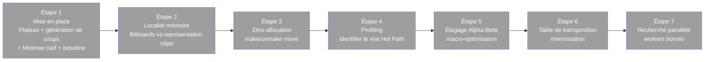

# Choix du Sujet — Projet Noté (RNCP Bloc 4)

> Ce document fixe le choix définitif du sujet libre pour le projet noté, distinct du TP fil rouge HashBreaker (qui reste le démonstrateur guidé — cf. [sujets.md](sujets.md) pour les 4 pistes envisagées à l'origine).

## Sujet retenu : Moteur d'échecs — Minimax / Alpha-Beta

## Pourquoi ce choix

Parmi les 4 pistes évaluées dans [sujets.md](sujets.md), le moteur d'échecs est celui qui colle le plus étroitement à la grille d'évaluation technique du module : calcul CPU intensif, structures de données critiques, opportunités de parallélisme, et un Hot Path clairement identifiable et mesurable par profiling — exactement la même forme d'exercice que HashBreaker (recherche combinatoire bornée par le temps), ce qui permet de réutiliser directement les réflexes acquis sur le TP fil rouge.

## Description du sujet

Un moteur d'échecs capable de :
1. Représenter un plateau et générer tous les coups légaux depuis une position donnée.
2. Évaluer numériquement une position (qui est mieux placé : les blancs ou les noirs, et de combien).
3. Explorer l'arbre des coups possibles sur plusieurs profondeurs pour choisir le meilleur coup — c'est l'algorithme **Minimax**.
4. Élaguer les branches de l'arbre qui ne peuvent de toute façon pas influencer la décision finale — c'est l'**élagage Alpha-Beta**.

### Les briques techniques

| Brique | Rôle |
|---|---|
| **Représentation du plateau** | Bitboards (64 bits = 64 cases, un bit par case) plutôt qu'un tableau d'objets — comparable au choix `char[]` vs `String[]` fait sur HashBreaker en Séance 2 |
| **Génération de coups** | Produire tous les coups légaux depuis une position (le "générateur combinatoire" de ce projet, au même titre que le compteur base-N de HashBreaker) |
| **Fonction d'évaluation** | Score numérique d'une position (valeur des pièces + tables de position) — le calcul répété des millions de fois, équivalent du `sha256()` de HashBreaker |
| **Minimax** | Explore récursivement l'arbre des coups à N profondeurs, en supposant que l'adversaire joue aussi le meilleur coup possible |
| **Élagage Alpha-Beta** | Réduction algorithmique : coupe les branches qui ne peuvent pas changer la décision — passe la complexité de O(b^d) à environ O(b^(d/2)) dans le meilleur cas |
| **Table de transposition** | Cache (hash map) des positions déjà évaluées, pour ne jamais recalculer deux fois la même position atteinte par des chemins différents |
| **Recherche parallèle** | Répartir l'exploration de l'arbre sur plusieurs cœurs (workers bornés) |

## Mapping avec les leviers du cours

| Levier du cours | Application sur ce projet |
|---|---|
| **Macro-optimisation** (réduction de complexité) | Élagage alpha-beta : O(b^d) → ~O(b^(d/2)) |
| **Micro-optimisation** | Bitboards : opérations bit à bit (AND, OR, XOR, shifts) au lieu de boucles sur un tableau 2D |
| **Zéro-allocation** | Pattern *make/unmake move* : modifier le plateau en place puis annuler le coup, plutôt que copier un nouveau plateau à chaque nœud de l'arbre |
| **Localité mémoire / cache** | Bitboards tiennent dans un seul registre 64-bit ; tables de position (piece-square tables) en tableaux contigus |
| **Compromis espace-temps** | Table de transposition = mémoïsation (+ RAM, - CPU), exactement la catégorie vue en J1_AM |
| **Profiling** | Identifier le vrai Hot Path : génération de coups vs évaluation vs tri des coups (l'ordre de tri des coups impacte fortement l'efficacité de l'élagage) |
| **Workers bornés / parallélisme** | Recherche parallèle sur plusieurs branches de l'arbre (ex: split au niveau racine, ou Lazy SMP) |
| **Loi d'Amdahl** | Vérifier quelle portion (génération, éval, ou recherche) domine réellement avant de paralléliser — même piège que celui découvert en Séance 2 de HashBreaker |
| **Streaming binaire / SQL** (optionnel, extension) | Exposer le moteur en service (gRPC) et/ou indexer une base de parties (Zobrist hashing) pour un livre d'ouvertures |

## Roadmap prévisionnelle (plan — rien n'est encore implémenté)

Calquée sur la progression suivie pour HashBreaker, à ajuster selon le calendrier réel des séances à venir.

Toutes les étapes sont **à réaliser** (grisées intentionnellement) — ce document sert de plan de route, pas de journal d'avancement. Un suivi détaillé (type `process/` et `syntheses/` de HashBreaker) sera mis en place dès le démarrage effectif du projet.

## Livrables attendus

Identiques à l'exigence du module (cf. [README.md](README.md)) :
- Code source versionné
- Mesures de temps avant/après pour chaque levier appliqué
- Profils d'exécution (Flamegraph / pprof ou équivalent selon le langage choisi)
- Rapport d'audit comparatif

## Décisions encore ouvertes

> ⏸️ **Reportées volontairement à plus tard** (2026-09-22) — ne pas trancher tant que HashBreaker n'est pas assez avancé pour en tirer les enseignements. Revenir sur cette section avant de démarrer le code du moteur d'échecs.

- **Langage** : à confirmer (Java, pour rester cohérent avec HashBreaker, ou un autre langage si l'exercice de comparaison inter-langage a un intérêt pédagogique).
- **Portée des règles d'échecs** : version complète (roque, prise en passant, promotion) ou sous-ensemble simplifié pour se concentrer sur la performance plutôt que l'exhaustivité des règles.
- **Interface** : moteur en ligne de commande (échange de positions FEN) vs interface graphique minimale.
