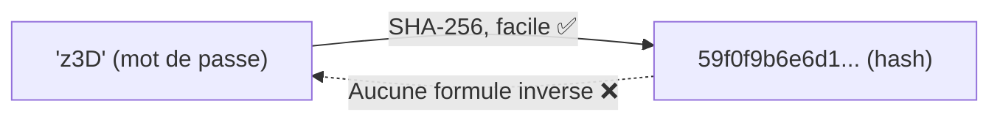
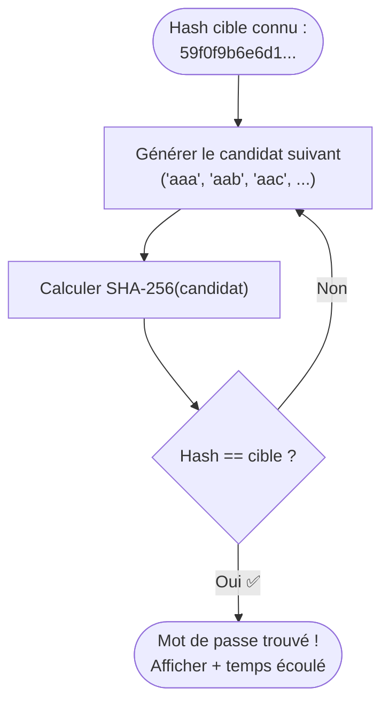
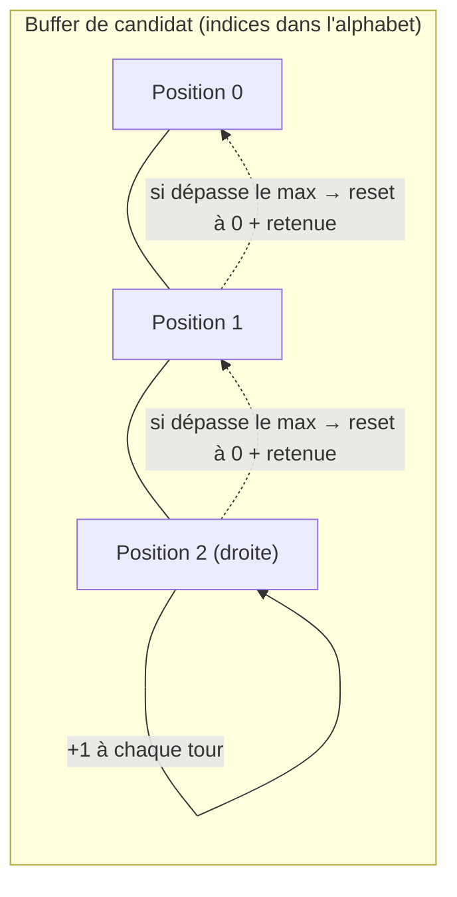
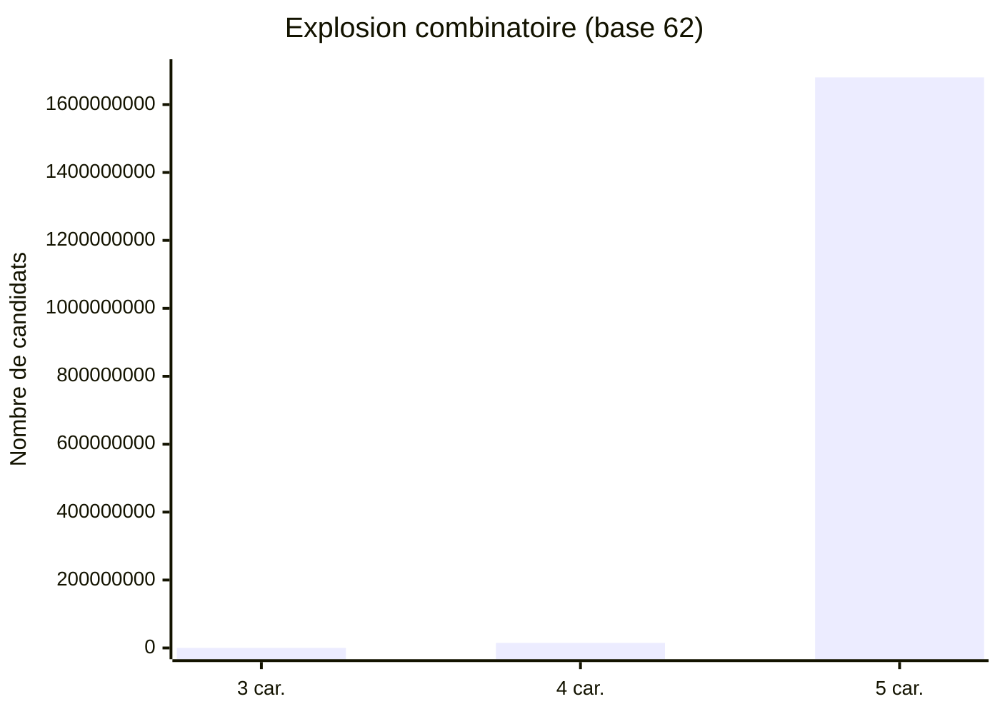

# Comprendre HashBreaker — De zéro à l'algorithme

Ce document explique **pourquoi** et **comment** fonctionne le craqueur, en partant de zéro. L'objectif : que tu puisses expliquer ton code à l'oral sans hésiter.

---

## 1. Le problème de départ : une fonction à sens unique

SHA-256 est une **fonction de hachage cryptographique**. Elle prend n'importe quel texte en entrée et produit une empreinte de taille fixe (256 bits, soit 64 caractères en hexadécimal).

```
"z3D"  ──[ SHA-256 ]──>  59f0f9b6e6d1... (64 caractères, toujours)
"Sh3n" ──[ SHA-256 ]──>  d3b07384d113...
"a"    ──[ SHA-256 ]──>  ca978112ca1b... (même taille de sortie !)
```

Trois propriétés importantes :

| Propriété | Explication |
|---|---|
| **Déterministe** | Le même texte donne toujours le même hash. |
| **Avalanche** | Changer un seul caractère change complètement le hash (aucun lien visuel entre "z3D" et "z3E"). |
| **Sens unique** | Facile à calculer dans un sens, **impossible** à inverser mathématiquement. |

### Pourquoi impossible à inverser ?

Imagine une machine à hacher de la viande : tu peux transformer un steak en viande hachée facilement, mais **impossible de reconstituer le steak initial** à partir de la viande hachée — l'information sur la forme exacte a été détruite dans le processus. SHA-256, c'est pareil : il "broie" l'information dans un sens précis, sans formule pour revenir en arrière.



---

## 2. Alors comment "casser" un hash ?

Puisqu'on ne peut pas inverser le calcul, il ne reste qu'**une seule stratégie** : essayer tous les mots de passe possibles, un par un, jusqu'à en trouver un dont le hash correspond exactement à la cible. C'est la **force brute** (brute force).



C'est une boucle bête et méchante : **générer → hacher → comparer → recommencer**. Toute l'intelligence du TP consiste à rendre cette boucle la plus rapide possible (c'est tout l'enjeu des séances suivantes : zéro-allocation, parallélisme, etc.).

---

## 3. Générer "tous les mots possibles" : le compteur base-N

La partie la plus subtile n'est pas le hachage (une seule ligne de code avec la librairie standard), c'est **générer systématiquement tous les candidats sans en oublier aucun et sans doublon**.

### L'analogie du compteur kilométrique

Pense à l'odomètre d'une voiture, ou à une horloge. Chaque position est un "chiffre" qui tourne dans son alphabet, et quand il boucle sur lui-même, il fait avancer la position à sa gauche — c'est la **retenue** (carry).

Avec un alphabet simple de 3 lettres `[a, b, c]` (base 3) et un mot de 2 caractères, voici l'énumération complète :

```
aa → ab → ac → ba → bb → bc → ca → cb → cc
```

### Pas à pas, avec la retenue en action

Regardons ce qui se passe quand on passe de `"ac"` à `"ba"` :

```
Position :     [gauche] [droite]
Candidat  :       a        c        <- "ac"

Étape 1 : on incrémente la position de droite.
          'c' est déjà le DERNIER caractère de l'alphabet [a,b,c]
          → elle repasse à 'a' ET on propage une retenue (+1) à gauche

Position :     [gauche] [droite]
Candidat  :       a        a        <- retenue en attente sur "gauche"

Étape 2 : on applique la retenue sur la position de gauche.
          'a' devient 'b' (pas de nouvelle retenue, ce n'était pas le dernier caractère)

Candidat final :  "ba"
```

C'est exactement comme un compteur kilométrique qui passe de `099` à `100` : le chiffre des unités boucle de 9 à 0 et fait "déborder" une retenue vers les dizaines, qui elles-mêmes débordent vers les centaines.

### Avec l'alphabet réel du TP (62 caractères)

Pour `z3D` (3 caractères, alphabet `a-z A-Z 0-9` = 62 symboles), le principe est identique mais chaque position peut prendre 62 valeurs au lieu de 3. Le buffer part de `[0,0,0]` (`"aaa"`) et s'incrémente jusqu'à atteindre `[index de 'z', index de '3', index de 'D']`.



**Pourquoi cet ordre (droite vers gauche) ?** Parce que ça garantit de passer par **tous** les mots possibles sans en sauter aucun, exactement comme compter de 0 à 999 en décimal passe forcément par chaque nombre une fois.

---

## 4. Pourquoi deux cibles différentes (z3D puis Sh3n) ?

| Cible | Longueur | Espace de recherche | Rôle |
|---|---|---|---|
| `z3D` | 3 caractères | 62³ = 238 328 candidats | **Valider** que l'algorithme est correct (résolution en millisecondes, même avec un code lent) |
| `Sh3n` | 4 caractères | 62⁴ = 14 776 336 candidats | **Mesurer** un vrai temps d'exécution (quelques secondes) → c'est ta **baseline** de référence |

L'espace de recherche croît de façon **exponentielle** avec la longueur (`62^N`), pas linéairement. C'est pour ça qu'une cible de 5 caractères (`@kAl1`, niveau 3) explose à 1,68 milliard de combinaisons alors qu'on n'a ajouté qu'un seul caractère.



---

## 5. Ce que ton programme doit faire concrètement

1. **Définir l'alphabet** (62 symboles : `a-z`, `A-Z`, `0-9`) et le **hash cible** (fourni en hexadécimal).
2. **Initialiser un buffer** de candidat à `[0, 0, 0]` (= `"aaa"`).
3. **Boucle** :
   - Convertir le buffer d'indices en chaîne de caractères (ex: `[25, 55, 29]` → `"z3D"`).
   - Calculer `SHA-256("z3D")`.
   - Comparer au hash cible (en hexadécimal).
   - Si ça correspond → **trouvé**, on affiche le résultat et on arrête le chrono.
   - Sinon → incrémenter le buffer avec la logique de retenue vue en section 3, et recommencer.
4. **Chronométrer** le temps total (baseline) pour comparer avec les futures versions optimisées.

---

## 6. Le piège à éviter dès maintenant

La version naïve (normale à ce stade) va **allouer un nouvel objet String et une conversion hexadécimale à chaque tentative** — potentiellement des millions de fois. C'est volontairement inefficace : c'est ce problème précis que les prochaines séances vont corriger (zéro-allocation, buffers réutilisés, etc.). Pas besoin de s'en soucier pour l'instant — l'objectif de la Séance 1 est juste que **ça marche** (`Make it work`), pas que ce soit rapide.

---

## Pour aller plus loin (vocabulaire du cours)

- **Espace de recherche** : le nombre total de candidats possibles (`alphabet_size ^ longueur`).
- **Force brute** : stratégie qui teste toutes les possibilités faute de méthode plus directe.
- **Compteur base-N** : technique d'énumération exhaustive et sans doublon d'un espace de candidats.
- **Baseline** : temps de référence mesuré sur la version non optimisée, qui sert de point de comparaison pour tous les gains futurs.
