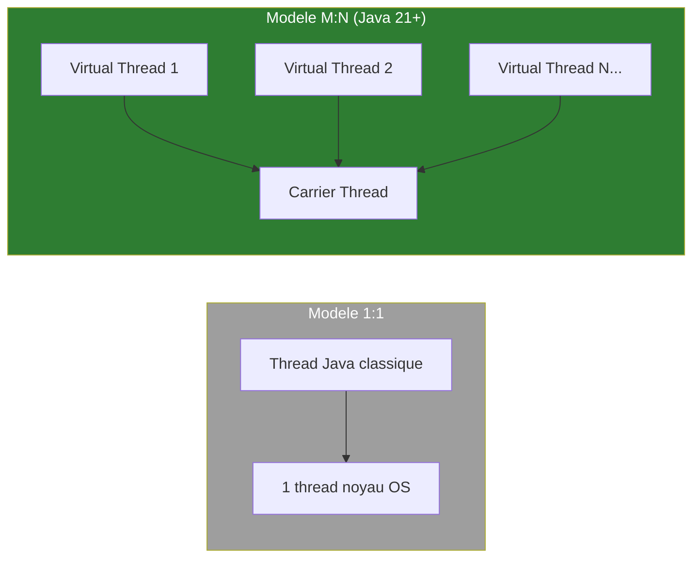
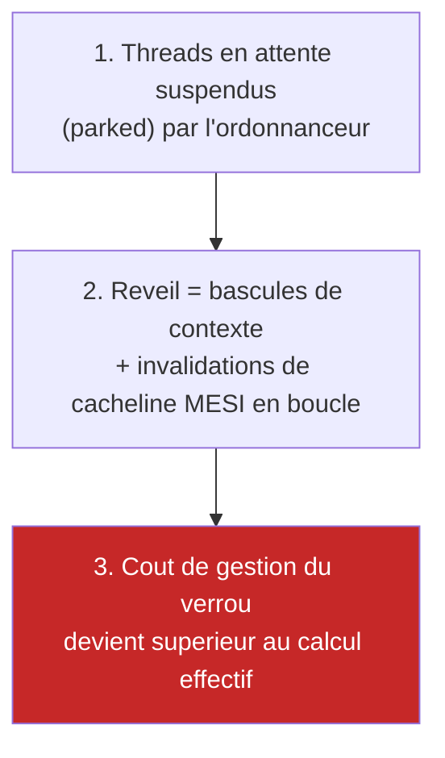
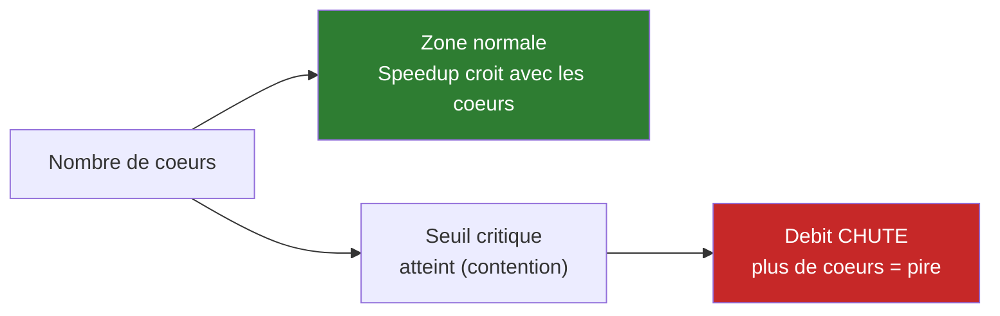
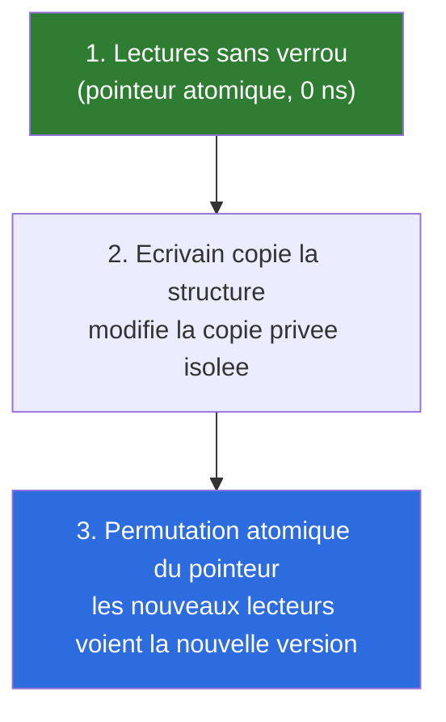
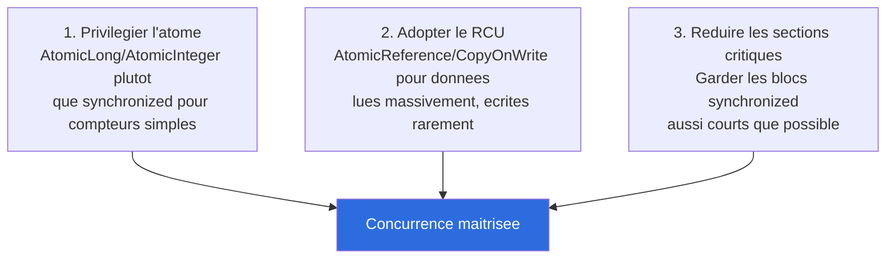

# Comprendre la Concurrence, les Threads OS, Verrous & Contention

Ce document explique le cours **Concurrence & traitements asynchrones (J3_AM)**, qui prépare la **Séance 5** du TP fil rouge (Parallélisation & Worker Pool Borné).

> Fait suite à [comprendre-hashbreaker.md](comprendre-hashbreaker.md), [comprendre-cpu-caches.md](comprendre-cpu-caches.md), [comprendre-memoire-stack-heap.md](comprendre-memoire-stack-heap.md) et [comprendre-metrologie-profiling.md](comprendre-metrologie-profiling.md).
>
> ⚠️ **Ce cours est illustré en Go** (`goroutine`, `sync.Mutex`, `sync/atomic`, `atomic.Pointer`). Chaque section inclut une note "**En Java**".
>
> 🎯 **Double objectif de ce document** : (1) préparer la Séance 5 de HashBreaker, (2) poser les bases théoriques pour l'**Étape 9 (Recherche parallèle)** de MoteurEchecs — voir la section dédiée en fin de document.

---

## 1. Concurrence vs Parallélisme

Deux concepts souvent confondus :

- **Concurrence (structure)** : gérer plusieurs tâches en cours de progression de manière entrelacée — *"dealing with a lot of things at once"*.
- **Parallélisme (exécution)** : exécution physique simultanée sur plusieurs cœurs matériels distincts — *"doing a lot of things at once"*.

**En Java :** un seul cœur peut faire de la concurrence (plusieurs threads entrelacés par l'ordonnanceur OS) sans faire de parallélisme réel. Le parallélisme nécessite plusieurs cœurs physiques — exactement la distinction pertinente pour MoteurEchecs : découper la recherche en plusieurs branches (concurrence) n'accélère rien tant que ces branches ne tournent pas réellement sur des cœurs différents (parallélisme).

---

## 2. Modèle de Threading (1:1 vs M:N)

| Modèle | Principe | Coût |
|---|---|---|
| **1:1** (Threads Kernel) | 1 thread logiciel = 1 thread noyau OS | Lourd, limité à quelques milliers d'unités |
| **M:N** (Green Threads) | Des millions de coroutines légères multiplexées sur peu de threads système | Scalabilité maximale (runtime Go/Erlang) |

**En Java :** c'est un fait directement pertinent pour ce projet — le JDK utilisé ici (**Java 21**) introduit les **Virtual Threads** (JEP 444, finalisées dans Java 21), qui sont *exactement* le modèle M:N décrit dans ce cours. Le `Thread` classique Java (`new Thread(...)`) est un thread **1:1** (mappé 1-pour-1 sur un thread OS, comme historiquement en Java). Un `Thread.ofVirtual()` est un thread **M:N**, multiplexé par la JVM sur un petit pool de "carrier threads" — le pendant direct des goroutines Go.



---

## 3. Coût Mémoire & Bascule de Contexte

| Critère | Thread OS (1:1) | Goroutine (M:N) |
|---|---|---|
| Taille de pile | 1-2 Mo fixe | ~2 Ko, extensible |
| Création | Appel système lourd (syscall) | Allocation utilisateur, quelques ns |
| Bascule de contexte | 1000-2000 cycles CPU (kernel) | 10-20 cycles CPU (user-space) |

**En Java :** `Thread` classique = colonne "Thread OS" (pile par défaut ~512 Ko-1 Mo, réglable via `-Xss`). `Virtual Thread` = colonne "Goroutine" (pile initiale minuscule, extensible dynamiquement, création sans syscall). C'est ce coût de création qui rend viable de lancer des **milliers** de tâches légères avec des Virtual Threads, là où faire pareil avec des `Thread` classiques épuiserait la mémoire — le même problème que "100 000 goroutines non bornées" évoqué en J3_PM.

---

## 4. L'Ordonnanceur Go & Work Stealing (GMP) — et son équivalent Java

Le triplet **G (Goroutine) / M (Machine/thread OS) / P (Processeur logique)** avec vol de travail (*work stealing*) : quand un P vide sa file, il vole la moitié des goroutines d'un autre P, sans goulot central.

**En Java :** l'ordonnanceur des Virtual Threads repose sur le même principe — un `ForkJoinPool` interne (par défaut, autant de "carrier threads" que de cœurs, `Runtime.getRuntime().availableProcessors()`) planifie les Virtual Threads dessus avec du work-stealing. Correspondance directe :

| GMP (Go) | Équivalent Java (Virtual Threads) |
|---|---|
| G (Goroutine) | `Thread` virtuel |
| M (Machine/thread OS) | "Carrier thread" (thread de plateforme) |
| P (Processeur logique, `GOMAXPROCS`) | File du `ForkJoinPool` sous-jacent |
| Délestage I/O bloquante | Le carrier thread se libère automatiquement quand le Virtual Thread bloque sur une I/O (mécanisme intégré à la JVM) |

---

## 5. Verrous d'Exclusion Mutuelle

```go
type SafeCounter struct {
    mu    sync.Mutex
    value int
}
func (c *SafeCounter) Increment() {
    c.mu.Lock()
    c.value++ // Section critique protégée
    c.mu.Unlock()
}
```

**Règle fondamentale** : une seule unité d'exécution à la fois peut pénétrer dans la section critique.

**En Java :** deux équivalents directs — le mot-clé `synchronized` (le plus simple) ou `java.util.concurrent.locks.ReentrantLock` (plus flexible, verrouillage/déverrouillage explicites) :

```java
public class CompteurSur {
    private final Object verrou = new Object();
    private int valeur;
    public void incrementer() {
        synchronized (verrou) {
            valeur++; // section critique protégée
        }
    }
}
```

---

## 6. Le Phénomène de Contention

Quand plusieurs cœurs se disputent le même verrou :



**En Java :** identique — un thread bloqué sur `synchronized`/`ReentrantLock.lock()` est mis en attente (`java.lang.Thread.State.BLOCKED` ou `WAITING`), son réveil déclenche une bascule de contexte OS. Le protocole MESI (cohérence de cache entre cœurs) est un mécanisme **matériel**, donc strictement identique quel que soit le langage.

---

## 7. L'Écroulement de la Loi d'Amdahl sous Contention

> Ajouter des cœurs CPU ne résout pas la contention : **cela peut l'aggraver**.

- **Loi d'Amdahl** : l'accélération maximale est bornée par la fraction strictement séquentielle du système — déjà appliquée dans ce projet ([README.md](../README.md#goulots-détranglement--loi-damdahl), calcul formel dans [process/07-seance2-partie4-validation-sympathie-materielle.md](../process/07-seance2-partie4-validation-sympathie-materielle.md)).
- **Loi d'Universal Scalability (USL)** : sous contention, l'effort de *coordination* entre cœurs fait chuter le débit net — **au-delà d'un seuil critique, passer de 8 à 32 cœurs peut diviser le débit au lieu de le multiplier.**



**⚠️ Point critique pour MoteurEchecs** : si une future table de transposition partagée (Étape 8) est protégée par un verrou trop grossier lors de la recherche parallèle (Étape 9), ce phénomène est exactement le risque à anticiper — un candidat naturel pour l'**Étape 11 (Échec constructif)** du barème si on le rencontre réellement en pratique plutôt que de le contourner sans le documenter.

---

## 8. Primitives Atomiques & Instructions LOCK

```go
func (c *AtomicCounter) Increment() {
    atomic.AddInt64(&c.value, 1) // Compile en LOCK XADDQ au niveau silicium
}
```

**Zéro appel système, zéro mise en veille** : l'instruction processeur (`LOCK CMPXCHG`/`LOCK XADDQ`) verrouille temporairement la ligne de cache pour exécuter la modification en 1 cycle — pas de thread suspendu, pas de bascule de contexte.

**En Java :** `java.util.concurrent.atomic` fournit l'équivalent exact — `AtomicLong`, `AtomicInteger`, `AtomicBoolean` :

```java
private static final AtomicLong positionsEvaluees = new AtomicLong();
// dans alphabeta(), au lieu de positionsEvaluees++ :
positionsEvaluees.incrementAndGet(); // compile vers LOCK XADDQ, pas de verrou explicite
```

**Application directe repérée dans le code actuel** : `MinimaxAlphaBeta.positionsEvaluees` ([MinimaxAlphaBeta.java:25](../MoteurEchecs/src/main/java/com/moteurechecs/recherche/MinimaxAlphaBeta.java)) est aujourd'hui un simple `static long`, incrémenté sans protection (`positionsEvaluees++`) — **correct en séquentiel, mais une vraie course critique (race condition) dès que plusieurs workers l'incrémenteront en parallèle** à l'Étape 9. Un `AtomicLong` sera nécessaire à ce moment-là.

---

## 9. Modèle Read-Copy-Update (RCU)

Pour des structures **très souvent lues, rarement écrites** (tables de routage, configuration) :



**En Java :** pas d'équivalent Go `atomic.Pointer[T]` natif identique, mais deux options directes :
- `java.util.concurrent.atomic.AtomicReference<T>` + `compareAndSet()` — reproduit manuellement le pattern Go exact (charger, copier, modifier la copie, permuter atomiquement).
- `java.util.concurrent.CopyOnWriteArrayList`/`CopyOnWriteArraySet` — collections RCU **déjà prêtes à l'emploi** dans la bibliothèque standard.

**Pertinence pour MoteurEchecs** : un futur livre d'ouvertures partagé (Étape 10, lu en boucle par tous les workers de recherche mais jamais modifié pendant une partie) serait un candidat naturel pour ce pattern — lecture sans contention garantie.

---

## 10. Synthèse — 3 règles d'or



---

## 11. TP Fil Rouge (Séance 5) : ce qui est demandé sur HashBreaker

**Mission officielle** : découper l'espace de recherche de la cible `@kAl1`, distribuer les lots sur un **Worker Pool borné au nombre de cœurs CPU**, et propager l'**annulation précoce instantanée** dès qu'un worker trouve le mot de passe.

1. **Partitionnement combinatoire** : découper l'espace par le premier caractère de `@kAl1` et distribuer les blocs.
2. **Pool borné sur `runtime.NumCPU()`** — en Java : `Runtime.getRuntime().availableProcessors()`, via `Executors.newFixedThreadPool(n)`.
3. **Arrêt précoce** (`context.WithCancel` en Go) — en Java : un `AtomicBoolean trouve` partagé, vérifié dans la boucle de chaque worker, ou l'annulation de `Future` (`future.cancel(true)`).
4. **Scaling multi-cœurs** : mesurer le speedup réel à 1, 2, 4, N cœurs et vérifier la linéarité (ou son absence, cf. section 7 ci-dessus).

---

## 12. Application prévue sur MoteurEchecs (Étape 9 — Recherche parallèle)

Ce cours pose directement les briques théoriques de l'**Étape 9** de la roadmap ([choix-sujet.md](../choix-sujet.md)) :

| Concept du cours | Application prévue sur MoteurEchecs |
|---|---|
| Worker Pool borné au nombre de cœurs | `Executors.newFixedThreadPool(Runtime.getRuntime().availableProcessors())` pour distribuer les branches de recherche |
| Fan-out des tâches | **Root splitting** — répartir les coups candidats de la racine (aujourd'hui une simple boucle `for` dans `meilleurCoup()`, [MinimaxAlphaBeta.java:41](../MoteurEchecs/src/main/java/com/moteurechecs/recherche/MinimaxAlphaBeta.java)) sur N workers, chacun explorant sa propre branche |
| Compteurs atomiques | `positionsEvaluees` doit devenir un `AtomicLong` dès que plusieurs workers y écrivent concurremment (actuellement un `static long` non protégé — correct seulement en séquentiel) |
| **Point d'attention critique, spécifique à ce projet** | Le pattern **make/unmake** de `Plateau.jouer()`/`annuler()` ([Plateau.java](../MoteurEchecs/src/main/java/com/moteurechecs/modele/Plateau.java)) **mute un seul objet `Plateau` partagé en place** — excellent en séquentiel (zéro allocation, Étape 4), mais **dangereux tel quel en parallèle** : deux workers ne peuvent pas jouer/annuler des coups sur le même `Plateau` simultanément sans corruption. Chaque worker devra recevoir sa **propre copie** du `Plateau` avant de diverger (une copie par branche de la racine, pas de partage d'état mutable entre threads). |
| Loi d'Amdahl / USL sous contention | Si une table de transposition partagée (Étape 8) est ajoutée avant l'Étape 9, sa politique de verrouillage devra être conçue avec ce risque en tête — sinon terrain fertile pour l'Étape 11 (Échec constructif) si la parallélisation régresse au lieu d'accélérer |
| RCU / `AtomicReference` | Candidat pour un futur livre d'ouvertures partagé en lecture seule pendant la recherche (Étape 10) |

---

## Vocabulaire à retenir

- **Modèle 1:1 vs M:N** : thread OS lourd et coûteux vs coroutine légère multiplexée — en Java, `Thread` classique vs `Thread` virtuel (Java 21+).
- **Work Stealing** : un cœur inactif "vole" la moitié des tâches d'un cœur surchargé, sans coordinateur central.
- **Contention** : plusieurs threads se disputant le même verrou, dont le coût de gestion peut dépasser le calcul utile.
- **Loi d'Universal Scalability (USL)** : au-delà d'un seuil, ajouter des cœurs sous contention réduit le débit au lieu de l'augmenter.
- **Primitive atomique (`LOCK CMPXCHG`/`XADDQ`)** : opération matérielle sans verrou logiciel ni mise en veille de thread.
- **RCU (Read-Copy-Update)** : lectures sans verrou, écrivain qui copie-modifie-permute atomiquement.
