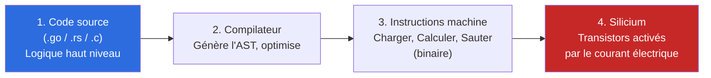
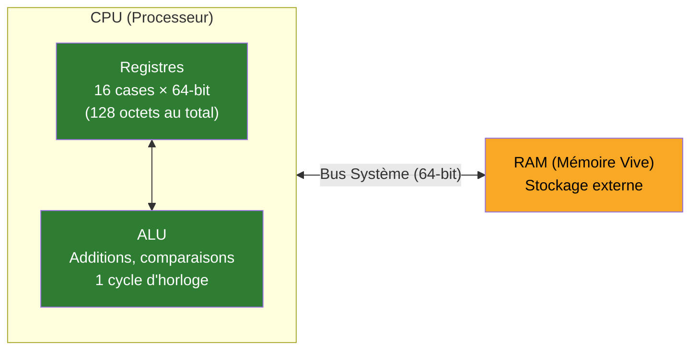
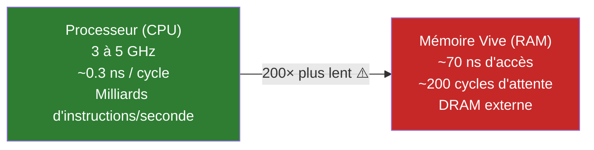
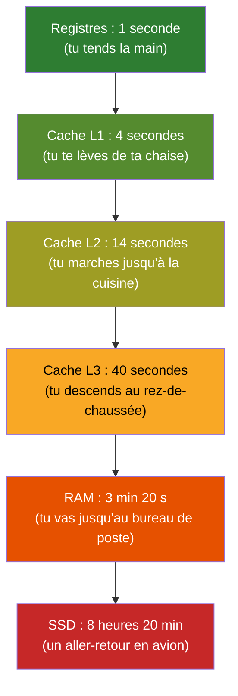
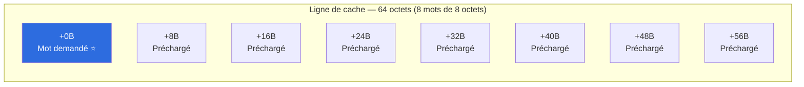
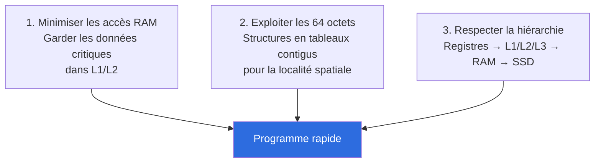

# Comprendre l'Architecture Matérielle — CPU & Caches

Ce document explique le cours **Architecture Matérielle : CPU & Caches (J1_PM)**, qui prépare la **Séance 2** du TP fil rouge (localité spatiale & lignes de cache). Objectif : comprendre *physiquement* pourquoi certains codes sont rapides et d'autres lents, avant même de parler d'algorithmes.

> Fait suite à [comprendre-hashbreaker.md](comprendre-hashbreaker.md) (force brute & SHA-256) et à [README.md](README.md) (fondamentaux de la performance).

---

## 1. Du code source au silicium

Quand tu écris `if (x > 5) { ... }`, il se passe 4 transformations avant que ça devienne un vrai calcul électrique :

- **AST (Abstract Syntax Tree)** : le compilateur transforme ton code en arbre pour vérifier les types et l'optimiser, avant de le traduire en instructions machine.
- **Le processeur ne comprend aucun texte.** Il n'y a pas de "lecture" du code comme toi tu lis une phrase : les octets du binaire **activent directement des pistes électroniques**. `if`, `for`, une addition — tout finit en signaux électriques qui ouvrent ou ferment des transistors.

C'est le même principe que le binaire/ASCII vu en Séance 1 (`comprendre-hashbreaker.md`), mais poussé plus loin : même les *instructions* du programme (pas seulement les données) sont du binaire.

---

## 2. Le CPU ne calcule jamais directement en RAM

Point contre-intuitif mais fondamental : **l'ALU (Arithmetic Logic Unit)**, le circuit qui fait les additions/comparaisons, ne peut travailler que sur des données **déjà présentes dans les registres du CPU**. Jamais directement sur la RAM.

**Analogie :** imagine un cuisinier (l'ALU) qui ne peut travailler que sur les ingrédients posés sur son plan de travail (les registres). Le garde-manger (la RAM) est juste à côté, mais à chaque fois qu'il lui faut un ingrédient qui n'est pas sur le plan de travail, il doit **s'arrêter de cuisiner**, aller le chercher, revenir, puis reprendre. C'est exactement ce que fait le CPU : `charger depuis la RAM vers un registre → calculer → éventuellement écrire le résultat en RAM`.

Les registres sont minuscules (128 octets au total !) mais **instantanés**. C'est le compromis espace-temps extrême : très peu de place, mais accès immédiat.

---

## 3. La RAM : un immense tableau d'octets numérotés

La RAM n'est pas une boîte magique, c'est littéralement un tableau géant où chaque case (1 octet) a un numéro unique : son **adresse mémoire**.

| Adresse | Octet (binaire) | Caractère |
|---|---|---|
| `0x1000` | `01001000` | `'H'` |
| `0x1001` | `01100101` | `'e'` |
| `0x1002` | `01101100` | `'l'` |
| `0x1003` | `01101111` | `'o'` |

Un **pointeur**, en programmation, n'est rien de plus qu'un **entier 64-bit qui contient une adresse mémoire** — littéralement un numéro de case dans ce tableau géant. Sur une architecture 64 bits, les adresses et les entiers natifs sont alignés sur des mots de **8 octets** (on reverra cette notion d'alignement en Séance 2/3 du TP, avec le struct padding).

---

## 4. Le Mur de la Mémoire (Memory Wall)

Voici le problème central de tout ce cours : **le CPU calcule beaucoup plus vite qu'il ne peut lire la RAM.**

**Ce qui se passe concrètement (CPU Stall) :** si la donnée dont le CPU a besoin n'est dans aucun cache, le cœur **s'arrête net** pendant environ 200 cycles d'horloge — le temps que la RAM réponde. Ce ne sont pas 200 cycles utiles, c'est 200 cycles de pipeline **vide**, gaspillés à attendre.

> **Loi absolue du cours :** en backend, la performance est presque toujours limitée par l'attente mémoire, **pas** par la puissance brute de calcul du CPU.

C'est un changement de perspective important : on a tendance à croire qu'un code lent = "le CPU calcule trop", alors qu'en pratique un code lent = très souvent "le CPU attend la RAM".

---

## 5. La hiérarchie des latences — et pourquoi c'est vertigineux

Entre les registres et la RAM, il existe plusieurs paliers intermédiaires (les caches), chacun un compromis taille/vitesse :

| Niveau | Taille | Cycles | Temps réel | Portée |
|---|---|---|---|---|
| Registres CPU | ~128 octets | 1 cycle | ~0.3 ns | Cœur (instantané) |
| Cache L1 | 32-64 Ko | 4 cycles | ~1 ns | Dédié à 1 cœur |
| Cache L2 | 512 Ko-1 Mo | 14 cycles | ~4 ns | Dédié à 1 cœur |
| Cache L3 (LLC) | 16-64 Mo | ~40 cycles | ~12 ns | Partagé entre cœurs |
| RAM DDR | 16-128 Go | ~200 cycles | ~70 ns | Toute la machine |
| SSD NVMe | 500 Go-4 To | 30 000+ cycles | 10-50 µs | Stockage persistant |

Ces chiffres sont abstraits — voici une façon de les rendre concrets :

### Si 1 cycle CPU durait 1 seconde...

C'est ça, le "mur de la mémoire" : passer des registres à la RAM, c'est comme passer d'une seconde à plus de 3 minutes. Et taper sur un SSD, c'est s'absenter une demi-journée entière — pour une seule donnée.

**Conséquence directe pour toi en tant que développeur backend :** chaque fois que ton code force un accès RAM (ou pire, disque) qui aurait pu être évité, tu payes ce facteur x200 ou x30000. C'est souvent bien plus déterminant sur la performance globale que la complexité algorithmique elle-même.

---

## 6. Pourquoi le CPU charge toujours 64 octets d'un coup

Autre point contre-intuitif : quand le CPU va chercher **une seule donnée** en RAM (par exemple un `int` de 4 octets), il ne rapatrie jamais que ces 4 octets. Il charge un bloc entier de **64 octets** d'un coup, appelé **ligne de cache (cache line)**.

**Pourquoi ?** Ouvrir une ligne mémoire en RAM coûte cher (~200 cycles, le fameux mur de la mémoire). Une fois que le bus est "amorcé" pour cette ouverture, rapatrier 64 octets d'un coup au lieu de 4 ne coûte quasiment rien de plus. C'est un pari du matériel : **"puisque tu me demandes cet octet, tu vas probablement aussi vouloir ses voisins juste après."** Ce pari s'appelle la **localité spatiale**.

---

## 7. Localité spatiale & temporelle

Deux principes qui expliquent pourquoi la **façon dont tu organises tes données** compte autant que l'algorithme lui-même :

### Localité spatiale
> Des données stockées à des adresses **contiguës** sont préchargées ensemble dans la même ligne de 64 octets.

**Exemple concret :** parcourir un tableau (`array`/`slice`) est jusqu'à **10x plus rapide** que parcourir une liste chaînée de même taille, même si les deux ont la même complexité algorithmique O(n) ! La différence n'est pas dans l'algorithme, elle est dans le matériel : le tableau profite du préchargement des 64 octets, la liste chaînée (avec ses nœuds éparpillés en mémoire par des pointeurs) déclenche un Cache Miss quasiment à chaque nœud.

### Localité temporelle
> Une donnée **récemment utilisée** a de fortes chances d'être réutilisée bientôt.

**Exemple concret :** dans une boucle serrée qui répète le même calcul, garder les variables "chaudes" (utilisées souvent) permet au CPU de les laisser dans le cache L1 au lieu de les recharger sans arrêt depuis la RAM.

---

## 8. Cache Hit vs Cache Miss

| | Cache Hit (succès) | Cache Miss (défaut) |
|---|---|---|
| Situation | La donnée est déjà dans un cache (L1/L2/L3) | La donnée n'est dans aucun cache |
| Coût | 1 à 15 cycles | ~200 cycles (le CPU "gèle") |
| Analogie | L'ingrédient est déjà sur le plan de travail | Il faut courir jusqu'au garde-manger |

Un programme "sympathique avec le matériel" (hardware-friendly) est un programme qui **maximise les Cache Hits** en organisant ses données pour profiter de la localité spatiale et temporelle — sans changer l'algorithme lui-même.

---

## 9. Synthèse — les 3 impératifs

---

## 10. Séance 2 du TP : ce que tu vas devoir démontrer

L'activité pratique demande de **prouver expérimentalement** tout ce qui précède, sur ton propre HashBreaker :

1. **Stockage contigu vs dispersé** : générer un lot de candidats en mémoire de deux façons — un tableau linéaire contigu vs une collection de nœuds reliés par des pointeurs.
2. **Parcours linéaire vs aléatoire** : chronométrer la lecture séquentielle (qui profite des lignes de 64 octets) contre un parcours à accès dispersés.
3. **Observer le goulot mémoire** : constater que le débit s'effondre quand le CPU enchaîne les Cache Miss et attend la RAM (~200 cycles perdus à chaque fois).
4. **Valider la sympathie matérielle** : montrer que la disposition contiguë améliore le débit de hachage **sans changer une seule ligne de la logique de calcul** — la preuve que la performance vient ici du matériel, pas de l'algorithme.

C'est la suite logique directe de la Séance 1 : maintenant que l'algorithme fonctionne (`Make it work`), on commence à le rendre rapide (`Make it fast`) en travaillant d'abord sur la couche la plus basse — comment les données sont rangées en mémoire.

---

## Vocabulaire à retenir

- **ALU** : circuit qui exécute les calculs, ne travaille que sur des registres.
- **Registre** : mémoire minuscule et instantanée intégrée au cœur du CPU.
- **Cache L1/L2/L3** : paliers intermédiaires de mémoire rapide (SRAM) entre les registres et la RAM.
- **Cache Line (ligne de cache)** : bloc de 64 octets, unité minimale de transfert entre RAM et cache.
- **Cache Hit / Cache Miss** : donnée trouvée / absente dans le cache.
- **CPU Stall** : le processeur s'arrête complètement en attendant une donnée (typiquement lors d'un Cache Miss vers la RAM).
- **Mur de la mémoire (Memory Wall)** : l'écart de vitesse structurel entre le CPU (rapide) et la RAM (lente).
- **Localité spatiale** : les données proches en mémoire sont accédées ensemble.
- **Localité temporelle** : une donnée récemment utilisée sera probablement réutilisée bientôt.
