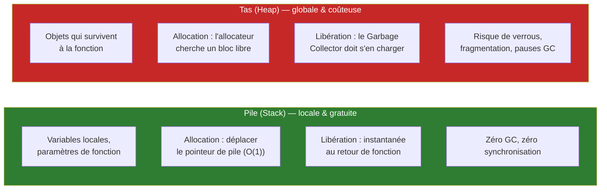
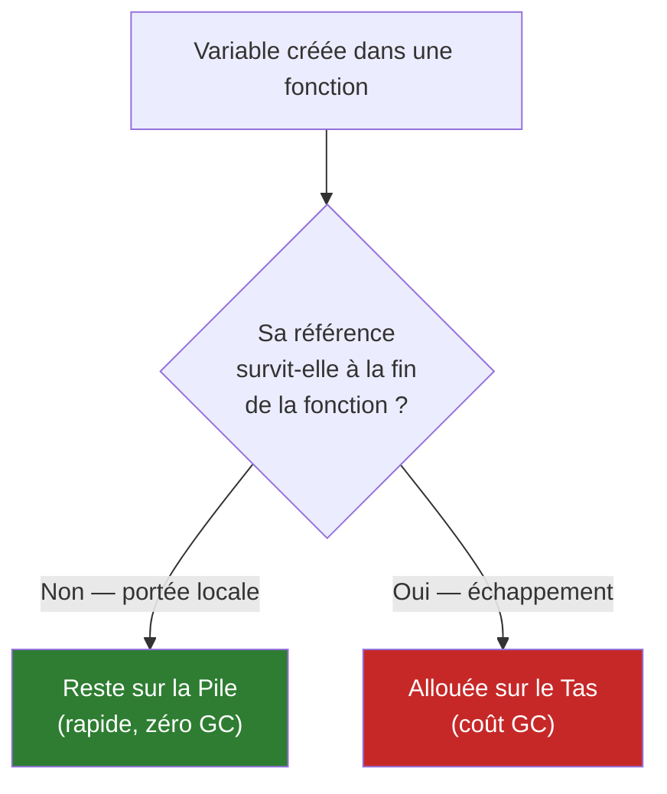
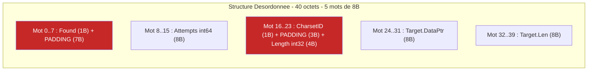
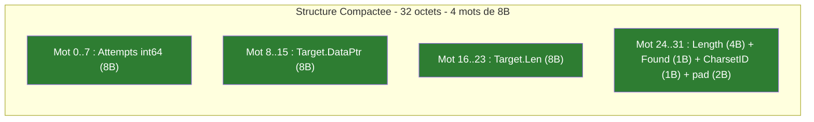
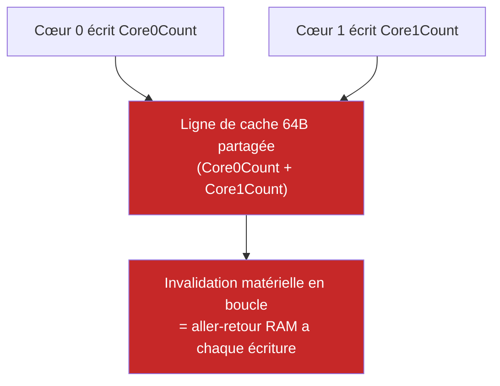
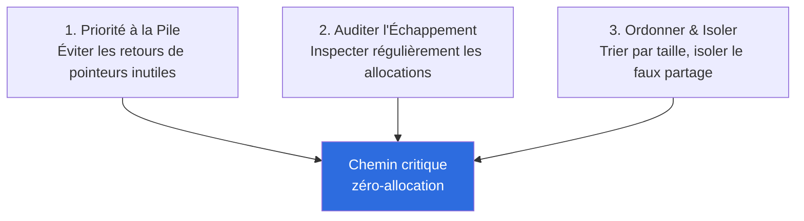

# Comprendre le Modèle Mémoire — Stack, Heap, Escape Analysis & Struct Padding

Ce document explique le cours **Optimisations orienté mémoire (J2_AM)**, qui prépare la **Séance 3** du TP fil rouge (Zéro-Allocation & Struct Padding). Objectif : comprendre où vivent réellement tes variables en mémoire, et pourquoi ça détermine si le Garbage Collector va devoir s'en mêler.

> Fait suite à [comprendre-hashbreaker.md](comprendre-hashbreaker.md) et [comprendre-cpu-caches.md](comprendre-cpu-caches.md).
>
> ⚠️ **Ce cours est illustré en Go** (goroutines, `go build -gcflags`, `[8]byte`). HashBreaker est en Java : chaque section ci-dessous inclut une note "**En Java**" pour traduire le concept quand l'équivalent n'est pas direct.

---

## 1. Pile (Stack) vs Tas (Heap) : le coût matériel

Deux régions mémoire radicalement différentes existent pour stocker les variables d'un programme en cours d'exécution.



**Analogie :** la pile, c'est ton bureau — tu poses un dossier, tu le ranges dès que tu as fini, zéro effort. Le tas, c'est un entrepôt partagé avec toute l'équipe — il faut chercher une place libre, parfois attendre que quelqu'un d'autre finisse, et quelqu'un (le Garbage Collector) doit périodiquement faire le tour pour retrouver ce qui n'est plus utilisé et le jeter.

### Pourquoi la pile est quasi gratuite

- **Allocation** : juste déplacer un pointeur (le "sommet de la pile") — un seul cycle CPU, complexité O(1).
- **Libération** : automatique, instantanée, au retour de la fonction — pas de travail de recherche.
- **Zéro Garbage Collector** : rien à tracer, rien à scanner.
- **Localité maximale** : le sommet de pile reste en permanence dans le cache L1 (cf. `comprendre-cpu-caches.md`).

### Pourquoi le tas coûte cher

1. **Allocateur dynamique** : doit chercher un bloc de mémoire libre de la bonne taille, avec un risque de fragmentation.
2. **Concurrence & synchronisation** : plusieurs threads peuvent demander de la mémoire en même temps → verrous.
3. **Pression GC** : chaque objet sur le tas doit être tracé, scanné, puis libéré par le ramasse-miettes — ça vole des cycles CPU et peut provoquer des pauses ("Stop-The-World").

> **Règle d'or du cours :** moins un objet s'échappe sur le tas, plus la latence de ton programme reste stable et basse.

**En Java :** le principe est identique (pile par thread pour les variables locales/paramètres, tas partagé pour les objets), mais **en Java, tout objet non-primitif est conceptuellement créé sur le tas** dès l'écriture du code (`new Node(...)`, `new String(...)`) — il n'existe pas de syntaxe pour déclarer explicitement "cette variable reste sur la pile" comme en Go ou en C. C'est la JVM (le JIT, pas le compilateur `javac`) qui peut *a posteriori*, au moment de l'exécution, décider d'éliminer certaines allocations si elle prouve que l'objet ne s'échappe jamais (voir section 2). C'est une optimisation automatique, pas un contrôle direct du développeur.

---

## 2. L'analyse d'échappement (Escape Analysis)

Le compilateur (ou le JIT) analyse le code pour décider : cette variable peut-elle rester sur la pile, ou doit-elle "s'échapper" sur le tas ?



### Les 4 causes classiques d'échappement (vocabulaire Go, mais le principe est universel)

| Cause | Exemple | Pourquoi ça échappe |
|---|---|---|
| **Retour de pointeur** | `return &user` | L'appelant garde une référence après la fin de la fonction |
| **Boxing vers une interface** | assignation à un type `any`/`interface{}` | La valeur doit être enveloppée dynamiquement, taille inconnue à la compilation |
| **Taille inconnue à la compilation** | `make([]byte, size)` où `size` n'est pas une constante | Le compilateur ne peut pas réserver une taille fixe sur la pile |
| **Capture dans une goroutine/thread asynchrone** | variable transmise par pointeur à une fonction lancée en parallèle | Sa durée de vie dépasse celle de la fonction appelante |

**Diagnostic en Go :** `go build -gcflags="-m" ./...` affiche directement les décisions du compilateur (`moved to heap: user` ou `user does not escape`).

**En Java :** il n'existe pas d'équivalent en une commande aussi simple, parce que l'escape analysis de la JVM se fait **au runtime par le JIT** (compilateur C2), pas statiquement à la compilation. On peut l'observer via des flags JVM (`-XX:+PrintEscapeAnalysis -XX:+PrintEliminateAllocations`, réservés aux builds JDK de debug) ou plus simplement en mesurant les allocations réelles avec un profileur (JFR, async-profiler) ou un micro-benchmark JMH avec `-prof gc`. C'est une différence philosophique importante : en Go, l'échappement est une décision *statique et prévisible* du compilateur ; en Java, c'est une optimisation *dynamique et potentiellement incertaine* du JIT — d'où l'importance, pour nous, de **ne jamais compter dessus** et de coder directement en style zéro-allocation (réutiliser les buffers) plutôt que d'espérer que la JVM l'élimine toute seule.

---

## 3. Alignement mémoire & Struct Padding

### La règle matérielle

Sur une architecture 64-bit, chaque donnée doit commencer à une adresse **multiple de sa propre taille** :

| Taille du type | Alignement requis | Exemples |
|---|---|---|
| 8 octets | adresse multiple de 8 | `int64`, `float64`, pointeurs |
| 4 octets | adresse multiple de 4 | `int32`, `float32` |
| 2 octets | adresse multiple de 2 | `int16` |
| 1 octet | n'importe quelle adresse | `bool`, `byte`, `int8` |

**Conséquence :** si les champs d'une structure sont déclarés dans le désordre, le compilateur insère des **octets de remplissage invisibles (padding)** pour respecter ces règles — ce qui peut gaspiller 20 à 40% de la RAM occupée par chaque instance.

### Cas pratique du cours : `Candidate`, 40 octets → 32 octets

**Version désordonnée (40 octets, 10 octets gaspillés = 25%) :**

```go
type CandidateBad struct {
    Found     bool    // 1B + 7B de padding (pour aligner Attempts sur 8B)
    Attempts  int64   // 8B
    CharsetID byte    // 1B + 3B de padding (pour aligner Length sur 4B)
    Length    int32   // 4B
    Target    string  // 16B (pointeur 8B + longueur 8B)
}  // Total = 40 octets, dont 10B totalement inutiles
```



**Version compactée (32 octets, -20% de RAM), champs triés du plus grand au plus petit :**

```go
type CandidateGood struct {
    Attempts  int64   // 8B
    Target    string  // 16B (pointeur 8B + longueur 8B)
    Length    int32   // 4B
    Found     bool    // 1B
    CharsetID byte    // 1B + 2B de padding final
}  // Total = 32 octets
```



**Règle d'or :** trier les champs du plus grand au plus petit (8B → 4B → 2B → 1B) pour agréger les petits types ensemble, sans laisser de trou entre eux. Gain ici : 8 octets économisés par instance, et la structure tient tout juste dans une moitié de ligne de cache — 2 instances tiennent exactement dans une ligne de cache de 64 octets.

**En Java :** cette optimisation manuelle **n'a pas d'équivalent direct**, et c'est une bonne nouvelle : la JVM HotSpot **réordonne déjà automatiquement les champs** d'une classe pour minimiser le padding (l'ordre de déclaration dans le code source n'a aucune influence sur la disposition mémoire réelle). Par contre, Java ajoute un coût que Go n'a pas : **chaque objet porte un en-tête obligatoire** (12 à 16 octets — mark word + pointeur de classe, +4B pour la longueur si c'est un tableau), avant même le premier champ. C'est directement lié à ce qu'on a découvert en Séance 2 : notre `Node` (`String candidat` + `Node suivant`) coûte environ 16B d'en-tête + 8B (référence `candidat`) + 8B (référence `suivant`) = **32 octets minimum**, avant même de compter l'objet `String` séparé qu'il référence (lui-même avec son propre en-tête). C'est très exactement ce qui explique l'écart mesuré en Séance 2 Partie 2 (tableau `char[]` vs liste de `Node`) : chaque `Node` traîne un surcoût structurel que le `char[]` n'a pas du tout.

---

## 4. Le piège du Faux Partage (False Sharing)

Un phénomène sournois qui apparaît **uniquement en environnement multi-cœurs**, sans qu'aucun verrou logiciel ne soit posé.

**Le problème :** si deux cœurs CPU écrivent chacun sur une variable différente, mais que ces deux variables se trouvent sur la **même ligne de cache de 64 octets**, le protocole matériel de cohérence de cache invalide la ligne en permanence entre les deux cœurs — chaque écriture force un aller-retour coûteux vers la mémoire centrale.

```go
// PIÈGE : deux compteurs indépendants, mais sur la même ligne de 64 octets
type BadCounters struct {
    Core0Count uint64 // 8 octets, offset 0
    Core1Count uint64 // 8 octets, offset 8  -> MÊME ligne de cache !
}
```



**La solution :** isoler chaque compteur sur sa propre ligne de cache, via du padding volontaire.

```go
type PaddedCounter struct {
    value uint64
    _     [7]uint64  // 56 octets de remplissage -> total = 64 octets exactement
}

type SafeCounters struct {
    Core0 PaddedCounter  // Cache Line #1, dédiée
    Core1 PaddedCounter  // Cache Line #2, dédiée
}
```

Chaque cœur ne touche plus que sa propre ligne de cache — **gains mesurés de x5 à x10** en forte concurrence.

**En Java :** le phénomène est identique (c'est un problème matériel, pas un problème de langage). L'équivalent existe via l'annotation `@Contended` (`jdk.internal.vm.annotation`, nécessite le flag JVM `-XX:-RestrictContended` pour du code applicatif) qui force le padding automatiquement, ou en ajoutant manuellement des champs `long` inutilisés autour de la variable sensible. Ce sujet deviendra concret dès qu'on introduira du vrai parallélisme (workers bornés) sur HashBreaker.

---

## 5. Synthèse — les 3 règles d'or



---

## 6. Séance 3 du TP : ce que tu vas devoir démontrer

L'activité pratique demande d'éliminer les allocations sur le tas dans le chemin critique de HashBreaker, et de compacter les structures de données :

1. **Diagnostic d'échappement** : constater que les conversions en `String` et les concaténations (le "piège de la version naïve" de la Séance 1 !) allouent des millions d'objets sur le tas.
2. **Compactage de structure (padding)** : réorganiser une structure `Candidate` pour économiser de la mémoire (concept transposable, même si la JVM gère déjà l'ordre des champs automatiquement — l'important est de comprendre *pourquoi*).
3. **Buffers fixes réutilisés** : remplacer les allocations dynamiques et concaténations par un buffer unique, alloué une seule fois, mutable par indice — voir explication détaillée ci-dessous.
4. **Validation zéro-allocation** : prouver, mesures à l'appui, que la boucle critique n'alloue (quasiment) plus rien sur le tas.

---

## Vocabulaire à retenir

- **Pile (Stack) / Tas (Heap)** : deux régions mémoire aux coûts radicalement différents.
- **Escape Analysis (analyse d'échappement)** : décision (statique en Go, dynamique en Java) de placer une variable sur la pile ou le tas.
- **Boxing** : conversion d'une valeur concrète vers un type englobant dynamique (coûteux, force l'échappement).
- **Padding** : octets de remplissage invisibles insérés pour respecter l'alignement mémoire.
- **Field alignment** : contrainte matérielle qui impose qu'un champ commence à une adresse multiple de sa taille.
- **False Sharing (faux partage)** : ralentissement causé par deux cœurs qui écrivent sur la même ligne de cache sans le savoir.
- **0 B/op, 0 allocs/op** : objectif de benchmark prouvant qu'une boucle critique n'alloue plus rien sur le tas.
