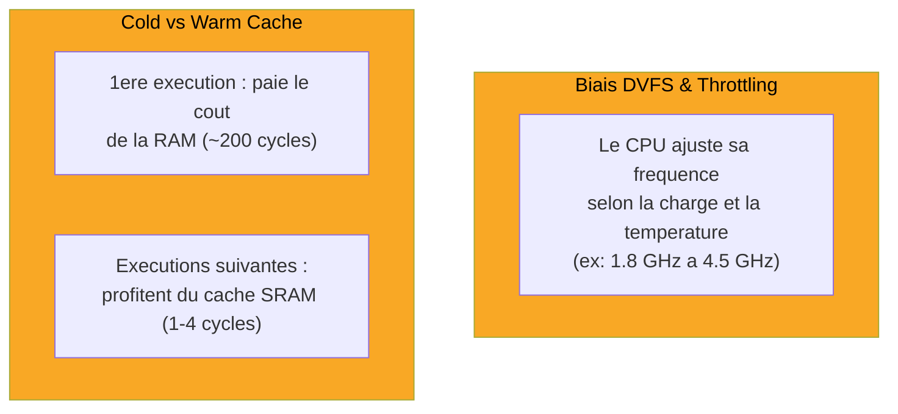
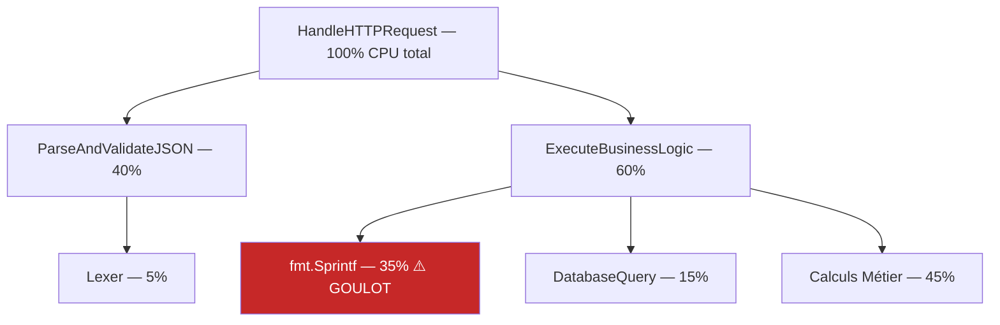
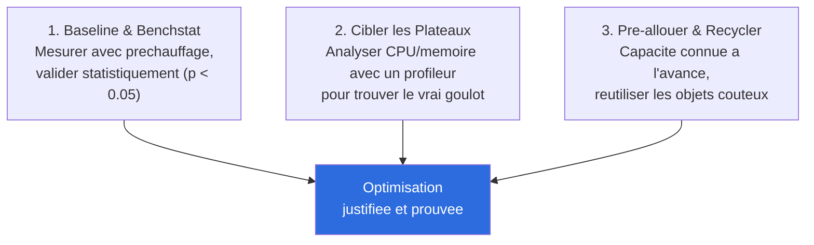

# Comprendre la Métrologie, les Micro-benchmarks & le Profiling

Ce document explique le cours **Métrologie, Micro-benchmarks & Profiling Applicatif (J2_PM)**, qui prépare la **Séance 4** du TP fil rouge (Diagnostic CPU & Profiling). Objectif : mesurer avec une rigueur scientifique, et savoir lire un profil d'exécution pour trouver le vrai goulot — pas celui qu'on imagine.

> Fait suite à [comprendre-hashbreaker.md](comprendre-hashbreaker.md), [comprendre-cpu-caches.md](comprendre-cpu-caches.md) et [comprendre-memoire-stack-heap.md](comprendre-memoire-stack-heap.md).
>
> ⚠️ **Ce cours est illustré en Go** (`testing.B`, `pprof`, `benchstat`, `sync.Pool`). Chaque section inclut une note "**En Java**".
>
> 💡 **Bonne nouvelle** : on a déjà commencé à appliquer une bonne partie de cette méthodologie sans le savoir, en Séance 3 (JFR pour diagnostiquer les allocations). Ce cours formalise et étend ce qu'on a déjà fait.

---

## 1. Pourquoi mesurer et profiler ?

> "Optimiser sans mesurer engendre du code complexe et inutile."

Trois raisons de toujours mesurer avant d'agir :

1. **Objectivité scientifique** : remplacer les intuitions subjectives par des données quantitatives et reproductibles. *(On l'a vécu deux fois : Séance 2, l'intuition sur la localité mémoire s'effaçait sous le hachage naïf ; Séance 3, le coupable supposé — `construireCandidat()` — n'était pas le vrai coupable — `sha256()`.)*
2. **Loi de Pareto (80/20)** : identifier avec certitude les ~5% de code responsables de ~95% du temps de traitement. C'est une reformulation directe de la "règle du maillon faible" et de la loi d'Amdahl vues en J1_AM.
3. **Sobriété & écoconception** : éliminer les goulots CPU et les allocations réduit directement le nombre de serveurs nécessaires et l'empreinte carbone — la performance backend a un impact environnemental concret, pas seulement un impact "expérience utilisateur".

---

## 2. Biais matériels & baseline fiable

Les processeurs modernes ne tournent jamais à vitesse constante — mesurer sans en tenir compte fausse les résultats.



**Conséquence pratique** : une seule mesure isolée (comme nos `System.currentTimeMillis()` actuels) peut tomber sur un pic de fréquence, un cache encore froid, ou un processus parasite qui tourne en arrière-plan — et donner un chiffre trompeur.

### L'outil : Hyperfine

`hyperfine` relance une commande plusieurs fois, ignore les premières exécutions (`--warmup`) pour laisser le CPU/cache se stabiliser, puis calcule des statistiques complètes (moyenne, médiane, écart-type) sur le reste :

```bash
hyperfine --warmup 5 --runs 50 './bin_v1' './bin_v2' --export-markdown report.md
```

**En Java :** exactement utilisable tel quel — Hyperfine est un outil externe, indépendant du langage. On peut déjà s'en servir aujourd'hui : `hyperfine --warmup 3 'java -cp out com.hashbreaker.Main'`.

---

## 3. Micro-benchmarking : Go `testing.B` vs Java JMH

Go a un moteur de benchmark intégré au langage. Java n'en a pas nativement, mais dispose de l'outil de facto standard : **JMH (Java Microbenchmark Harness)**, développé par l'équipe OpenJDK elle-même (les auteurs du JIT) — précisément pour éviter les pièges de mesure que les benchmarks "faits main" (comme nos boucles avec `System.nanoTime()`) ne détectent pas.

| Concept Go | Rôle | Équivalent Java (JMH) |
|---|---|---|
| `testing.B`, `b.N` | Le runtime ajuste automatiquement le nombre d'itérations jusqu'à une mesure stable | JMH ajuste aussi automatiquement (`@Warmup`, `@Measurement` avec un nombre d'itérations et une durée cible) |
| `b.ResetTimer()` | Exclut le temps d'initialisation du chronométrage | `@Setup(Level.Trial)` exécuté hors mesure |
| `go test -bench=. -benchmem` | Rapporte temps/op **et** allocations/op (B/op, allocs/op) | `mvn ... -prof gc` ou annotations JMH + profiler GC intégré, rapporte l'équivalent (`·gc.alloc.rate.norm`) |

### Le piège du Dead Code Elimination (DCE)

Un compilateur moderne (Go **et** le JIT Java) peut **supprimer purement et simplement un calcul** si son résultat n'est jamais lu ailleurs — un risque énorme en benchmark : on croit mesurer un calcul qui n'existe plus dans le code exécuté.

```go
// PIÈGE : localRes n'est jamais lu après la boucle -> le compilateur peut supprimer le calcul entier
func BenchmarkBad(b *testing.B) {
    var localRes int
    for i := 0; i < b.N; i++ {
        localRes = HeavyComputation(i)
    }
    // localRes jamais utilisé -> risque de DCE
}

// CORRECT : une variable globale force le compilateur a garder le calcul
var BenchmarkSink int

func BenchmarkGood(b *testing.B) {
    var localRes int
    for i := 0; i < b.N; i++ {
        localRes = HeavyComputation(i)
    }
    BenchmarkSink = localRes // le calcul ne peut plus etre elimine
}
```

**En Java :** JMH fournit un mécanisme dédié et plus propre que la variable globale — `org.openjdk.jmh.infra.Blackhole.consume(valeur)`, appelé explicitement dans le corps du benchmark, qui garantit au JIT que la valeur est "consommée" sans jamais l'afficher ni la stocker réellement. **On applique déjà ce principe intuitivement** dans nos classes `Seance2LocaliteMemoire` et `Seance3ZeroAllocation` : les méthodes `parcourirTableau()`, `hacherTableau()` etc. retournent un `long` (checksum) précisément pour empêcher le JIT d'éliminer la boucle — c'est le même réflexe que le `BenchmarkSink` de Go, en plus simple.

---

## 4. Comparaison statistique rigoureuse : Benchstat

> "Ne jamais comparer deux benchmarks à l'œil nu."

Deux mesures moyennes différentes ne prouvent rien seules — il faut un test statistique pour savoir si l'écart est réel ou du bruit.

```bash
go test -bench=BenchmarkTransform -count=10 ./... > old.txt
go test -bench=BenchmarkTransform -count=10 ./... > new.txt
benchstat old.txt new.txt
```

```
name           old time/op    new time/op    delta
Transform-8    45.2ns ± 2%    18.1ns ± 1%    -59.96%  (p=0.000 n=10+10)
```

**`benchstat` applique le test de Mann-Whitney** et calcule une **p-value** : si `p < 0.05`, l'écart est statistiquement significatif (pas du hasard). C'est exactement le réflexe qu'on a déjà eu en Séance 2 Partie 4, en moyennant sur **10 essais** et en fixant un seuil (5%) pour distinguer un vrai gain du bruit de mesure — sans le formaliser avec un vrai test statistique comme `benchstat` le fait.

**En Java :** pas d'équivalent officiel unique. JMH rapporte déjà des intervalles de confiance sur ses propres mesures. Pour une comparaison formelle entre deux versions, la méthode la plus simple reste ce qu'on a fait en Séance 2 : plusieurs essais + moyenne + seuil de significativité — une rigueur "artisanale" mais honnête, qu'on pourra formaliser avec JMH plus tard si besoin.

---

## 5. Profiling & Flamegraphs

### Les profils fondamentaux (`pprof`)

| Profil | Ce qu'il mesure |
|---|---|
| **CPU** | Échantillonnage à haute fréquence (ex: 100 Hz) des fonctions qui consomment des cycles |
| **Allocs / Heap** | Distingue le volume **cumulé** d'allocations (`alloc_space`) de la mémoire **vivante** résidente (`inuse_space`) |
| **Mutex / Block** | Temps perdu à attendre un verrou ou un canal/I/O bloquant |

**En Java :** on a déjà utilisé l'équivalent exact en Séance 3 — **JFR (Java Flight Recorder)**. `jdk.ObjectAllocationSample` = profil Allocs (`alloc_space`, volume cumulé), `jdk.ExecutionSample` = profil CPU (on l'a vu apparaître dans `jfr summary` sans encore l'avoir exploité). **Côté `inuse_space` (mémoire vivante résidente)** — longtemps manquant de cette note — l'équivalent Java est `jdk.GCHeapSummary` : un événement standard, déjà présent dans nos `.jfr` existants sans configuration supplémentaire (capturé après chaque cycle GC), qui donne la taille réelle du tas juste avant/après chaque collection (`when = "Before GC"` / `"After GC"`). Utilisé sur MoteurEchecs pour mesurer un vrai pic d'empreinte mémoire par étape (`jfr print --events jdk.GCHeapSummary`), bien plus fiable qu'un `Runtime.totalMemory()` lu à la main (instant arbitraire, très bruité — piège rencontré et documenté). Pas de profil Mutex/Block direct en JFR sans configuration supplémentaire, mais `jdk.ThreadPark`/`jdk.JavaMonitorWait` couvrent ce rôle. Pour une vraie vue Flamegraph interactive comme `go tool pprof -http=:8080`, l'outil de référence Java est **async-profiler**, ou l'interface graphique **JDK Mission Control (JMC)** qui peut ouvrir directement nos fichiers `.jfr` existants.

### Anatomie d'un Flamegraph



**Règle de lecture :** chercher les **plateaux larges au sommet** des flammes — ils désignent directement la fonction *finale* responsable du temps CPU ou des allocations (pas une fonction intermédiaire qui ne fait qu'appeler d'autres fonctions). C'est exactement ce qu'on a fait "à la main" en Séance 3 en lisant les stack traces JFR : le plateau le plus large pointait vers `sha256()` ligne 99, pas vers `construireCandidat()`.

---

## 6. Le goulot classique : réallocations dynamiques

```go
// PIÈGE : capacité initiale 0 -> le tableau est realloue et recopie plusieurs fois en grandissant
func BuildCatalogBad(source []Item) []Record {
    items := make([]Record, 0)
    for i := range source {
        items = append(items, transform(source[i]))
    }
    return items
}

// OPTIMAL : 1 seule allocation, capacite connue a l'avance
func BuildCatalogGood(source []Item) []Record {
    items := make([]Record, 0, len(source))
    for i := range source {
        items = append(items, transform(source[i]))
    }
    return items
}
```

Chaque fois qu'une structure dynamique dépasse sa capacité actuelle, elle doit être **réallouée en mémoire et intégralement recopiée** — un coût caché qui grandit avec le nombre d'éléments.

**En Java :** le même piège existe avec `ArrayList`, `StringBuilder`, `HashMap`, etc. — tous doublent leur capacité interne (et recopient) quand ils débordent. La solution est identique : préciser la capacité dès la construction quand elle est connue à l'avance (`new ArrayList<>(source.size())`, `new StringBuilder(tailleAttendue)`). On a d'ailleurs déjà appliqué ce principe en Séance 2 avec `new char[nombreCandidats * longueur]` (une seule allocation, taille connue à l'avance) plutôt qu'une structure qui grandit dynamiquement.

---

## 7. Recyclage mémoire : `sync.Pool`

Pour des objets coûteux et éphémères (buffers, encodeurs), plutôt que d'en allouer un nouveau à chaque utilisation, on le **réutilise** via un pool :

```go
var bufferPool = sync.Pool{
    New: func() any { return new(bytes.Buffer) },
}

func ProcessRequest(data []byte) {
    buf := bufferPool.Get().(*bytes.Buffer)
    buf.Reset()
    defer bufferPool.Put(buf)
    buf.Write(data)
}
```

**Avantage clé** : `sync.Pool` maintient une liste **locale par cœur CPU**, donc récupérer un objet du pool ne nécessite **aucun verrou** — zéro contention entre threads.

**En Java :** pas d'équivalent standard direct dans la bibliothèque de base. Le pattern se recrée manuellement (une file/pile d'objets réutilisables, ou une variable `ThreadLocal<T>` pour un objet dédié par thread — l'équivalent le plus proche de "liste locale par cœur"). **On applique déjà ce principe** en Séance 3 : notre unique instance de `MessageDigest`, créée une fois et réutilisée à travers toute la boucle, est un pool à un seul objet. Le sujet deviendra pleinement pertinent dès qu'on introduira du vrai parallélisme (plusieurs threads, chacun avec son propre `MessageDigest` pour éviter tout partage).

---

## 8. Synthèse — les 3 impératifs



---

## 9. Séance 4 du TP : ce qui est demandé

**Mission officielle** : attaquer la cible lourde `@kAl1` (Niveau 3, 5 caractères, alphabet étendu 70+ symboles, ~1,68 milliard de candidats) avec le profileur CPU activé, isoler le goulot d'encodage hexadécimal, et le remplacer par une comparaison binaire 64-bit.

1. **Profiling CPU & Flamegraph** : exécuter le craqueur avec un profil CPU actif, générer et inspecter un Flamegraph interactif.
2. **Détection du "Goulet Hex"** : constater que plus de 35% du temps CPU est gaspillé dans la conversion hexadécimale utilisée pour comparer le hash calculé au hash cible.
3. **Comparaison binaire 64-bit** : décoder le hash cible en octets une seule fois au démarrage, puis comparer les octets bruts par mots de 64 bits plutôt qu'octet par octet ou en texte.
4. **Preuve statistique** : mesurer le gain net avant/après avec un outil de comparaison statistique, et intégrer les captures de Flamegraph annotées dans le rapport d'audit.

### ⚠️ Point important : on a déjà fait la moitié de ce travail, mais pas encore sur `@kAl1`

Les étapes 2 et 3 (éliminer la conversion hexadécimale, comparer directement des octets) sont **exactement** ce qu'on a fait en Séance 3 Partie 3 (`Seance3ZeroAllocation.java`, via `MessageDigest.isEqual()`) — mais motivé et mesuré différemment : en Séance 3 c'était un problème **d'allocations** (diagnostiqué par JFR), ici c'est explicitement un problème de **temps CPU** (diagnostiqué par un profil CPU/Flamegraph). Ce sont deux angles complémentaires sur le même défaut de code.

**Ce qui est vraiment nouveau pour cette séance :**
- **La cible `@kAl1`** : jamais attaquée jusqu'ici (on s'est arrêtés à `z3D` et `Sh3n`). Avec 1,68 milliard de candidats et un alphabet à 70+ symboles (notre alphabet actuel n'en a que 62 — il faudra l'étendre), c'est un bond d'échelle qui va rendre le profiling CPU beaucoup plus parlant (plus de temps d'exécution = profils plus riches et stables).
- **La comparaison par mots de 64 bits** : notre `MessageDigest.isEqual()` actuel compare déjà les octets directement (donc déjà bien plus rapide que du texte), mais pas explicitement par blocs de 64 bits (`long` en Java) — c'est une micro-optimisation supplémentaire à vérifier/appliquer.
- **Le profiling CPU formel** (Flamegraph), qu'on n'a pas encore exploité — seulement le profil d'allocations en Séance 3.

---

## Vocabulaire à retenir

- **DVFS (Dynamic Voltage and Frequency Scaling)** : ajustement dynamique de la fréquence CPU selon charge/température.
- **Cold cache / Warm cache** : premher accès (lent, RAM) vs accès suivants (rapides, déjà en cache).
- **Dead Code Elimination (DCE)** : suppression par le compilateur/JIT d'un calcul dont le résultat n'est jamais utilisé.
- **p-value** : probabilité que l'écart mesuré soit dû au hasard — `p < 0.05` = statistiquement significatif.
- **Flamegraph** : visualisation en flammes d'un profil d'exécution ; les plateaux larges au sommet indiquent le vrai goulot.
- **`sync.Pool`** : pool d'objets réutilisables, local par cœur, sans verrou.
