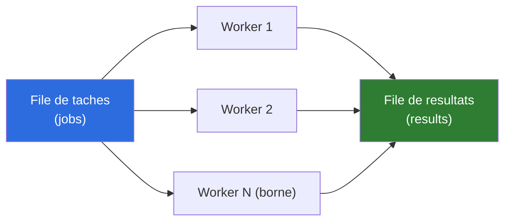
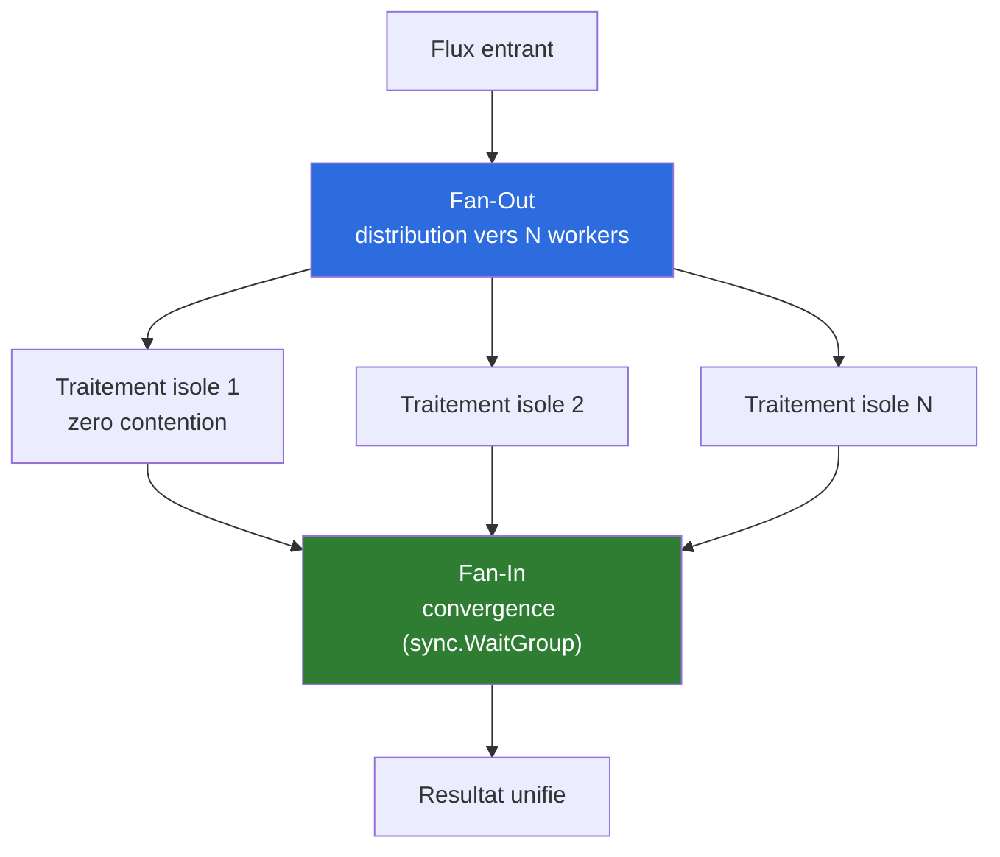
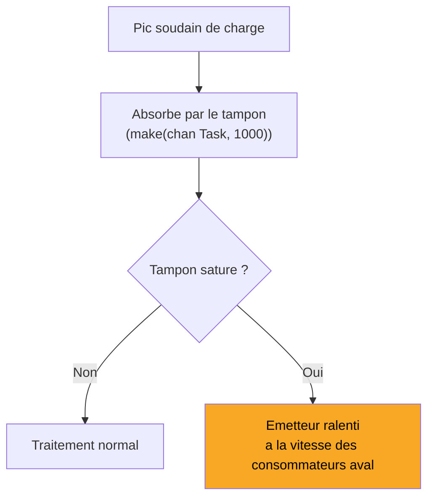
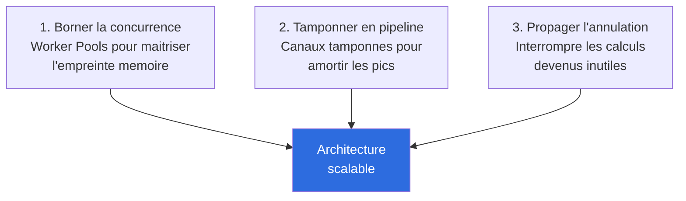

# Comprendre les Worker Pools, Pipelines & l'Annulation Précoce

Ce document explique le cours **Scalabilité des traitements asynchrones (J3_PM)**, qui prépare la **Séance 6** du TP fil rouge (Contention de Verrous & `sync.Pool`).

> Fait suite à [comprendre-concurrence-threads-verrous.md](comprendre-concurrence-threads-verrous.md) (J3_AM) — ce document part du principe que la concurrence, les verrous et les primitives atomiques sont déjà acquis.
>
> ⚠️ **Ce cours est illustré en Go** (`chan`, `sync.WaitGroup`, `context.WithTimeout`). Chaque section inclut une note "**En Java**".
>
> 🎯 **Double objectif** : (1) préparer la Séance 6 de HashBreaker, (2) poser les bases pratiques pour l'**Étape 9 (Recherche parallèle)** de MoteurEchecs — voir la section dédiée en fin de document.

---

## 1. Pourquoi Limiter la Concurrence ?

```go
// DANGER : lancer 50 000 goroutines non bornées sature immédiatement la base de données !
func HandleBatch(requests []Request) {
    for _, req := range requests {
        go ProcessDatabase(req)
    }
}
```

Trois risques d'une concurrence non bornée :
1. **Surcharge mémoire** — des milliers de piles d'exécution simultanées (risque OOM Killer).
2. **Épuisement système** — sockets réseau, descripteurs de fichiers (`Too many open files`).
3. **Perte de sobriété/contrôle** — latence imprévisible, bases de données submergées.

**En Java :** le même piège existe avec `Executors.newCachedThreadPool()` (pool **non borné**, il crée un thread par tâche soumise si aucun n'est libre) ou pire, `new Thread(...).start()` dans une boucle sans limite. La solution est identique : **toujours borner** via `Executors.newFixedThreadPool(n)`.

---

## 2. Architecture d'un Worker Pool



Un nombre **fixe** de travailleurs consomme la file à son propre rythme, sans jamais dépasser la capacité allouée.

**En Java :** la "file de tâches" (`jobs <-chan Job`) correspond à une `BlockingQueue<Job>` ou, plus simplement, à la file interne d'un `ExecutorService`. La "file de résultats" correspond à une liste de `Future<Result>`.

---

## 3. Implémentation du Worker Pool

```go
func StartWorkerPool(numWorkers int, jobs <-chan Job, results chan<- Result) {
    for w := 0; w < numWorkers; w++ {
        go func() {
            for job := range jobs {
                res, err := ProcessJob(job)
                results <- Result{JobID: job.ID, Output: res, Err: err}
            }
        }()
    }
}
```

**En Java**, équivalent direct avec `ExecutorService` :

```java
ExecutorService pool = Executors.newFixedThreadPool(numWorkers);
List<Future<Result>> resultats = jobs.stream()
    .map(job -> pool.submit(() -> traiterJob(job)))
    .toList();
pool.shutdown();
```

Le pool gère lui-même la file interne et la distribution aux N threads fixes — pas besoin de coder la boucle `for job := range jobs` manuellement.

---

## 4. Dimensionnement Idéal des Workers

| Type de tâche | Formule | Raison |
|---|---|---|
| **CPU-Bound** (calculs purs, cryptographie) | Workers = **cœurs physiques** | Ajouter des workers au-delà crée de la contention inutile (cf. J3_AM, section Amdahl/USL) |
| **I/O-Bound** (requêtes HTTP, SQL, disque) | Workers = cœurs × **2 à 10** | Masque la latence d'attente réseau — le CPU n'est pas occupé pendant l'attente |

**En Java :** `Runtime.getRuntime().availableProcessors()` donne le nombre de cœurs logiques.

**⚠️ Application directe à MoteurEchecs** : la recherche Minimax/Alpha-Beta est un cas d'école **CPU-Bound pur** (aucune I/O, aucune attente réseau/disque pendant la recherche) — donc la formule à appliquer à l'Étape 9 est sans ambiguïté : `Workers = Runtime.getRuntime().availableProcessors()`, pas plus. C'est exactement ce que `choix-sujet.md` anticipait déjà ("Recherche parallèle | Répartir l'exploration de l'arbre sur plusieurs cœurs (workers bornés)") — ce cours donne la formule précise pour le borner correctement.

---

## 5. Patterns Fan-Out & Fan-In



1. **Fan-Out** : distribution de la file entrante vers N goroutines parallèles.
2. **Traitement isolé** : calcul indépendant, sans partage de mémoire ni verrou — zéro contention.
3. **Fan-In** : multiplexage des résultats vers un flux unique, synchronisé par `sync.WaitGroup`.

**En Java :** `ExecutorService.invokeAll(taches)` est un **Fan-Out + Fan-In intégré en une seule ligne** — soumet toutes les tâches, bloque jusqu'à ce que toutes soient terminées, retourne la liste des `Future` :

```java
List<Future<Integer>> scores = pool.invokeAll(tachesDeRecherche); // fan-out + fan-in
```

**Application directe à MoteurEchecs (root splitting)** : c'est *exactement* le pattern pour paralléliser `MinimaxAlphaBeta.meilleurCoup()` ([MinimaxAlphaBeta.java:27-60](../MoteurEchecs/src/main/java/com/moteurechecs/recherche/MinimaxAlphaBeta.java)) — la boucle actuelle `for (Coup coup : coups) { ... }` sur les coups candidats de la racine devient un **fan-out** (chaque coup racine part sur son propre worker, avec sa propre copie de `Plateau`), et le choix du meilleur score parmi tous les résultats devient le **fan-in**. C'est la technique de parallélisation la plus simple et la plus sûre pour un moteur d'échecs (pas de partage d'état mutable entre workers, contrairement à une parallélisation plus profonde dans l'arbre).

---

## 6. Pipelines Étagés de Traitement

Découpage d'un algorithme en étapes séquentielles indépendantes, fonctionnant simultanément (chaque étage tourne pendant que l'étage suivant traite le résultat précédent) :

| Étape | Rôle | Nature |
|---|---|---|
| 1. Ingestion | Lecture réseau/disque | I/O Bound |
| 2. Parsing | Validation/transformation | CPU Bound |
| 3. Persistance | Écriture groupée en base | Batch Database |

**Pertinence pour MoteurEchecs (Étape 10 — I/O & Persistance)** : si le moteur est exposé en service (gRPC, prévu dans le barème), le cycle "recevoir une position FEN → chercher le meilleur coup → renvoyer la réponse" est structurellement un pipeline à 3 étages (parsing I/O-bound, recherche CPU-bound, sérialisation I/O-bound) — pas nécessaire à implémenter en pipeline explicite pour un simple aller-retour, mais le concept devient pertinent si le service doit traiter plusieurs positions en flux continu.

---

## 7. Canaux Tampons & Contre-Pression (Backpressure)



Un canal tamponné absorbe les pics, puis **ralentit automatiquement l'émetteur** une fois le tampon saturé — protection contre l'allocation infinie.

**En Java :** `java.util.concurrent.ArrayBlockingQueue<T>(capacite)` — une file bornée dont la méthode `put()` **bloque automatiquement** l'émetteur si elle est pleine, exactement le mécanisme de contre-pression décrit ici. Pertinent pour un futur service MoteurEchecs recevant plus de requêtes de calcul que de workers disponibles.

---

## 8. Annulation Précoce avec Context

```go
func HandleRequest(w http.ResponseWriter, r *http.Request) {
    ctx, cancel := context.WithTimeout(r.Context(), 2*time.Second)
    defer cancel()
    res, err := QueryDatabase(ctx)
    if errors.Is(err, context.Canceled) {
        return // Requête abandonnée : aucun calcul inutile !
    }
}
```

**Règle absolue** : toujours écouter `ctx.Done()` dans les boucles de traitement intensives, pour sortir immédiatement dès qu'un délai est dépassé.

**En Java :** pas de `context.Context` intégré au langage, mais plusieurs équivalents :
- Un `volatile boolean`/`AtomicBoolean` partagé, vérifié à chaque itération d'une boucle de calcul.
- `Future.cancel(true)` + `Thread.interrupted()` vérifié dans la boucle.
- **Structured Concurrency** (`java.util.concurrent.StructuredTaskScope`, disponible en aperçu depuis Java 21 — le JDK de ce projet) : `shutdownOnSuccess()` annule automatiquement les tâches sœurs dès qu'une seule a fini, l'équivalent le plus direct et le plus moderne de `context.WithCancel`.

**⚠️ Application directe et concrète à MoteurEchecs** : c'est exactement le mécanisme qui manque aujourd'hui pour une **recherche à budget de temps** (iterative deepening) — actuellement, `MinimaxAlphaBeta.meilleurCoup()` cherche à une **profondeur fixe**, sans aucune notion de temps limite. Une future version pourrait chercher profondeur 1, puis 2, puis 3... en boucle, avec un flag `AtomicBoolean tempsEcoule` vérifié dans `alphabeta()` à chaque nœud, pour interrompre proprement et retourner le meilleur coup trouvé jusque-là dès que le budget de temps est atteint — le même réflexe que la boucle Go `select { case <-ctx.Done(): return ... default: ... }` de ce cours.

---

## 9. Synthèse — 3 Piliers des Architectures Scalables



---

## 10. TP Fil Rouge (Séance 6) : ce qui est demandé sur HashBreaker

**Mission officielle** : diagnostiquer l'effondrement causé par les verrous partagés sur le compteur d'essais, passer aux opérations atomiques, et recycler les buffers d'état de hachage.

1. **Lock Contention sous pprof** — observer la dégradation causée par un `sync.Mutex` partagé quand tous les workers incrémentent un compteur centralisé. En Java : profiler avec JFR (`jdk.JavaMonitorEnter`/`jdk.ThreadPark`), l'équivalent du profil `pprof -mutex`.
2. **Compteurs atomiques** — remplacer le `Mutex` par `sync/atomic.AddUint64`. En Java : `AtomicLong.incrementAndGet()` (cf. [comprendre-concurrence-threads-verrous.md](comprendre-concurrence-threads-verrous.md), section 8).
3. **Recyclage via `sync.Pool`** — chaque worker réutilise son instance `sha256.New()` sans allouer sur le tas. En Java : on a déjà appliqué ce principe en Séance 3 (une seule instance de `MessageDigest` réutilisée) — en parallèle, il faudra **une instance par thread** (`ThreadLocal<MessageDigest>`), pas une instance partagée (un `MessageDigest` n'est pas thread-safe).
4. **Validation débit max** — vérifier que le débit reste stable même à saturation complète des cœurs.

---

## 11. Application prévue sur MoteurEchecs (Étape 9 — Recherche parallèle)

Ce cours complète directement [comprendre-concurrence-threads-verrous.md](comprendre-concurrence-threads-verrous.md) avec les briques **pratiques** de mise en œuvre :

| Concept du cours | Application prévue sur MoteurEchecs |
|---|---|
| Dimensionnement CPU-bound (workers = cœurs) | `Executors.newFixedThreadPool(Runtime.getRuntime().availableProcessors())` — recherche 100% CPU-bound, aucune raison de dépasser le nombre de cœurs |
| Fan-Out / Fan-In (`invokeAll`) | **Root splitting** : chaque coup candidat de la racine part sur son propre worker avec sa propre copie de `Plateau`, résultats regroupés par `invokeAll()` |
| Annulation précoce / budget de temps | Piste pour une future recherche à profondeur variable (iterative deepening) avec coupure sur budget de temps — actuellement absent, profondeur fixe uniquement |
| `ThreadLocal` pour objets non thread-safe | Si une structure mutable est partagée entre workers (au-delà du simple `Plateau` par branche), prévoir un exemplaire par thread plutôt qu'un exemplaire partagé |
| Contre-pression (`ArrayBlockingQueue`) | Pertinent seulement si le moteur devient un service recevant plusieurs requêtes de recherche simultanées (Étape 10, hors périmètre de l'Étape 9) |

**Rappel du point de vigilance déjà identifié (cf. document précédent)** : le pattern make/unmake de `Plateau` mute un état partagé en place — le root splitting fonctionne précisément *parce qu'*il donne à chaque worker sa **propre copie** de `Plateau` avant de diverger, évitant tout partage d'état mutable entre threads pendant la recherche elle-même.

---

## Vocabulaire à retenir

- **Worker Pool** : nombre fixe de travailleurs consommant une file de tâches à leur rythme, sans jamais dépasser un plafond.
- **CPU-Bound vs I/O-Bound** : détermine la formule de dimensionnement (cœurs physiques vs cœurs × 2-10).
- **Fan-Out / Fan-In** : distribution parallèle puis convergence des résultats — en Java, `ExecutorService.invokeAll()`.
- **Pipeline étagé** : découpage séquentiel d'un traitement en étapes qui tournent simultanément.
- **Contre-pression (Backpressure)** : un tampon saturé ralentit automatiquement l'émetteur plutôt que d'exploser en mémoire.
- **Annulation précoce** : interrompre un calcul devenu inutile dès qu'un résultat est trouvé ou qu'un budget de temps est dépassé (`context.Context` en Go, `AtomicBoolean`/`StructuredTaskScope` en Java).
