# Schémas — État actuel du projet (Séances 1 à 4 complètes)

Diagrammes Mermaid de ce qui a été produit jusqu'ici : structure du projet, code de `Main.java` et `Seance2LocaliteMemoire.java`, flux d'exécution et couverture des tests.

> Journal détaillé étape par étape : voir [process/](../process/README.md). Synthèses "ce qu'il faut retenir" par séance : voir [syntheses/](../syntheses/README.md).

> Pour voir les diagrammes : ouvre ce fichier dans VSCode et fais `Ctrl+Shift+V` (aperçu Markdown). Si les schémas ne s'affichent pas, installe l'extension **"Markdown Preview Mermaid Support"**.

---

## 1. Structure du projet

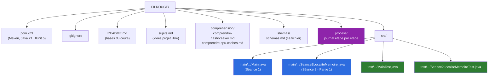
```mermaid
graph TD
    Root["FILROUGE/"]
    Root --> Pom["pom.xml<br/>(Maven, Java 21, JUnit 5)"]
    Root --> Gitignore[".gitignore"]
    Root --> Readme["README.md<br/>(bases du cours)"]
    Root --> Sujets["sujets.md<br/>(idées projet libre)"]
    Root --> Compr["compréhension/<br/>comprendre-hashbreaker.md<br/>comprendre-cpu-caches.md"]
    Root --> Shemas["shemas/<br/>schemas.md (ce fichier)"]
    Root --> Process["process/<br/>journal étape par étape"]
    Root --> Src["src/"]
    Src --> Main["main/.../Main.java<br/>(Séance 1)"]
    Src --> Seance2["main/.../Seance2LocaliteMemoire.java<br/>(Séance 2 - Partie 1)"]
    Src --> TestMain["test/.../MainTest.java"]
    Src --> TestS2["test/.../Seance2LocaliteMemoireTest.java"]

    style Main fill:#2d6cdf,color:#fff
    style Seance2 fill:#2d6cdf,color:#fff
    style TestMain fill:#2e7d32,color:#fff
    style TestS2 fill:#2e7d32,color:#fff
    style Process fill:#8e24aa,color:#fff
```

---

## 2. Diagramme de classe — `Main`

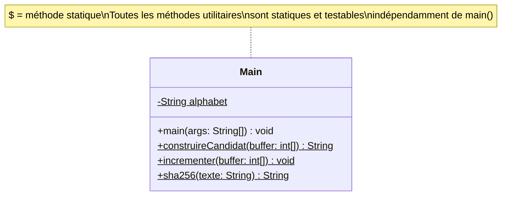
```mermaid
classDiagram
    class Main {
        -String alphabet$
        +main(args: String[]) void
        +construireCandidat(buffer: int[]) String$
        +incrementer(buffer: int[]) void$
        +sha256(texte: String) String$
    }
    note for Main "$ = méthode statique\nToutes les méthodes utilitaires\nsont statiques et testables\nindépendamment de main()"
```

| Méthode | Rôle |
|---|---|
| `construireCandidat(buffer)` | Transforme le buffer d'indices en chaîne (ex: `[25,55,29]` → `"z3D"`) |
| `incrementer(buffer)` | Fait avancer le buffer d'un cran (compteur base-N avec retenue) |
| `sha256(texte)` | Calcule le hash SHA-256 et le renvoie en hexadécimal |

---

## 3. Flux d'exécution de `main()`

`main()` appelle maintenant `craquer(nomCible, hashCible, longueur)` une fois par cible, à la suite.

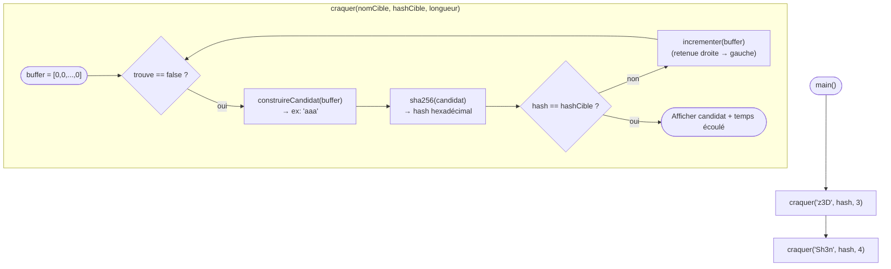
```mermaid
flowchart TD
    MainStart(["main()"]) --> Craquer1["craquer('z3D', hash, 3)"]
    Craquer1 --> Craquer2["craquer('Sh3n', hash, 4)"]

    subgraph "craquer(nomCible, hashCible, longueur)"
    Init(["buffer = [0,0,...,0]"]) --> Boucle{"trouve == false ?"}
    Boucle -- "oui" --> Construire["construireCandidat(buffer)<br/>→ ex: 'aaa'"]
    Construire --> Hash["sha256(candidat)<br/>→ hash hexadécimal"]
    Hash --> Compare{"hash == hashCible ?"}
    Compare -- "non" --> Increment["incrementer(buffer)<br/>(retenue droite → gauche)"]
    Increment --> Boucle
    Compare -- "oui" --> Fin(["Afficher candidat + temps écoulé"])
    end
```

---

## 4. Séquence d'une itération (zoom sur un tour de boucle)

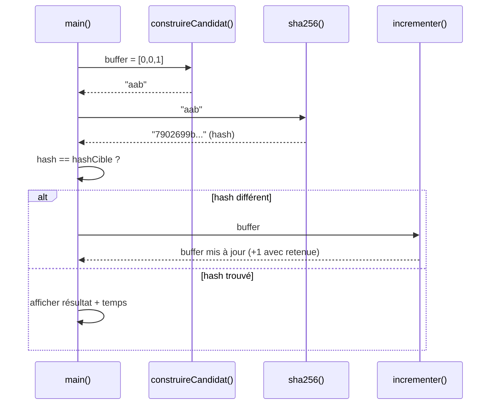
```mermaid
sequenceDiagram
    participant M as main()
    participant C as construireCandidat()
    participant H as sha256()
    participant I as incrementer()

    M->>C: buffer = [0,0,1]
    C-->>M: "aab"
    M->>H: "aab"
    H-->>M: "7902699b..." (hash)
    M->>M: hash == hashCible ?
    alt hash différent
        M->>I: buffer
        I-->>M: buffer mis à jour (+1 avec retenue)
    else hash trouvé
        M->>M: afficher résultat + temps
    end
```

---

## 5. Séance 2 — Partie 1 : Stockage contigu vs dispersé

### Diagramme de classe — `Seance2LocaliteMemoire`

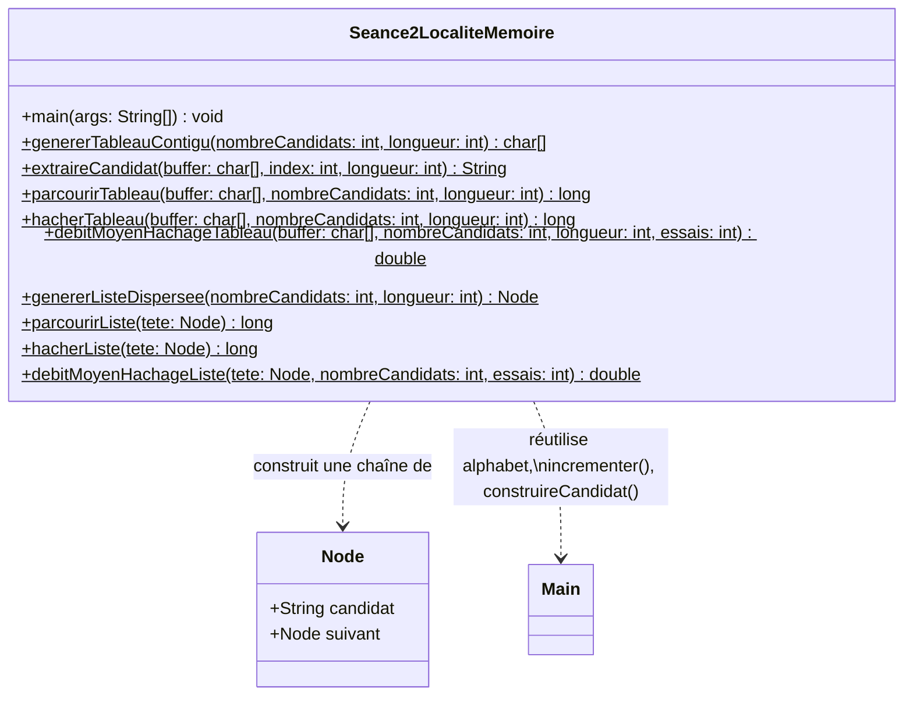
```mermaid
classDiagram
    class Seance2LocaliteMemoire {
        +main(args: String[]) void
        +genererTableauContigu(nombreCandidats: int, longueur: int) char[]$
        +extraireCandidat(buffer: char[], index: int, longueur: int) String$
        +parcourirTableau(buffer: char[], nombreCandidats: int, longueur: int) long$
        +hacherTableau(buffer: char[], nombreCandidats: int, longueur: int) long$
        +debitMoyenHachageTableau(buffer: char[], nombreCandidats: int, longueur: int, essais: int) double$
        +genererListeDispersee(nombreCandidats: int, longueur: int) Node$
        +parcourirListe(tete: Node) long$
        +hacherListe(tete: Node) long$
        +debitMoyenHachageListe(tete: Node, nombreCandidats: int, essais: int) double$
    }
    class Node {
        +String candidat
        +Node suivant
    }
    Seance2LocaliteMemoire ..> Node : construit une chaîne de
    Seance2LocaliteMemoire ..> Main : réutilise alphabet,\nincrementer(), construireCandidat()
```

### Structure A vs Structure B — ce qui change en mémoire

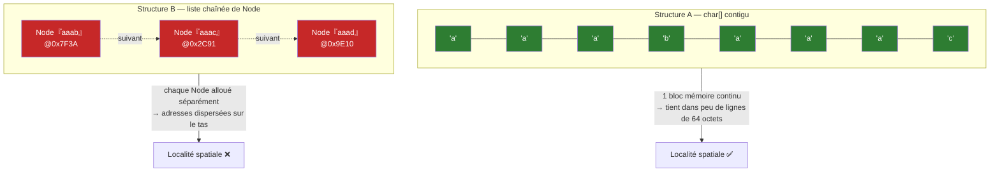
```mermaid
flowchart TD
    subgraph A["Structure A — char[] contigu"]
    direction LR
    A0["'a'"] --- A1["'a'"] --- A2["'a'"] --- A3["'b'"] --- A4["'a'"] --- A5["'a'"] --- A6["'a'"] --- A7["'c'"]
    end

    subgraph B["Structure B — liste chaînée de Node"]
    direction LR
    B0["Node『aaab』\n@0x7F3A"] -.->|suivant| B1["Node『aaac』\n@0x2C91"]
    B1 -.->|suivant| B2["Node『aaad』\n@0x9E10"]
    end

    A -->|"1 bloc mémoire continu\n→ tient dans peu de lignes de 64 octets"| Note1["Localité spatiale ✅"]
    B -->|"chaque Node alloué séparément\n→ adresses dispersées sur le tas"| Note2["Localité spatiale ❌"]

    style A0 fill:#2e7d32,color:#fff
    style A1 fill:#2e7d32,color:#fff
    style A2 fill:#2e7d32,color:#fff
    style A3 fill:#2e7d32,color:#fff
    style A4 fill:#2e7d32,color:#fff
    style A5 fill:#2e7d32,color:#fff
    style A6 fill:#2e7d32,color:#fff
    style A7 fill:#2e7d32,color:#fff
    style B0 fill:#c62828,color:#fff
    style B1 fill:#c62828,color:#fff
    style B2 fill:#c62828,color:#fff
```

> Rappel important (cf. [comprendre-cpu-caches.md](../compréhension/comprendre-cpu-caches.md)) : un `String[]` Java n'aurait **pas** donné un vrai bloc contigu — seul un tableau de type primitif (`char[]`) garantit l'absence d'indirection. C'est pour ça que la Structure A utilise `char[]` et pas `String[]`.

Les deux structures contiennent **exactement les mêmes candidats, dans le même ordre** (vérifié par les tests) — seule leur disposition physique en mémoire diffère.

---

## 6. Séance 2 — Partie 2 : Parcours linéaire vs aléatoire

`parcourirTableau()` lit le `char[]` séquentiellement (profite des lignes de cache 64 octets + prefetcher). `parcourirListe()` suit les pointeurs `suivant` un par un (pointer-chasing). Les deux calculent un checksum identique — seul le temps d'accès change.

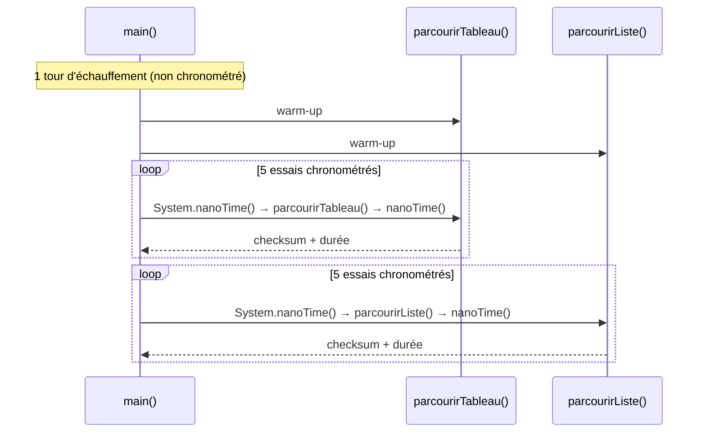
```mermaid
sequenceDiagram
    participant Main as main()
    participant A as parcourirTableau()
    participant B as parcourirListe()

    Note over Main: 1 tour d'échauffement (non chronométré)
    Main->>A: warm-up
    Main->>B: warm-up

    loop 5 essais chronométrés
        Main->>A: System.nanoTime() → parcourirTableau() → nanoTime()
        A-->>Main: checksum + durée
    end
    loop 5 essais chronométrés
        Main->>B: System.nanoTime() → parcourirListe() → nanoTime()
        B-->>Main: checksum + durée
    end
```

### Résultats mesurés (1 000 000 candidats, longueur 4)

```mermaid
xychart-beta
    title "Temps de parcours par essai (ms) — plus bas = mieux"
    x-axis ["Essai 1", "Essai 2", "Essai 3", "Essai 4", "Essai 5"]
    y-axis "Temps (ms)" 0 --> 13
    bar [4, 1, 1, 2, 1]
    bar [12, 11, 10, 11, 10]
```

*(première série = Structure A tableau contigu, deuxième série = Structure B liste chaînée)*

**Checksum identique dans les deux cas (`360018520`)** : le contenu lu est rigoureusement le même, seule la disposition mémoire change. La liste chaînée est **~8 à 10x plus lente** à parcourir que le tableau contigu.

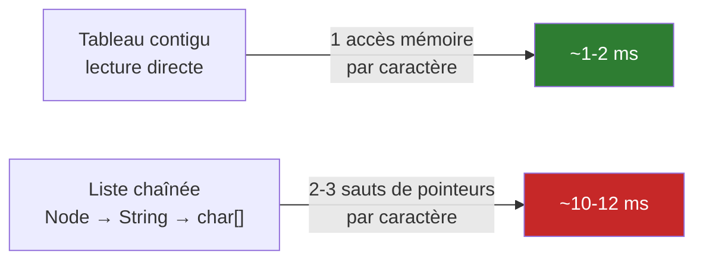
```mermaid
flowchart LR
    A["Tableau contigu\nlecture directe"] -->|"1 accès mémoire\npar caractère"| Fast["~1-2 ms"]
    B["Liste chaînée\nNode → String → char[]"] -->|"2-3 sauts de pointeurs\npar caractère"| Slow["~10-12 ms"]

    style Fast fill:#2e7d32,color:#fff
    style Slow fill:#c62828,color:#fff
```

**Pourquoi un tel écart malgré l'allocation séquentielle en Java ?** Même si la JVM alloue les `Node` les uns après les autres (bump-pointer allocation, potentiellement proches en mémoire), chaque candidat de la liste nécessite **plusieurs indirections** : `Node` → référence `candidat` → objet `String` séparé → tableau interne de caractères. Le tableau contigu, lui, n'a aucune indirection : c'est ça, et pas uniquement la "dispersion physique", qui explique l'essentiel de l'écart mesuré. Détails : [process/05-seance2-partie2-parcours-lineaire-vs-aleatoire.md](../process/05-seance2-partie2-parcours-lineaire-vs-aleatoire.md).

---

## 7. Séance 2 — Partie 3 : Observation du goulot mémoire (résultat contre-intuitif)

`hacherTableau()` / `hacherListe()` reprennent exactement les mêmes parcours, mais calculent en plus le **vrai SHA-256** de chaque candidat (`Main.sha256()`, non modifié).

```mermaid
xychart-beta
    title "Débit de hachage (candidats/s) — Structure A vs Structure B"
    x-axis ["Essai 1", "Essai 2", "Essai 3"]
    y-axis "Candidats / seconde" 0 --> 1300000
    bar [1095792, 1146980, 1152936]
    bar [1077823, 1136985, 1162127]
```

*(première série = tableau contigu, deuxième série = liste chaînée — les deux courbes sont quasiment superposées)*

**Résultat inattendu : aucune différence significative** (~1-2%, dans le bruit de mesure), alors que la Partie 2 montrait un facteur x8-x10 sur le parcours seul.

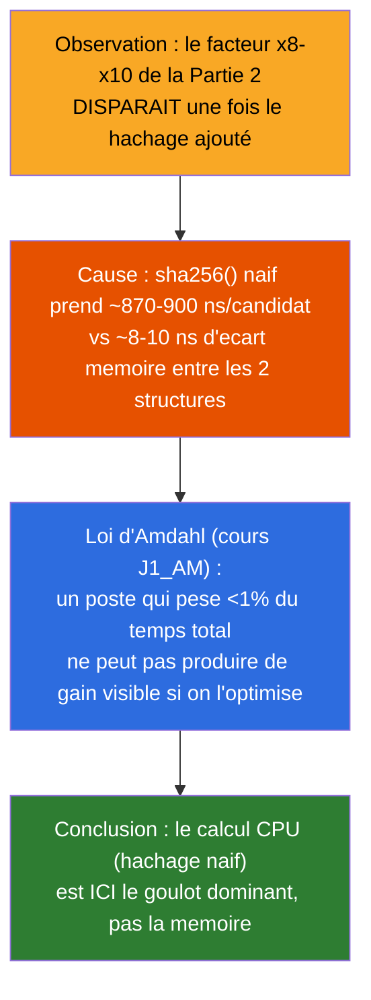
```mermaid
flowchart TD
    Obs["Observation : le facteur x8-x10 de la Partie 2\nDISPARAIT une fois le hachage ajouté"] --> Cause["Cause : sha256() naif prend ~870-900 ns/candidat\nvs ~8-10 ns d'ecart memoire entre les 2 structures"]
    Cause --> Amdahl["Loi d'Amdahl (cours J1_AM) :\nun poste qui pese <1% du temps total\nne peut pas produire de gain visible si on l'optimise"]
    Amdahl --> Conclusion["Conclusion : le calcul CPU (hachage naif)\nest ICI le goulot dominant, pas la memoire"]

    style Obs fill:#f9a825,color:#000
    style Cause fill:#e65100,color:#fff
    style Amdahl fill:#2d6cdf,color:#fff
    style Conclusion fill:#2e7d32,color:#fff
```

> Ce résultat n'est pas un échec de l'expérience — c'est une **application directe de la loi d'Amdahl** vue en J1_AM : la portion "accès mémoire" pèse ici moins de 1% du temps total par candidat (dominé par la conversion hexadécimale naïve de `sha256()`), donc l'optimiser ne peut produire aucun gain visible sur le débit global, quel que soit le facteur d'accélération obtenu sur cette portion isolée. **Prédiction pour la Séance 3** : une fois le hachage naïf remplacé par une version zéro-allocation, le poids relatif de l'accès mémoire va remonter, et l'écart entre les deux structures devrait redevenir visible sur le débit de hachage. Détails : [process/06-seance2-partie3-observation-goulot-memoire.md](../process/06-seance2-partie3-observation-goulot-memoire.md).

---

## 8. Séance 2 — Partie 4 : Validation de la sympathie matérielle (verdict final)

`debitMoyenHachageTableau()` / `debitMoyenHachageListe()` moyennent le débit sur **10 essais** (au lieu de 3) pour une confirmation statistique — sans toucher une seule ligne de `sha256()` ou des méthodes de hachage.

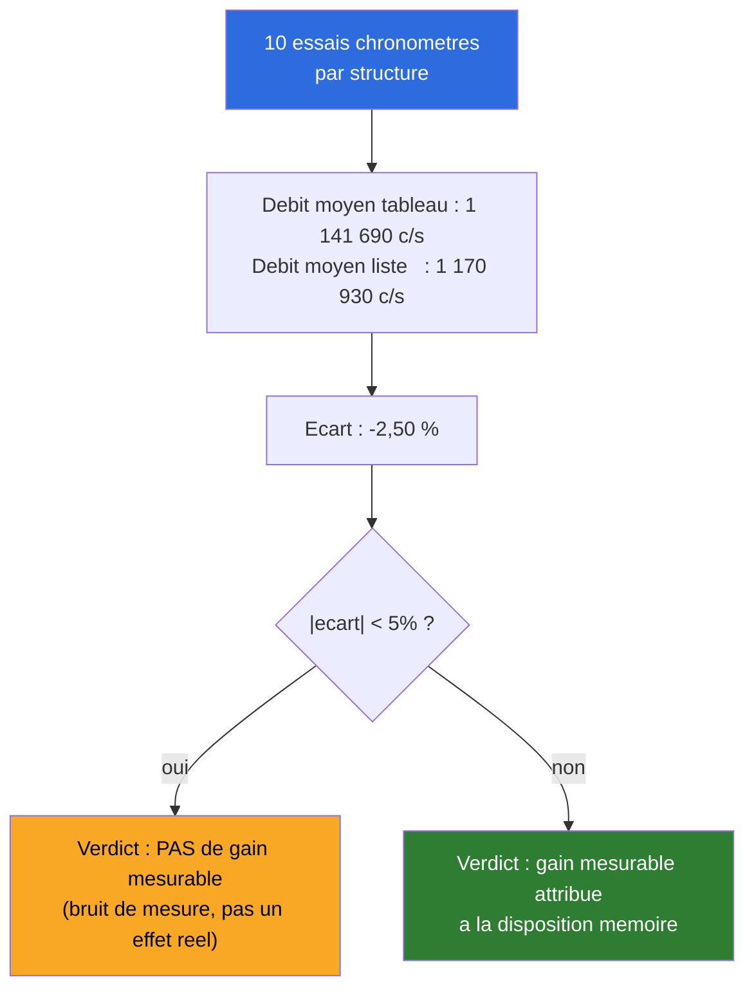
```mermaid
flowchart TD
    Mesure["10 essais chronometres\npar structure"] --> Moyenne["Debit moyen tableau : 1 141 690 c/s\nDebit moyen liste   : 1 170 930 c/s"]
    Moyenne --> Ecart["Ecart : -2,50 %"]
    Ecart --> Seuil{"|ecart| < 5% ?"}
    Seuil -- "oui" --> Bruit["Verdict : PAS de gain mesurable\n(bruit de mesure, pas un effet reel)"]
    Seuil -- "non" --> Gain["Verdict : gain mesurable attribue\na la disposition memoire"]

    style Mesure fill:#2d6cdf,color:#fff
    style Bruit fill:#f9a825,color:#000
    style Gain fill:#2e7d32,color:#fff
```

**Verdict obtenu : PAS de gain mesurable.** Résultat cohérent avec la Partie 3 : le calcul CPU (hachage naïf) domine si largement le temps par candidat que la disposition mémoire, pourtant x8-x10 plus rapide en accès pur (Partie 2), n'a aucun effet visible sur le débit final.

**Ce que ça valide réellement :** la localité spatiale est bien réelle et démontrée (Partie 2) — mais un gain sur un sous-système ne se traduit en gain global que s'il touche le goulot *dominant* du système complet. C'est la preuve pratique de la règle scientifique du cours : "toujours profiler avant d'optimiser". Détails : [process/07-seance2-partie4-validation-sympathie-materielle.md](../process/07-seance2-partie4-validation-sympathie-materielle.md).

> **Séance 2 terminée.** Synthèse complète à retenir : [syntheses/02-seance2-cpu-caches-localite-memoire.md](../syntheses/02-seance2-cpu-caches-localite-memoire.md).

---

## 9. Séance 3 — Partie 1 : Diagnostic Escape Analysis (via JFR)

Pas d'équivalent Java à `go build -gcflags="-m"` : diagnostic fait par profiling réel (Java Flight Recorder) sur `Main.java` (version naïve inchangée), preuve conservée dans [profiling/seance3-diagnostic-naif.jfr](../profiling/seance3-diagnostic-naif.jfr).

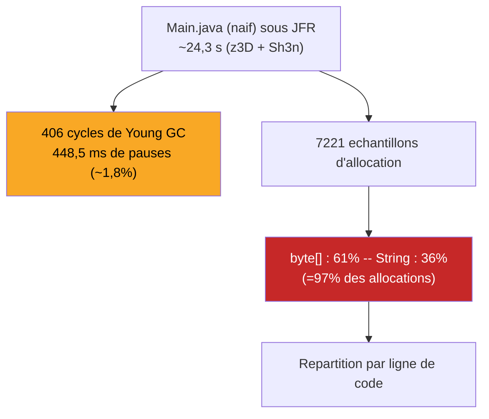
```mermaid
flowchart TD
    Run["Main.java (naif) sous JFR\n~24,3 s (z3D + Sh3n)"] --> GC["406 cycles de Young GC\n448,5 ms de pauses (~1,8%)"]
    Run --> Alloc["7221 echantillons d'allocation"]
    Alloc --> Types["byte[] : 61% -- String : 36%\n(=97% des allocations)"]
    Types --> Sites["Repartition par ligne de code"]

    style GC fill:#f9a825,color:#000
    style Types fill:#c62828,color:#fff
```

### Répartition par ligne de code — le vrai coupable n'est pas celui attendu

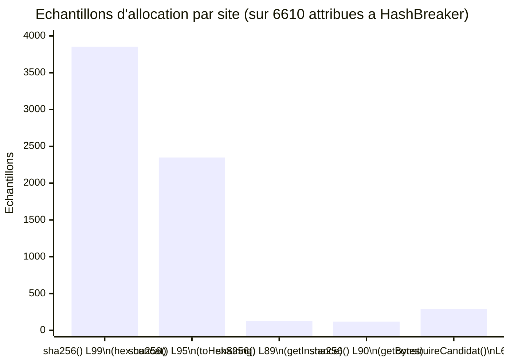
```mermaid
xychart-beta
    title "Echantillons d'allocation par site (sur 6610 attribues a HashBreaker)"
    x-axis ["sha256() L99\n(hex concat)", "sha256() L95\n(toHexString)", "sha256() L89\n(getInstance)", "sha256() L90\n(getBytes)", "construireCandidat()\nL64"]
    y-axis "Echantillons" 0 --> 4000
    bar [3853, 2349, 129, 118, 291]
```

**Surprise mesurée :** on s'attendait (Séance 1) à ce que `construireCandidat()` (concaténation du mot candidat) soit le principal coupable. En réalité il ne pèse que **~4,4%** des allocations. Le vrai goulot est la **conversion hexadécimale dans `sha256()`** (lignes 95 + 99), qui à elle seule totalise **~94%** des allocations attribuées à notre code — plus une inefficacité annexe découverte au passage : `MessageDigest.getInstance("SHA-256")` est recréé à chaque tentative au lieu d'être réutilisé.

> **Conséquence directe pour la Partie 3 (buffers fixes)** : la correction zéro-allocation doit cibler `sha256()` en priorité, pas seulement `construireCandidat()`. Nouvelle preuve de la règle "toujours profiler avant d'optimiser". Détails : [process/08-seance3-partie1-diagnostic-escape-analysis.md](../process/08-seance3-partie1-diagnostic-escape-analysis.md).

---

## 10. Séance 3 — Partie 2 : Compactage de structure (Padding) — l'astuce Go ne marche pas en Java

Vérifié empiriquement avec **JOL** (Java Object Layout) sur deux classes identiques, seul l'ordre de déclaration des champs change.

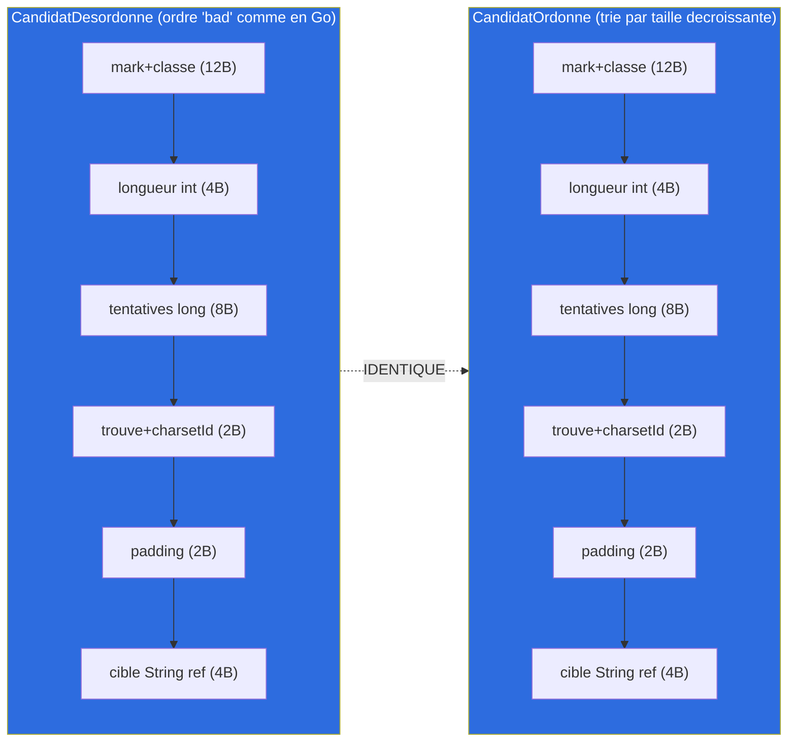
```mermaid
flowchart LR
    subgraph Bad["CandidatDesordonne (ordre 'bad' comme en Go)"]
    direction TB
    B1["mark+classe (12B)"] --> B2["longueur int (4B)"] --> B3["tentatives long (8B)"] --> B4["trouve+charsetId (2B)"] --> B5["padding (2B)"] --> B6["cible String ref (4B)"]
    end
    subgraph Good["CandidatOrdonne (trie par taille decroissante)"]
    direction TB
    G1["mark+classe (12B)"] --> G2["longueur int (4B)"] --> G3["tentatives long (8B)"] --> G4["trouve+charsetId (2B)"] --> G5["padding (2B)"] --> G6["cible String ref (4B)"]
    end
    Bad -.->|"IDENTIQUE"| Good

    style Bad fill:#2d6cdf,color:#fff
    style Good fill:#2d6cdf,color:#fff
```

**Résultat : les deux classes font exactement 32 octets, avec le même agencement au byte près.** La JVM HotSpot réordonne déjà les champs elle-même — l'ordre choisi dans le code source n'a **aucune influence** sur le résultat final, contrairement à Go où c'est le développeur qui doit s'en charger manuellement.

**Deux découvertes bonus grâce à l'outil :**
- L'en-tête d'objet Java (12 octets) est un coût que Go n'a pas — explique en partie le surcoût mesuré sur nos `Node` en Séance 2.
- La référence `String` ne pèse que 4 octets (pas 8) grâce aux *compressed oops* activés par défaut.

> **Conséquence** : le levier "struct padding" du cours ne s'applique pas en Java tel quel — rien à optimiser manuellement ici. Le vrai levier zéro-allocation reste celui de la Partie 1 : `sha256()`. Détails : [process/09-seance3-partie2-padding.md](../process/09-seance3-partie2-padding.md).

---

## 11. Séance 3 — Partie 3 : Buffers Fixes (Zéro-Allocation)

`Seance3ZeroAllocation.java` corrige les 4 sources d'allocation identifiées en Partie 1, en ciblant `sha256()` en priorité (94% du problème).

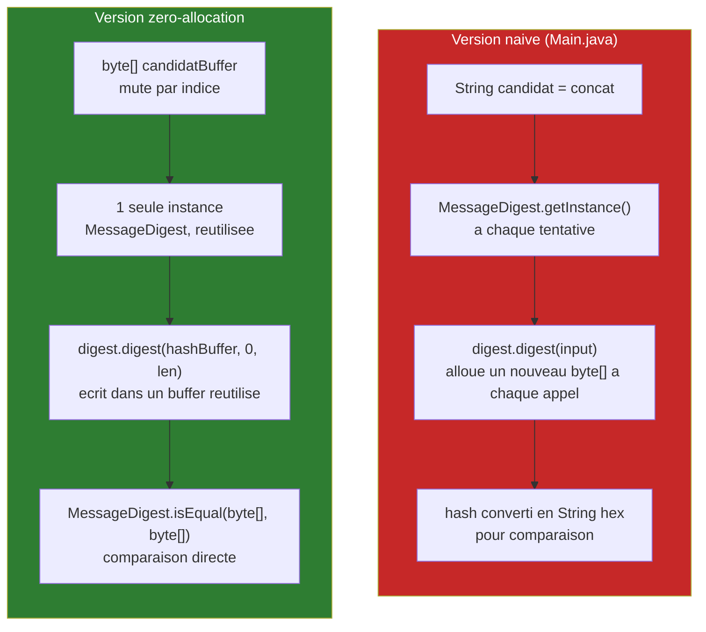
```mermaid
flowchart TD
    subgraph Avant["Version naive (Main.java)"]
    direction TB
    A1["String candidat = concat"] --> A2["MessageDigest.getInstance()\na chaque tentative"]
    A2 --> A3["digest.digest(input)\nalloue un nouveau byte[] a chaque appel"]
    A3 --> A4["hash converti en String hex\npour comparaison"]
    end
    subgraph Apres["Version zero-allocation"]
    direction TB
    B1["byte[] candidatBuffer\nmute par indice"] --> B2["1 seule instance\nMessageDigest, reutilisee"]
    B2 --> B3["digest.digest(hashBuffer, 0, len)\necrit dans un buffer reutilise"]
    B3 --> B4["MessageDigest.isEqual(byte[], byte[])\ncomparaison directe"]
    end

    style Avant fill:#c62828,color:#fff
    style Apres fill:#2e7d32,color:#fff
```

### Résultat mesuré

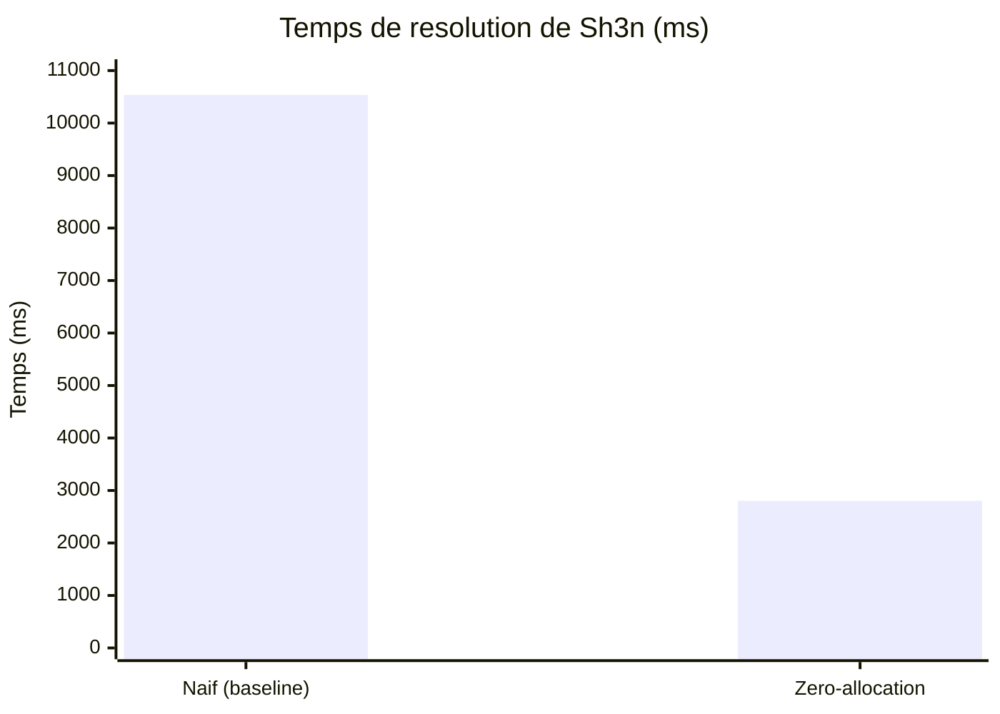
```mermaid
xychart-beta
    title "Temps de resolution de Sh3n (ms)"
    x-axis ["Naif (baseline)", "Zero-allocation"]
    y-axis "Temps (ms)" 0 --> 11000
    bar [10536, 2803]
```

**Gain mesuré : ~x3,76** sur `Sh3n` (10 536 ms → 2 803 ms), sans changer l'algorithme de force brute lui-même — uniquement la gestion mémoire. `z3D` : 594 ms → 236 ms.

> La conversion hexadécimale n'a plus lieu que **si le mot de passe est trouvé** (une seule fois, hors boucle chaude) — plus jamais à chaque tentative. Détails : [process/10-seance3-partie3-buffers-fixes.md](../process/10-seance3-partie3-buffers-fixes.md).

---

## 12. Séance 3 — Partie 4 : Validation 0 allocs/op (verdict final)

Même protocole JFR que le diagnostic initial (section 9), appliqué cette fois à la version zéro-allocation, pour comparer objectivement les deux enregistrements.

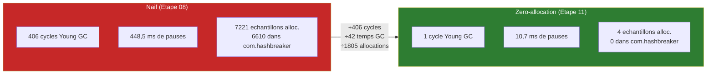
```mermaid
flowchart LR
    subgraph Naif["Naif (Etape 08)"]
    direction TB
    N1["406 cycles Young GC"]
    N2["448,5 ms de pauses"]
    N3["7221 echantillons alloc.\n6610 dans com.hashbreaker"]
    end
    subgraph Zero["Zero-allocation (Etape 11)"]
    direction TB
    Z1["1 cycle Young GC"]
    Z2["10,7 ms de pauses"]
    Z3["4 echantillons alloc.\n0 dans com.hashbreaker"]
    end
    Naif -->|"÷406 cycles\n÷42 temps GC\n÷1805 allocations"| Zero

    style Naif fill:#c62828,color:#fff
    style Zero fill:#2e7d32,color:#fff
```

**Les 4 échantillons résiduels ne proviennent pas de notre code** (vérifié stack trace par stack trace) : 3 viennent de JFR lui-même (son propre `StringPool` interne) et 1 du thread de compilation JIT (`C1 CompilerThread0`). **Zéro allocation attribuable à `com.hashbreaker`** dans la boucle critique — l'objectif "0 allocs/op" du cours est atteint au sens strict.

> **Verdict : validation réussie.** Contrairement à la Séance 2 (où la correction n'avait donné aucun gain visible, goulot CPU dominant), ici la correction ciblée sur le vrai goulot identifié en Partie 1 (`sha256()`, ~94% des allocations) a produit un effet massif et mesurable. Détails : [process/11-seance3-partie4-validation-zero-allocation.md](../process/11-seance3-partie4-validation-zero-allocation.md).

> **Séance 3 terminée.** Synthèse complète à retenir : [syntheses/03-seance3-memoire-zero-allocation.md](../syntheses/03-seance3-memoire-zero-allocation.md).

---

## 13. Séance 4 — Partie 1 : Profiling CPU & Flamegraph

Réutilise l'enregistrement JFR naïf de la Séance 3 (aucun nouveau run) — converti en flamegraph HTML interactif via l'outil officiel `jfr-converter.jar` (async-profiler).

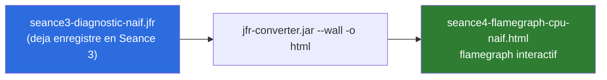
```mermaid
flowchart LR
    JFR["seance3-diagnostic-naif.jfr\n(deja enregistre en Seance 3)"] --> Conv["jfr-converter.jar --wall -o html"]
    Conv --> HTML["seance4-flamegraph-cpu-naif.html\nflamegraph interactif"]

    style JFR fill:#2d6cdf,color:#fff
    style HTML fill:#2e7d32,color:#fff
```

**Piège rencontré** : l'option `--cpu` du convertisseur produisait un flamegraph vide (aucune frame). Les données existaient pourtant bien dans le `.jfr` (vérifié via `jfr print`). Contourné avec `--wall` (profil wall-clock, quasi identique au CPU pour notre programme mono-thread sans I/O), qui a fonctionné correctement.

### Répartition du temps CPU — confirme et renforce le diagnostic d'allocations

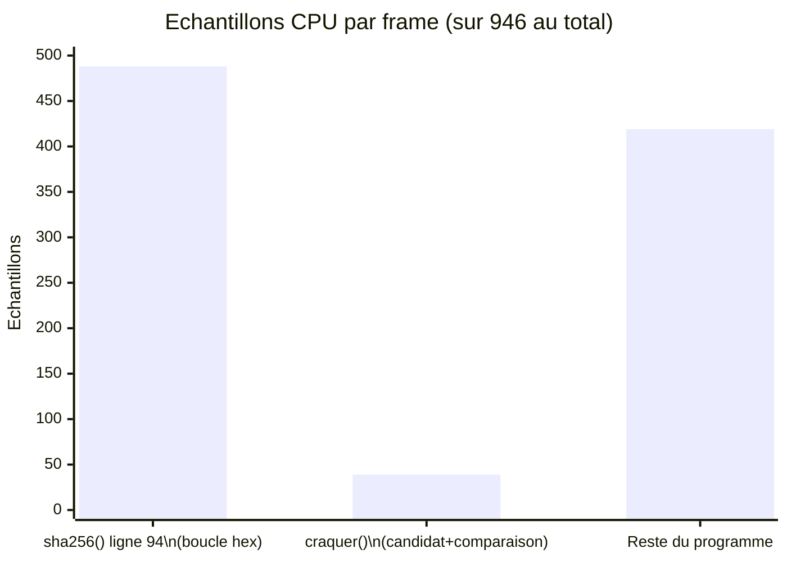
```mermaid
xychart-beta
    title "Echantillons CPU par frame (sur 946 au total)"
    x-axis ["sha256() ligne 94\n(boucle hex)", "craquer()\n(candidat+comparaison)", "Reste du programme"]
    y-axis "Echantillons" 0 --> 500
    bar [488, 39, 419]
```

**Plus de la moitié du temps CPU (~51,6%) est passée dans la boucle de conversion hexadécimale** — encore plus que le ">35%" donné en exemple par le cours. C'est la même fonction (`sha256()`) qui domine à la fois le temps CPU (ici) et les allocations (Séance 3, Étape 08) — deux angles différents, même conclusion. Détails : [process/13-seance4-partie1-profiling-cpu-flamegraph.md](../process/13-seance4-partie1-profiling-cpu-flamegraph.md).

> **Partie 2 (Détection du Goulet Hex) considérée satisfaite** par cette même mesure — le cours demande de "constater que plus de 35% du temps CPU est gaspillé dans la conversion hex", ce qui est exactement le résultat obtenu ci-dessus.

---

## 14. Séance 4 — Partie 3 : Comparaison Binaire 64-bit

`Seance4ComparaisonBinaire.java` repart de la version zéro-allocation (Séance 3) et remplace `MessageDigest.isEqual()` par une comparaison manuelle en 4 mots de 64 bits (`long`), avec **sortie anticipée** dès le premier mot différent.

```mermaid
flowchart TD
    subgraph Avant["MessageDigest.isEqual() - Seance 3"]
    direction TB
    A1["Compare TOUJOURS les 32 octets\n(temps constant, anti-timing-attack)"]
    end
    subgraph Apres["egalise64bit() - Seance 4"]
    direction TB
    B1["Compare par mots de 64 bits\navec sortie anticipee"]
    B2[">99% des candidats echouent\nau 1er octet -> sortie immediate"]
    B1 --> B2
    end

    Decouverte["Decouverte : le gain ne vient pas que\nde la taille des mots, mais surtout\nde l'abandon du temps constant\n(inutile ici : pas de secret a proteger)"]

    Avant -.->|comparaison| Decouverte
    Apres -.->|comparaison| Decouverte

    style Avant fill:#c62828,color:#fff
    style Apres fill:#2e7d32,color:#fff
    style Decouverte fill:#f9a825,color:#000
```

### Preuve statistique — première vraie comparaison Hyperfine à 3 versions

```mermaid
xychart-beta
    title "Temps moyen (secondes) - execution complete z3D+Sh3n, 5 essais chacun"
    x-axis ["Naif (Seance 1)", "Zero-allocation (Seance 3)", "Binaire 64-bit (Seance 4)"]
    y-axis "Temps (s)" 0 --> 12
    bar [11.161, 1.337, 1.104]
```

| Version | Temps moyen | vs Naïf | vs Séance 3 |
|---|---|---|---|
| Naïve (Séance 1) | 11,161 s ± 0,306 s | — | — |
| Zéro-allocation (Séance 3) | 1,337 s ± 0,025 s | ×8,35 | — |
| **Binaire 64-bit (Séance 4)** | **1,104 s ± 0,055 s** | **×10,11** | **×1,21** |

**Gain statistiquement significatif** (intervalles ne se chevauchant pas). Détails et interprétation complète : [process/14-seance4-partie3-comparaison-binaire-64bit.md](../process/14-seance4-partie3-comparaison-binaire-64bit.md).

---

## 15. Séance 4 — Partie 4 : Validation finale — `@kAl1` enfin craqué

La mission originale du tout premier document du cours (J1_AM, Niveau 3 "Saturation") n'avait jamais été attaquée. Constat : `@`, `k`, `A`, `l`, `1` sont déjà tous dans notre alphabet (63 symboles) — pas besoin d'extension à 70+ symboles pour cette cible précise.

```mermaid
flowchart LR
    Hash["Hash reel calcule :\nb96ec5f7...4ab641a5"] --> Run["Seance4ComparaisonBinaire.craquer\n('@kAl1', hash, 5)"]
    Run --> Result["Trouve en 77 461 ms\n(~12,8M candidats/s)"]
    Result --> Why["'@' = dernier caractere de l'alphabet\n-> quasi pire-cas d'enumeration\n(~98,4% de l'espace parcouru)"]

    style Hash fill:#2d6cdf,color:#fff
    style Result fill:#2e7d32,color:#fff
    style Why fill:#f9a825,color:#000
```

> ⚠️ Craqué en **mono-thread**. Le PDF d'origine le désignait comme "stress-test multi-cœurs" — le vrai test de parallélisme reste à faire dans une séance future dédiée aux workers.

**Séance 4 terminée (4/4 parties).** Synthèse complète : [syntheses/04-seance4-metrologie-profiling.md](../syntheses/04-seance4-metrologie-profiling.md). Détails : [process/15-seance4-partie4-preuve-statistique.md](../process/15-seance4-partie4-preuve-statistique.md).

---

## 16. Couverture des tests (`MainTest.java` + `Seance2LocaliteMemoireTest.java` + `Seance3ZeroAllocationTest.java` + `Seance4ComparaisonBinaireTest.java`)

```mermaid
graph LR
    subgraph "sha256() - 5 tests"
        T1["chaîne vide"]
        T2["'abc' (vecteur connu)"]
        T3["'z3D' == hash cible"]
        T4["déterminisme"]
        T5["toujours 64 caractères"]
    end
    subgraph "construireCandidat() - 3 tests"
        T6["buffer [0,0,0] → 'aaa'"]
        T7["indices de z,3,D → 'z3D'"]
        T8["buffer de taille 1"]
    end
    subgraph "incrementer() - 5 tests"
        T9["incrément simple, sans retenue"]
        T10["une retenue ('aa9' → 'aba')"]
        T11["retenue en chaîne ('a99' → 'baa')"]
        T12["débordement complet (rebouclage)"]
        T13["plusieurs appels dans l'ordre"]
    end
    subgraph "Seance2LocaliteMemoireTest - 7 tests"
        T14["tableau : taille correcte"]
        T15["tableau : premier candidat 'aaaa'"]
        T16["tableau : ordre du compteur base-N"]
        T17["liste : premier nœud 'aaaa'"]
        T18["liste : longueur de chaîne correcte"]
        T19["liste : dernier nœud sans suivant"]
        T20["les deux structures contiennent\nles mêmes candidats, même ordre"]
        T21["checksum du tableau : valeur exacte"]
        T22["checksum tableau == checksum liste"]
        T23["hash du tableau : valeur exacte"]
        T24["hachage tableau == hachage liste"]
    end
    subgraph "Seance3ZeroAllocationTest - 6 tests"
        T25["hexVersOctets : conversion correcte"]
        T26["hexVersOctets : taille 32 octets"]
        T27["remplirCandidat : buffer [0,0,0] → 'aaa'"]
        T28["remplirCandidat : indices z,3,D → 'z3D'"]
        T29["remplirCandidat : reutilisation du buffer"]
        T30["coherence avec le hash de Main.sha256()"]
    end
    subgraph "Seance4ComparaisonBinaireTest - 6 tests"
        T31["octetsVersLongs : conversion 1 mot"]
        T32["octetsVersLongs : hash 32B → 4 mots"]
        T33["egalise64bit : hashes identiques → true"]
        T34["egalise64bit : 1er octet different → false"]
        T35["egalise64bit : dernier octet different → false"]
        T36["coherence avec un vrai calcul SHA-256"]
    end
```

**Résultat actuel : 36/36 tests passent.**

---

## 17. Baseline mesurée — z3D vs Sh3n

```mermaid
xychart-beta
    title "Temps de résolution (version naïve)"
    x-axis ["z3D (238 328 candidats)", "Sh3n (14 776 336 candidats)"]
    y-axis "Temps (ms)" 0 --> 11000
    bar [249, 10536]
```

L'espace de recherche est ~62x plus grand pour `Sh3n` (un caractère de plus) et le temps suit à peu près la même échelle : c'est cohérent avec un algorithme en **O(62^longueur)**, qui teste les candidats un par un sans aucune astuce. C'est exactement cette explosion combinatoire que les prochaines séances vont attaquer (parallélisme, élagage, etc. — pas en changeant l'algo de force brute lui-même mais en réduisant le coût de chaque tentative et en répartissant le travail).

---

## 18. Où on en est dans le TP

```mermaid
flowchart LR
    A["✅ Init projet Java\n(pom.xml, JDK 21)"] --> B["✅ Algo naïf\n(compteur base-N + SHA-256)"]
    B --> C["✅ Résolution z3D + Sh3n\n(baseline: 249 ms / 10 536 ms)"]
    C --> D["✅ Séance 2 Partie 1\nStockage contigu vs dispersé"]
    D --> E["✅ Séance 2 Partie 2\nParcours linéaire vs aléatoire\n(~1-2 ms vs ~10-12 ms)"]
    E --> F["✅ Séance 2 Partie 3\nGoulot mémoire\n(masqué par le hachage naïf — cf. Amdahl)"]
    F --> G["✅ Séance 2 Partie 4\nValidation (verdict: pas de gain,\nAmdahl confirmé sur 10 essais)"]
    G --> H["✅ Séance 3 Partie 1\nDiagnostic JFR\n(sha256() = ~94% des allocations)"]
    H --> I["✅ Séance 3 Partie 2\nPadding (JOL) :\naucun effet en Java (JVM reordonne deja)"]
    I --> J["✅ Séance 3 Partie 3\nBuffers fixes :\nSh3n 10536ms → 2803ms (x3,76)"]
    J --> K["✅ Séance 3 Partie 4\nValidation : 406→1 cycle GC,\n0 alloc. attribuable au code"]
    K --> L["✅ Séance 4 Partie 1-2\nFlamegraph CPU :\nsha256() = ~51,6% du temps CPU"]
    L --> M["✅ Séance 4 Partie 3\nComparaison 64-bit :\nHyperfine x10,11 vs naif (statistique)"]
    M --> N["✅ Séance 4 Partie 4\n@kAl1 craqué : 77,5s mono-thread"]
    N --> O["⬜ Séances suivantes :\nworkers, gRPC, SQL"]

    style A fill:#2e7d32,color:#fff
    style B fill:#2e7d32,color:#fff
    style C fill:#2e7d32,color:#fff
    style D fill:#2e7d32,color:#fff
    style E fill:#2e7d32,color:#fff
    style F fill:#2e7d32,color:#fff
    style G fill:#2e7d32,color:#fff
    style H fill:#2e7d32,color:#fff
    style I fill:#2e7d32,color:#fff
    style J fill:#2e7d32,color:#fff
    style K fill:#2e7d32,color:#fff
    style L fill:#2e7d32,color:#fff
    style M fill:#2e7d32,color:#fff
    style N fill:#2e7d32,color:#fff
    style O fill:#9e9e9e,color:#fff
```

**Séances 2, 3 et 4 terminées.**
