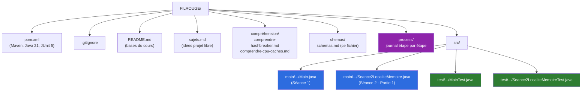
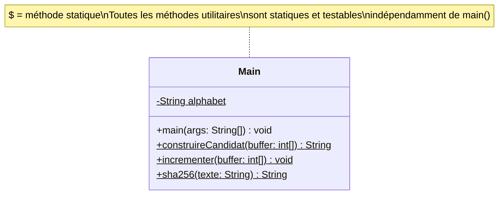
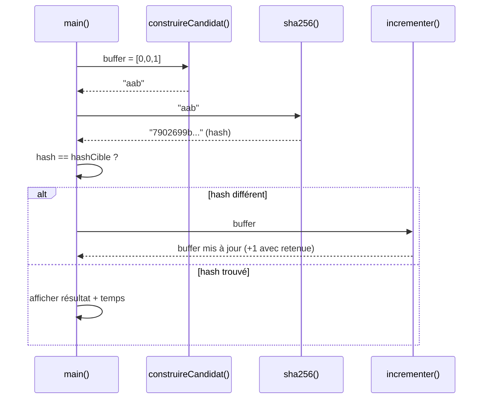
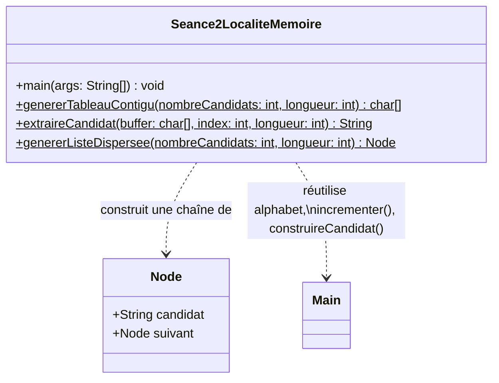
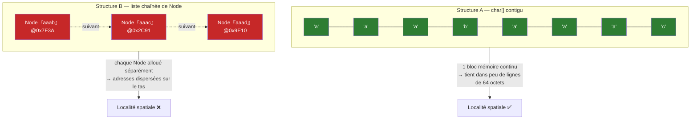
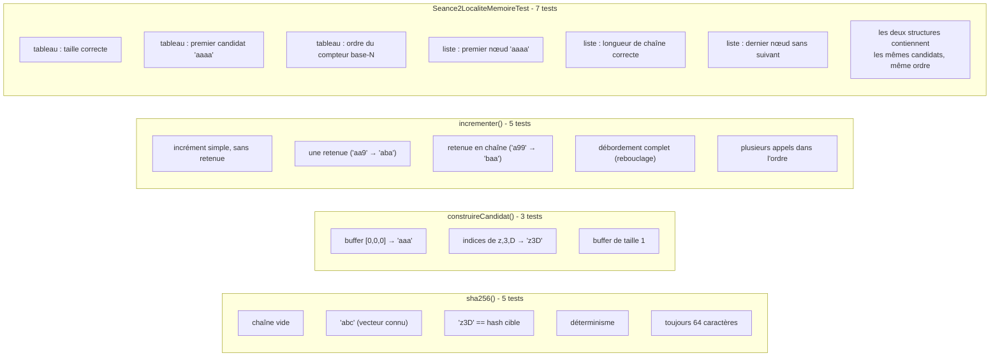
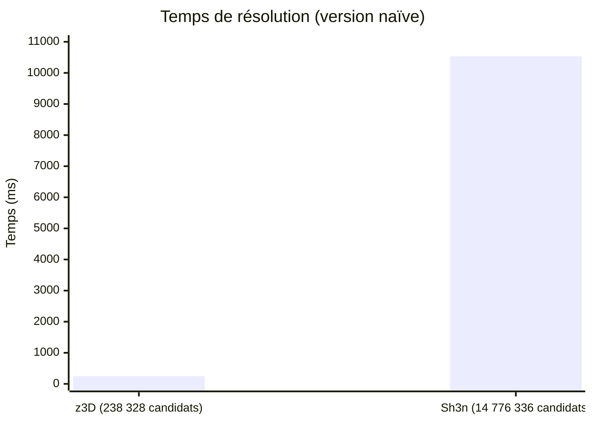
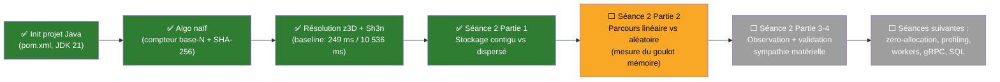

# Schémas — État actuel du projet (Séance 1 + Séance 2 Partie 1)

Diagrammes Mermaid de ce qui a été produit jusqu'ici : structure du projet, code de `Main.java` et `Seance2LocaliteMemoire.java`, flux d'exécution et couverture des tests.

> Journal détaillé étape par étape : voir [process/](../process/README.md).

> Pour voir les diagrammes : ouvre ce fichier dans VSCode et fais `Ctrl+Shift+V` (aperçu Markdown). Si les schémas ne s'affichent pas, installe l'extension **"Markdown Preview Mermaid Support"**.

---

## 1. Structure du projet

---

## 2. Diagramme de classe — `Main`

| Méthode | Rôle |
|---|---|
| `construireCandidat(buffer)` | Transforme le buffer d'indices en chaîne (ex: `[25,55,29]` → `"z3D"`) |
| `incrementer(buffer)` | Fait avancer le buffer d'un cran (compteur base-N avec retenue) |
| `sha256(texte)` | Calcule le hash SHA-256 et le renvoie en hexadécimal |

---

## 3. Flux d'exécution de `main()`

`main()` appelle maintenant `craquer(nomCible, hashCible, longueur)` une fois par cible, à la suite.

---

## 4. Séquence d'une itération (zoom sur un tour de boucle)

---

## 5. Séance 2 — Partie 1 : Stockage contigu vs dispersé

### Diagramme de classe — `Seance2LocaliteMemoire`

### Structure A vs Structure B — ce qui change en mémoire

> Rappel important (cf. [comprendre-cpu-caches.md](../compréhension/comprendre-cpu-caches.md)) : un `String[]` Java n'aurait **pas** donné un vrai bloc contigu — seul un tableau de type primitif (`char[]`) garantit l'absence d'indirection. C'est pour ça que la Structure A utilise `char[]` et pas `String[]`.

Les deux structures contiennent **exactement les mêmes candidats, dans le même ordre** (vérifié par les tests) — seule leur disposition physique en mémoire diffère. C'est cette différence, et uniquement elle, que la Partie 2 va mesurer.

---

## 6. Couverture des tests (`MainTest.java` + `Seance2LocaliteMemoireTest.java`)

**Résultat actuel : 20/20 tests passent.**

---

## 7. Baseline mesurée — z3D vs Sh3n

L'espace de recherche est ~62x plus grand pour `Sh3n` (un caractère de plus) et le temps suit à peu près la même échelle : c'est cohérent avec un algorithme en **O(62^longueur)**, qui teste les candidats un par un sans aucune astuce. C'est exactement cette explosion combinatoire que les prochaines séances vont attaquer (parallélisme, élagage, etc. — pas en changeant l'algo de force brute lui-même mais en réduisant le coût de chaque tentative et en répartissant le travail).

---

## 8. Où on en est dans le TP

